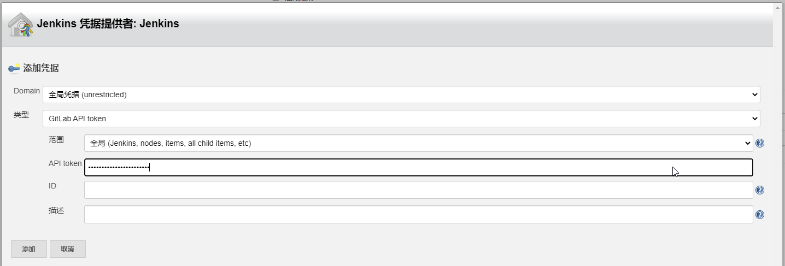
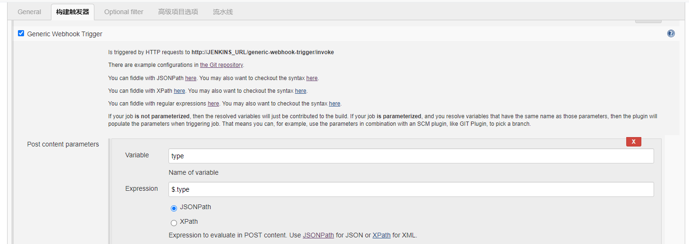

= devops-ops-k8s
Author 卢冬榕
:doctype: article
:encoding: utf-8
:lang: en
:toc: left
:numbered:

= CICD

== `CICD` 是什么？

CICD 是 持续集成（Continuous Integration）和持续部署（Continuous Deployment）的简称。Continuous Delivery 是持续交付的意思。

=== `CICD` 的持续集成

`持续集成` 指的是当代码有变更时，立即进行 `构建` 和 `测试`，反馈运行结果，我们可以根据测试结果，**确定新代码是否可以和原有代码正确的集成在一起**。让你能够在开发中随时发现问题，在快速的产品迭代中还可以保持很高的质量。因为修复问题的成本随着时间的推移而增长，越早发现，修复成本越低。

=== `CICD` 的持续部署

`持续部署` 指的是代码尽快向可运行的开发/测试环节交付，以便尽早测试；

=== `CICD` 的持续交付

`持续交付` 指的是指研发尽快向客户交付，以便尽早发现生产环境中存在的问题。

[NOTE]
====
所谓的持续，就是说每完成一个完整的部分，就向下个环节交付，发现问题可以马上调整。问题不会放大到其他部分和后面的环节。
====

=== `CICD` 的架构

代码编写 -> 代码构建 -> 单元测试 -> 质量管理 -> 打包与归档 -> 集成测试 -> 部署测试环境 -> 部署预生产环境 -> 验收测试 -> 部署生产环境 -> 运维与监控

= CAAS

== `CAAS` 是什么？

`CAAS` 是 Containers as a Service 的缩写。

[NOTE]
====
https://www.docker.com/blog/containers-as-a-service-caas/
====

=== `CAAS` 的架构

`CAAS` 的架构有 `k8s+containerd`、`k8s+cri-o` 和 `k8s+docker`。推荐 `k8s+containerd` 架构。 link:./kubernates/README.adoc[其他架构]。

= jenkins

== `jenkins` 是什么？

`jenkins` 是基于 `Java` 开发的一种持续集成工具。

- https://jenkins.io

- 下载地址 - https://jenkins.io/download

- 下载插件 - http://updates.jenkins-ci.org/download/plugins

- 教程 - https://www.w3cschool.cn/jenkins/jenkins-jg9528pb.html

https://github.com/jenkins-docs/simple-java-maven-app.git

== 搭建 `jenkins` 环境

https://jenkins.io/zh/doc/book/installing

- 依赖环境 - https://jenkins.io/doc/administration/requirements/java/

=== 在 `Docker` 上搭建 `jenkins`

- docker - https://hub.docker.com/_/jenkins

- docker-github - https://github.com/jenkinsci/docker

- 下载 - https://www.jenkins.io/download/

==== 安装 `1.23.0`

[source,sh]
----
$ sudo docker search jenkinsci/blueocean
$ sudo docker pull jenkinsci/blueocean:1.23.0
$ sudo docker images
$ sudo mkdir -p /opt/n5/jenkins/bin/jenkins-1.23.0/data
$ sudo chown -R 200 /opt/n5/jenkins/bin/jenkins-1.23.0/data
$ sudo docker run \
  -u root \
  -d \
  -p 8080:8080 \
  -p 50000:50000 \
  --name jenkins \
  --restart=always \
  -v /opt/n5/jenkins/bin/jenkins-1.23.0/data:/var/jenkins_home \
  -v /var/run/docker.sock:/var/run/docker.sock \
  jenkinsci/blueocean:1.23.0
----

==== 安装 `jenkins:2.277.4-lts`

https://hub.docker.com/r/jenkins/jenkins

https://github.com/jenkinsci/docker/blob/master/README.md

[source,sh]
----
$ sudo docker pull jenkins/jenkins:2.277.4-lts-centos7
$ sudo docker images
$ sudo mkdir -p /opt/n5/jenkins/bin/jenkins-2.277/data
$ sudo chown -R 200 /opt/n5/jenkins/bin/jenkins-2.277/data
$ sudo docker run \
  -u root \
  -d \
  -p 8090:8080 \
  --name jenkins2.277.4 \
  --restart=always \
  -v /opt/n5/jenkins/bin/jenkins-2.277/data:/var/jenkins_home \
  -v /var/run/docker.sock:/var/run/docker.sock \
  jenkins/jenkins:2.277.4-lts-centos7
----

==== CA证书

[source,text]
----
FROM jenkins:1.565.3

COPY https.pem /var/lib/jenkins/cert

COPY https.key /var/lib/jenkins/pk

ENV JENKINS_OPTS --httpPort=-1 --httpsPort=8083 --httpsCertificate=/var/lib/jenkins/cert --httpsPrivateKey=/var/lib/jenkins/pk

EXPOSE 8083
----

== 维护和管理 `jenkins`

=== `jenkins` 的激活

==== 激活环境

获取登录密码

[source,sh]
----
$ sudo docker logs jenkins-blueocean
----

输出

[source,text]
----
Jenkins initial setup is required. An admin user has been created and a password generated.
Please use the following password to proceed to installation:
50de1ecbe1654d4b975da8dc894cf0ae <1>
This may also be found at: /var/jenkins_home/secrets/initialAdminPassword
----

<1> 登录密码

登录 `jenkins` http://192.168.41.34:8080

==== 安装插件

安装插件，可以通过官网（需要连接外网）或者设置代理进行自动安装，也可以通过手动安装插件，点击系统管理 -> 管理插件 -> 高级 -> 上传插件。

https://plugins.jenkins.io/

=== `jenkins` 的节点

- 登录 `Jenkins` 安装 `SSH Agent Plugin` 和 `SSH Build Agents plugin` 插件，系统管理 → 管理插件。

. SSH Agent Plugin + 
This plugin allows you to provide SSH credentials to builds via a ssh-agent in Jenkins

. SSH Build Agents plugin + 
Allows to launch agents over SSH, using a Java implementation of the SSH protocol.

. SSH Pipeline Steps

- 添加节点，系统管理 -> 节点管理 -> 新建节点

=== `jenkins` 的凭证

==== SSH Username with private key

创建SSH密钥对（此处以root用户为例，所有选项使用默认值）。

[source,sh]
----
$ ssh-keygen -t rsa -C "user@example.com"
$ more /root/.ssh/id_rsa.pub
----

将获得的公钥，加入到GitLab中，点击“账号->Settings->SSH Keys”，如下图所示：

在Jenkins界面中，选择“SSH Username with private key”，并填入私钥文件名，如下图所示：

image::./README/2021-03-28_15-26-44.png[align="center"]

=== `Gitlab` webhook `jenkins`

==== `jenkins` 调用 `Gitlab`

- 登录 `GitLab` 插件 `Access Tokens`，账号 -> Settings -> Access Tokens。

- 如果 `jenkins` 和 `Gitlab` 在同一台机器上，`admin` 角色登录 `Gitlab` ，设置 `Gitlab` 的 `Outbound requests` 勾选允许所有请求。

- 登录 `Jenkins` 安装 `GitLab` 插件，系统管理 → 管理插件。

- 设置 `GitLab` 信息，系统管理 -> 系统设置 -> Gitlab。

增加 `Credentials`

==== `Gitlab` 调用 `jenkins`

- 登录 `Jenkins` 安装 `Gitlab Hook` 插件，系统管理 → 管理插件。

- 在 `Jenkins` 上设置 `Gitlab Hook`，新建任务 -> 构建一个自由风格的软件项目 -> 构建触发器。

- 生成 `Secret token`，`GitLab` 调用 `Jenkins` 时候用到。

- 在 `GitLab` 上设置 `Jenkins` 调用地址和 `Secret token`，Projects -> 某个仓库 -> Settings -> Webhooks。

- 点击 `Test` 测试 `Webhook` 的功能。

=== `Harbor` webhook `jenkins`

==== 设置 `jenkins` 端

- `Harbor` 的 `Post` 内容

[source,json]
----
{
    "method" : "POST",
    "path" : "/",
    "headers" : {
      "Host" : [ "192.168.41.35:1080" ],
      "User-Agent" : [ "Go-http-client/1.1" ],
      "Content-Length" : [ "384" ],
      "Content-Type" : [ "application/json" ],
      "Accept-Encoding" : [ "gzip" ]
    },
    "keepAlive" : true,
    "secure" : false,
    "body" : {
      "type" : "pushImage",
      "occur_at" : 1620398885,
      "operator" : "admin",
      "event_data" : {
        "resources" : [ {
          "digest" : "sha256:50c3e028b6015527fd6a3c55d0054c4044d330dc8b1e86eb13a52df15a1713d3",
          "tag" : "1.0.0",
          "resource_url" : "192.168.41.32/test/test-jenkins:1.0.0"
        } ],
        "repository" : {
          "date_created" : 1620398885,
          "name" : "test-jenkins",
          "namespace" : "test",
          "repo_full_name" : "test/test-jenkins",
          "repo_type" : "public"
        }
      }
    }
}
----

- 通过 `$.type` 取到 `type` 的值赋值给 `type`。

- `$type_$repo_full_name` 的值与 `^pushImage_test/test-jenkins$` 正则能匹配上则执行。

- 设置 `token`，请求的地址需要带上 `token` 才会触发。

http://192.168.41.34:8080/generic-webhook-trigger/invoke?token=fba93331ac6075af87919f1705923d8c

==== 设置 `Harbor` 端

https://goharbor.io/docs/1.10/working-with-projects/project-configuration/configure-webhooks/

引导路径 -> 项目 -> 特定项目 -> Webhooks

=== `jenkins` 使用 `SSH`

- 登录 `Jenkins` 安装 `SSH Credentials Plugin` 和 `SSH plugin` 插件，系统管理 → 管理插件。

. SSH Credentials Plugin + 
Allows storage of SSH credentials in Jenkins

. SSH plugin + 
This plugin executes shell commands remotely using SSH protocol.

- 设置 `SSH remote hosts`

- 选择凭据 `Credentials` ，如果未插件，则新插件一个 `Credentials`。 `Credentials` 的类型有 `Username with password` 或 `X.509 Client Certificate`

image::./README/2021-05-07_13-43-11.png[align="center"]

== `jenkins` 通过 `Docker` 构建项目

=== 拉取代码 -> 构建镜像

Gitlab > jenkins > git > maven > docker image > harbor

==== 第一步：准备环境

[source,sh]
----
# 构建目录
WORK_SPACE="/opt/n5/cicd/bin/docker/data"
# MAVEN的仓库目录
MAVEN_REPO=/opt/n5/maven/bin/.m2
# 项目
PROJECT_NAME=test-jenkins

PROJECT_SPACE=${WORK_SPACE}"/"${PROJECT_NAME}

# 如果存在构建目录，就删除
if [ -e ${PROJECT_SPACE} ] ; then
    echo "file "${PROJECT_SPACE}" exists"
    rm -rf ${PROJECT_SPACE}
fi

mkdir -p ${PROJECT_SPACE}
----

==== 第二步：运行 `Git` 容器拉取到项目目录

[source,sh]
----
# 构建目录
WORK_SPACE="/opt/n5/cicd/bin/docker/data"
# MAVEN的仓库目录
MAVEN_REPO=/opt/n5/maven/bin/.m2
# 项目
PROJECT_NAME=test-jenkins

PROJECT_SPACE=${WORK_SPACE}"/"${PROJECT_NAME}
GIT_SPACE=${PROJECT_SPACE}"/git"
GIT_NAME=${PROJECT_NAME}"-GIT"

docker run -i \
  --rm \
  --name ${GIT_NAME} \
  -v "${GIT_SPACE}":/git \
  alpine/git \
  clone http://192.168.41.31:180/ludongrong/test-jenkins.git
  
#删除容器
docker ps -a | grep ${GIT_NAME} | awk '{print $1}' | xargs -I {} docker rm {}
----

==== 第三步：运行 `Maven` 容器打包项目

[source,sh]
----
# 构建目录
WORK_SPACE="/opt/n5/cicd/bin/docker/data"
# MAVEN的仓库目录
MAVEN_REPO=/opt/n5/maven/bin/.m2
# 项目
PROJECT_NAME=test-jenkins

PROJECT_SPACE=${WORK_SPACE}"/"${PROJECT_NAME}
GIT_SPACE=${PROJECT_SPACE}"/git"
MAVEN_SPACE=${GIT_SPACE}"/"${PROJECT_NAME}
MAVEN_NAME=${PROJECT_NAME}"-MAVEN"

# 如果不存在maven的仓库目录，就创建
if [ ! -e ${MAVEN_REPO} ] ; then
    echo "file "${MAVEN_REPO}" not exists"
    mkdir -p ${MAVEN_REPO}
    chown -R 200 ${MAVEN_REPO}
fi

docker run -i \
    --rm \
    --name ${MAVEN_NAME} \
    -v "${MAVEN_SPACE}":/usr/src/git \
    -v "${MAVEN_REPO}":/root/.m2 \
    -w /usr/src/git \
    192.168.41.32/test/maven33:3.6.3 mvn clean install

#删除容器
docker ps -a | grep ${MAVEN_NAME} | awk '{print $1}' | xargs -I {} docker rm {}
----

==== 第四步：构建项目的 `Docker` 镜像

[source,sh]
----
# 构建目录
WORK_SPACE="/opt/n5/cicd/bin/docker/data"
# MAVEN的仓库目录
MAVEN_REPO=/opt/n5/maven/bin/.m2
# 项目
PROJECT_NAME=test-jenkins
# 项目端口
TARGET_PORT=8081
# 版本号
VERSION=1.0.0

PROJECT_SPACE=${WORK_SPACE}"/"${PROJECT_NAME}
GIT_SPACE=${PROJECT_SPACE}"/git"
MAVEN_SPACE=${GIT_SPACE}"/"${PROJECT_NAME}
TARGET_SPACE=${MAVEN_SPACE}"/target"

cd ${TARGET_SPACE}
 
# 创建Dockerfile文件
cat << EOF > Dockerfile111
FROM kdvolder/jdk8
MAINTAINER ${PROJECT_NAME}
VOLUME /tmp
LABEL app="${PROJECT_NAME}" version="${VERSION}" by="${PROJECT_NAME}"
COPY ${PROJECT_NAME}.jar ${PROJECT_NAME}.jar
EXPOSE ${TARGET_PORT}
CMD -Xmx100m -Xms100m -jar -Duser.timezone=GMT+08 ${PROJECT_NAME}.jar
ENTRYPOINT java
EOF

# 创建Dockerfile文件
cat << EOF > Dockerfile
FROM tomcat:8.5.65-jdk8-corretto
ADD ./springmvcdemo.war /usr/local/tomcat/webapps/
EXPOSE 8080
CMD ["/usr/local/tomcat/bin/catalina.sh","run"]
EOF
 
#删除容器
docker ps -a | grep ${PROJECT_NAME} | awk '{print $1}' | xargs -I {} docker rm {}

#删除镜像
docker images | grep ${PROJECT_NAME} | awk '{print $3}' | xargs -I {} docker rmi -f {}

#创建镜像
docker build -t ${PROJECT_NAME}:${VERSION} .
----

==== 第五步：推送项目镜像到 `Harbor`

[source,sh]
----
# 构建目录
WORK_SPACE="/opt/n5/cicd/bin/docker/data"
# MAVEN的仓库目录
MAVEN_REPO=/opt/n5/maven/bin/.m2
# 项目
PROJECT_NAME=test-jenkins
# 项目端口
TARGET_PORT=8081
# 版本号
VERSION=1.0.0
# 组织
ORG_NAME=test

PROJECT_SPACE=${WORK_SPACE}"/"${PROJECT_NAME}

docker login -u admin -p Harbor12345 192.168.41.32

docker tag ${PROJECT_NAME}:${VERSION} 192.168.41.32/${ORG_NAME}/${PROJECT_NAME}:${VERSION}

docker push 192.168.41.32/${ORG_NAME}/${PROJECT_NAME}:${VERSION}

#删除容器
docker rm -f $(docker ps -a | grep "${PROJECT_NAME}" | awk '{print $1}')
 
#删除镜像
docker images | grep ${PROJECT_NAME} | awk '{print $1}' | xargs -I {} docker rmi -f {}

rm -rf ${PROJECT_SPACE}
----

=== 拉取镜像 -> 停止镜像 -> 运行镜像

jenkins > docker pull > docker stop  > docker rmi > docker run

[source,sh]
----
# 构建目录
WORK_SPACE="/opt/n5/cicd/bin/docker/data"
# MAVEN的仓库目录
MAVEN_REPO=/opt/n5/maven/bin/.m2
# 项目
PROJECT_NAME=test-jenkins
# 项目端口
TARGET_PORT=8081
# 项目日志
LOG_PATH="/opt/n5/logs/"${PROJECT_NAME}
# 版本号
VERSION=1.0.0
# 组织
ORG_NAME=test

HARBOR_URL=192.168.41.32

#删除同名容器
docker_id=$(docker ps | grep "${PROJECT_NAME}" | awk '{print $1}')
if [ "${docker_id}" != "" ]; then
    docker rm -f ${docker_id}
fi

#删除镜像
docker images | grep ${PROJECT_NAME} | awk '{print $3}' | xargs -I {} docker rmi -f {}

# 登录Harbor
docker login -u admin -p Harbor12345 ${HARBOR_URL}

# 拉取镜像
docker pull ${HARBOR_URL}/${ORG_NAME}/${PROJECT_NAME}:${VERSION}

docker run -itd -p ${TARGET_PORT}:8080 \
  --name ${PROJECT_NAME}-${VERSION} \
  -v ${LOG_PATH}:/usr/local/tomcat/logs \
  ${HARBOR_URL}/${ORG_NAME}/${PROJECT_NAME}:${VERSION}
----

= bamboo

== `bamboo` 是什么？

`bamboo` 是持续集成、部署和交付的商业软件。

https://www.atlassian.com/software/bamboo

=== `bamboo` 跟 `jenkins` 的差异

https://www.atlassian.com/software/bamboo/comparison/bamboo-vs-jenkins

[width="100%",options="header"]
|====================
|内容                                   |bamboo    |jenkins
|Built-in Git branching workflows		|support   |not support
|Built-in deployment Projects			|support   |not support
|Built-in Jira Software integration		|support   |not support
|Built-in Bitbucket Server integration	|support   |not support
|REST APIs								|support   |support
|Test Automation						|support   |Supported through plugins
|Easy Enterprise-grade permissions		|support   |Supported through plugins
|====================

= GitLab

== `GitLab` 是什么？

`GitLab` 是开源的代码托管软件。

[NOTE]
====
https://about.gitlab.com/
====

- webhook - https://jerryzou.com/posts/webhook-practice/

== 搭建 `GitLab` 环境

=== 在 `Centos` 上安装 `GitLab`

https://about.gitlab.com/installation/#centos-7

[source,sh]
----
sudo yum install -y curl policycoreutils-python openssh-server
sudo systemctl enable sshd
sudo systemctl start sshd
sudo firewall-cmd --permanent --add-service=http
sudo systemctl reload firewalld
rpm -i gitlab-ce-10.1.4-ce.0.el7.x86_64.rpm
----

修改配置

[source,sh]
----
$ vim /etc/gitlab/gitlab.rb
unicorn['port'] = 8082
nginx['listen_port'] = 82
git_data_dirs({
  "default" => {
    "path" => "/data/git-data",
    "failure_count_threshold" => 10,
    "failure_wait_time" => 30,
    "failure_reset_time" => 1800,
    "storage_timeout" => 30
   }
})
----

重启 `gitlab`

[source,sh]
----
$ gitlab-ctl reconfigure
$ gitlab-ctl restart
----

=== 在 `Docker` 上安装 `12.9.4-ce.0`

https://hub.docker.com/r/gitlab/gitlab-ce/tags

- 教程 - https://docs.gitlab.com/omnibus/docker/

[source,sh]
----
$ sudo docker search gitlab
$ sudo docker pull gitlab/gitlab-ce:12.9.4-ce.0
$ sudo docker images
----

[source,sh]
----
$ sudo mkdir -p /opt/n5/gitlab/bin/gitlab-12.9.4-ce.0/config
$ sudo chown -R 200 /opt/n5/gitlab/bin/gitlab-12.9.4-ce.0/config
$ sudo mkdir -p /opt/n5/gitlab/bin/gitlab-12.9.4-ce.0/logs
$ sudo chown -R 200 /opt/n5/gitlab/bin/gitlab-12.9.4-ce.0/logs
$ sudo mkdir -p /opt/n5/gitlab/bin/gitlab-12.9.4-ce.0/data
$ sudo chown -R 200 /opt/n5/gitlab/bin/gitlab-12.9.4-ce.0/data
$ export GITLAB_HOME=/opt/n5/gitlab/bin/gitlab-12.9.4-ce.0

$ sudo docker run --detach \
  --hostname 192.168.41.31 \                     <1>
  --publish 443:443 \                            <2>
  --publish 80:80 \                              <3>
  --publish 122:22 \                             <4>
  --name gitlab \                                <5>
  --restart always \                             <6>
  --volume $GITLAB_HOME/config:/etc/gitlab \
  --volume $GITLAB_HOME/logs:/var/log/gitlab \
  --volume $GITLAB_HOME/data:/var/opt/gitlab \
  gitlab/gitlab-ce:12.9.4-ce.0
----

<1> 指定容器域名,未知功能:创建镜像仓库的时候使用到
<2> 443(主机端口):443(容器端口),提供https服务
<3> 80(主机端口):80(容器端口)，提供http服务
<4> 122(主机端口):22(容器端口)，提供ssh服务
<5> 指定容器名称
<6> 容器运行中退出时（不是手动退出）,自动重启

==== 配置 `/etc/gitlab/gitlab.rb`

[source,sh]
----
$ sudo docker exec -it gitlab /bin/bash
$ vi /etc/gitlab/gitlab.rb
----

或者直接修改 `/opt/n5/gitlab/bin/gitlab-12.9.4-ce.0/config/gitlab.rb`

===== 修改 `external_url`

https://docs.gitlab.com/omnibus/settings/configuration.html#configuring-the-external-url-for-gitlab

为了让 `GitLab` 向您的用户显示正确的克隆链接。

[source,text]
----
For HTTP
external_url 'http://192.168.41.31'
----

或者

[source,text]
----
For HTTPS (notice the https)
external_url 'https://192.168.41.31'
----

===== 修改 `ssh` 访问地址和端口

[source,sh]
----
gitlab_rails['gitlab_ssh_host'] = '192.168.41.31'
gitlab_rails['gitlab_ssh_user'] = ''
gitlab_rails['time_zone'] = 'UTC'
gitlab_rails['gitlab_shell_ssh_port'] = 122
----

==== 重启

$ sudo docker restart gitlab

- 查看过程

$ sudo docker logs -f gitlab

- 查看过程

After starting a container you can visit http://localhost/ or http://192.168.59.103

- 重启失败

[source,sh]
----
$ cd /opt/n5/gitlab/bin/gitlab-12.9.4-ce.0/logs/unicorn
$ rm -rf *
$ sudo docker restart gitlab
----

== 平台管理员

=== 登录和退出

访问【http://192.168.41.31:180/】>> 输入密码。

=== 修改密码

== 普通用户

=== 项目管理

- 新建项目

=== 组管理

==== 新建组

== 项目管理员

=== 用户管理

=== 项目管理

=== 组的管理

