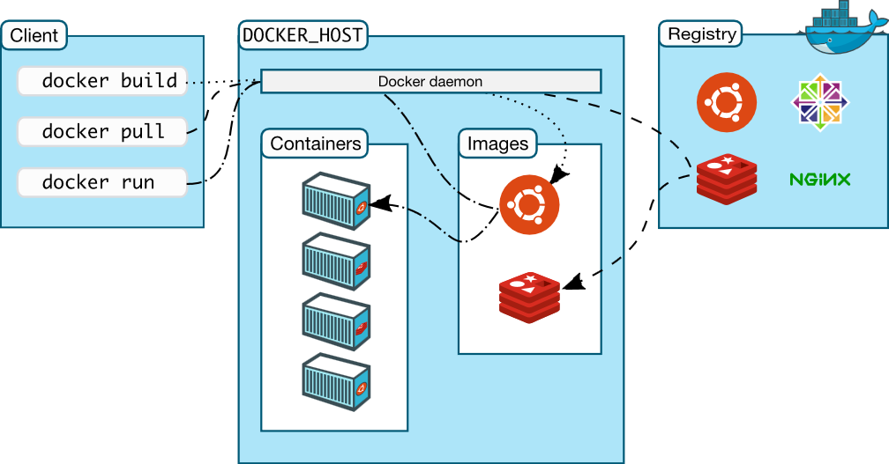
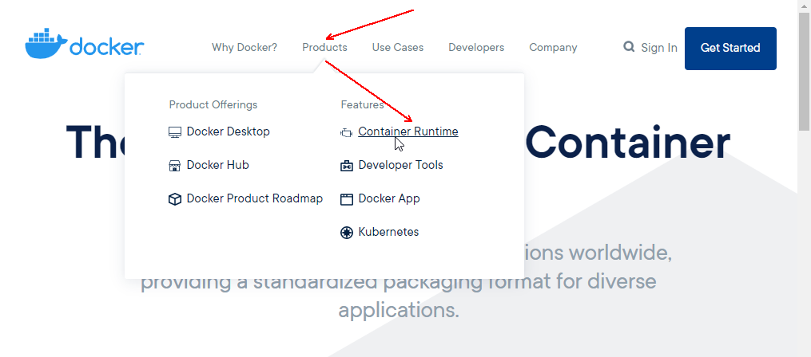
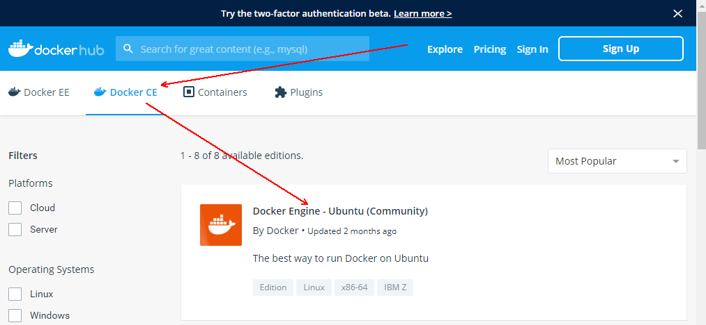
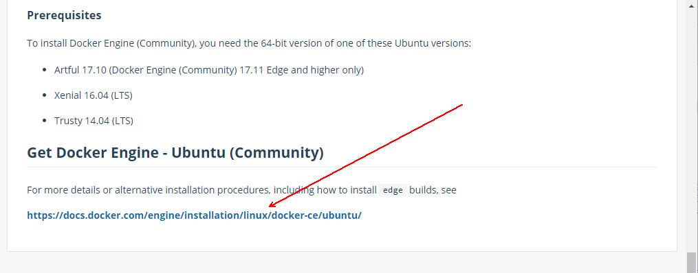
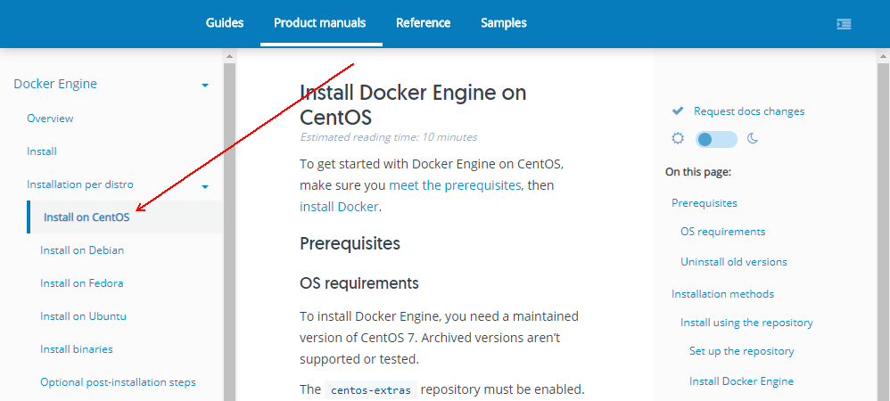
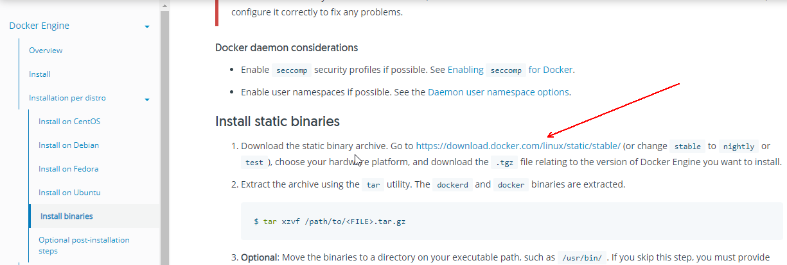
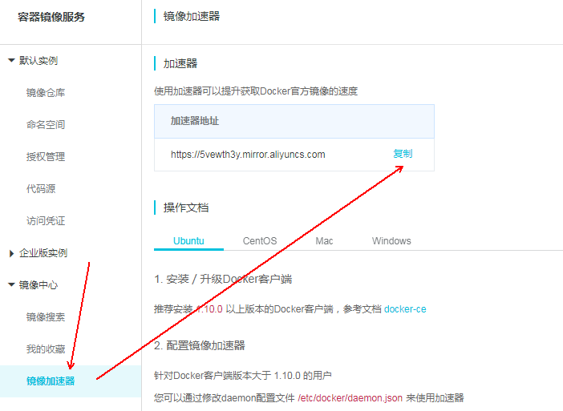

= docker
Author 卢冬榕
:doctype: article
:encoding: utf-8
:lang: en
:toc: left
:numbered:

= Docker

== `Docker` 是什么？

`Docker` 是一个用于开发，交付和运行应用程序的开放平台。 `Docker` 提供了在松散隔离的环境中打包和运行应用程序的功能。这个环境称为 `容器`。

[NOTE]
====
https://docs.docker.com/get-started/overview/
====

- 代码托管 - https://github.com/docker/docker-ce
- 命令手册 - https://docs.docker.com/engine/reference/commandline/push/
- 引用教程 - https://www.runoob.com/docker/docker-architecture.html

=== `容器` 是什么？

容器是应用程序层的一种抽象，它将代码和依赖项打包在一起。多个容器可以运行在同一台机器上，并与其他容器共享操作系统内核，每个容器作为用户空间中的独立进程运行。

[NOTE]
====
https://www.docker.com/resources/what-container
====

=== `Docker` 的原理

Docker使用客户端-服务器架构。Docker客户端和守护进程通过UNIX套接字或网络接口使用REST API进行通信。

== 搭建 `Docker` 环境

=== 下载 `Docker`

[NOTE]
====
https://www.docker.com/products/container-runtime
====

image::./README/2021-05-06_08-54-03.png[align="center"]

==== 下载 `Ubuntu` 版 `Docker`

[NOTE]
====
https://hub.docker.com/search?q=&type=edition&offering=community
====

[NOTE]
====
https://hub.docker.com/editions/community/docker-ce-server-ubuntu
====

==== 下载 `Centos` 版 `Docker`

[NOTE]
====
https://docs.docker.com/engine/install/centos/
====

==== 下载 `Docker` 的 `binaries`

[NOTE]
====
https://docs.docker.com/engine/install/binaries/
====

[source,sh]
----
wget https://download.docker.com/linux/static/stable/x86_64/docker-18.09.6.tgz
----

=== 安装 `Docker`

推荐您在Ubuntu下面安装，因为docker是在Ubuntu下面开发的，安装包测试比较充分，可以保证软件包的可用性。

[NOTE]
====
http://www.docker.org.cn/book/install/install-docker-trusty-14.04-26.html
====

- `ubuntu` 支持版本。

Eoan 19.10 Bionic 18.04 (LTS) Xenial 16.04 (LTS)

[NOTE]
====
https://docs.docker.com/engine/install/ubuntu/
====

==== 在 `ubuntu-18.04` 上通过 `apt` 安装 `18.09.6`

推荐通过 `repository` 安装，方便安装和升级的优点。

[NOTE]
====
https://docs.docker.com/engine/install/ubuntu/#install-using-the-repository
====

===== 安装 `Docker Engine`

卸载旧版本 `Docker`

[source,sh]
----
$ sudo apt-get remove docker docker-engine docker.io containerd runc
----

SET UP THE REPOSITORY

[source,sh]
----
$ sudo apt-get update
$ sudo apt-get install apt-transport-https \
​    ca-certificates \
​    curl \
​    gnupg-agent \
​    software-properties-common
----

添加Docker的官方GPG密钥

[source,sh]
----
$ curl -fsSL https://download.docker.com/linux/ubuntu/gpg | sudo apt-key add -
----

查看秘钥列表

[source,sh]
----
$ apt-key list
----

验证当前是否拥有密钥

[source,sh]
----
$ sudo apt-key fingerprint 0EBFCD88
----

添加Docker的官方源

[source,sh]
----
$ sudo add-apt-repository \
   "deb [arch=amd64] https://download.docker.com/linux/ubuntu \
   $(lsb_release -cs) \
   stable"
----

更新本地源索引

[source,sh]
----
$ sudo apt-get update
----

获取版本信息

[source,sh]
----
$ apt-cache madison docker-ce
----

安装指定版本的 `Docker Engine`

[source,]
----
# 格式
$ sudo apt-get install \
  docker-ce=<versiong_string> \
  docker-ce-cli=<versiong_string> \
  containerd.io

# 样例
$ sudo apt-get install \
  docker-ce=5:19.03.8~3-0~ubuntu-bionic \
  docker-ce-cli=5:19.03.8~3-0~ubuntu-bionic \
  containerd.io
----

安装最新版本的 `Docker Engine`

[source,]
----
$ sudo apt-get update
$ sudo apt-get install docker-ce docker-ce-cli containerd.io
----

安装信息

[source,text]
----
Created symlink /etc/systemd/system/multi-user.target.wants/containerd.service → /lib/systemd/system/containerd.service.

...

Created symlink /etc/systemd/system/multi-user.target.wants/docker.service → /lib/systemd/system/docker.service.

Created symlink /etc/systemd/system/sockets.target.wants/docker.socket → /lib/systemd/system/docker.socket.
----

== 维护 `Docker` 环境

=== manage docker as a non-root user.

[NOTE]
====
https://docs.docker.com/engine/install/linux-postinstall/
====

[source,]
----
$ sudo groupadd docker
$ sudo usermod -aG docker $USER
$ newgrp docker
$ docker run hello-world
$ sudo chown "$USER":"$USER" /home/"$USER"/.docker -R
$ sudo chmod g+rwx "$HOME/.docker" -R
----

=== not support cgroup swap limit

[NOTE]
====
https://docs.docker.com/engine/install/linux-postinstall/
====

On Ubuntu or Debian hosts, You may see messages similar to the following when working with an image.

WARNING: Your kernel does not support swap limit capabilities. Limitation discarded.

[source,sh]
----
$ sudo vi /etc/default/grub
----

GRUB_CMDLINE_LINUX="cgroup_enable=memory swapaccount=1"

[source,sh]
----
$ sudo update-grub
$ sudo reboot
----

=== Insecure registries and registry-mirrors

[NOTE]
====
https://cr.console.aliyun.com/cn-hangzhou/instances/mirrors
====

https://5vewth3y.mirror.aliyuncs.com

验证镜像地址的可用性

[source,sh]
----
$ docker pull docker.io/library/ubuntu:latest
$ docker rm ubuntu
$ docker pull 5vewth3y.mirror.aliyuncs.com/library/ubuntu:latest
$ docker rm ubuntu
$ sudo vi /etc/docker/daemon.json
{
​    "registry-mirrors":["https://5vewth3y.mirror.aliyuncs.com"],
​    "insecure-registry": ["192.168.41.32:5000","192.168.41.33:8082"]
}
$ sudo systemctl daemon-reload
$ sudo systemctl restart docker.service
$ sudo netstat -lntp | grep dockerd
----

=== registries>>废弃

[source,sh]
----
$ systemctl status docker
----

[source,sh]
----
docker.service - Docker Application Container Engine

Loaded: loaded (/lib/systemd/system/docker.service; enabled; vendor preset: disabled)

Active: active (running) since 日 2018-05-13 10:02:21 CST; 14min ago
----

[source,sh]
----
$ vi /lib/systemd/system/docker.service
----

ExecStart=/usr/local/bin/dockerd --log-level=error --add-registry=192.168.80.129:5000

重启 `docker`

[source,sh]
----
$ sudo systemctl daemon-reload
$ sudo systemctl restart docker
----

查看Registries是否更改

[source,sh]
----
$ sudo docker info
----

Registry: https://192.168.80.129:5000/v1/

Experimental: false...

=== 远程启动

[NOTE]
====
https://docs.docker.com/engine/reference/commandline/dockerd/#daemon-configuration-file
====

On systems that use systemd to start the Docker daemon, -H is already set, so you cannot use the hosts key in daemon.json to add listening addresses.

[source,sh]
----
$ sudo vi /lib/systemd/system/docker.service
----

...

ExecStart=/usr/bin/dockerd -H fd:// --containerd=/run/containerd/containerd.sock

改成

ExecStart=/usr/bin/dockerd --containerd=/run/containerd/containerd.sock

==== systemd

[source,sh]
----
$ sudo systemctl edit docker.service
----

[source,text]
----
[Service]

ExecStart=

ExecStart=/usr/bin/dockerd -H fd:// -H tcp://127.0.0.1:2375
----

[source,sh]
----
$ sudo systemctl daemon-reload
$ sudo systemctl restart docker.service
$ sudo netstat -lntp | grep dockerd
----

==== daemon.json

[NOTE]
====
https://docs.docker.com/engine/reference/commandline/dockerd/#daemon-configuration-file
====

192.168.41.31机器 >> tcp://192.168.41.31:2375，192.168.41.32机器 >> tcp://192.168.41.32:2375...

[source,text]
----
$ sudo vi /etc/docker/daemon.json
{
    "hosts": ["unix:///var/run/docker.sock",
    "tcp://192.168.41.31:2375"]
}
----

[source,text]
----
$ sudo systemctl daemon-reload
$ sudo systemctl restart docker.service
$ sudo netstat -lntp | grep dockerd
----

=== Protect the Docker daemon socket

[NOTE]
====
https://docs.docker.com/engine/security/security/#docker-daemon-attack-surface

https://docs.docker.com/engine/security/https/
====

[source,sh]
----
$ mkdir -p /opt/n5/docker/work /opt/n5/docker/bin
----

==== 插件ca

[source,sh]
----
$ cd /opt/n5/docker/bin
$ cat > environment.sh <<EOF
#!/usr/bin/bash

#部署docker的机器IP

export NODE_IPS=(192.168.41.31 192.168.41.32 192.168.41.33 192.168.41.34 192.168.41.35)

EOF

$ source environment.sh
$ cd /opt/n5/docker/work
$ cat > docker-csr.json <<EOF
{

  "CN": "docker",
  "hosts": [
​    "127.0.0.1",
​    "192.168.41.31",
​    "192.168.41.32",
​    "192.168.41.33",
​    "192.168.41.34",
​    "192.168.41.35"
  ],
  "key": {
​    "algo": "rsa",
​    "size": 2048
  },

  "names": [
​    {
​      "C": "CN",
​      "ST": "BeiJing",
​      "L": "BeiJing",
​      "O": "docker",
​      "OU": "opsnull"
​    }
  ]
}

EOF

$ cfssl gencert -ca=/etc/cert/n5/ca.pem \
  -ca-key=/etc/cert/n5/ca-key.pem \
  -config=/etc/cert/n5/ca-config.json \
  -profile=n5 docker-csr.json | cfssljson -bare docker

$ ls docker*
----

==== 分发ca

[source,sh]
----
$ su root
$ cd /opt/n5/docker/work
$ source /opt/n5/docker/bin/environment.sh

for node_ip in ${NODE_IPS[@]}
  do
    echo ">>> ${node_ip}"
    ssh root@${node_ip} "mkdir -p /etc/cert/docker"
    scp docker*.pem docker-csr.json root@${node_ip}:/etc/cert/docker
  done
----

==== 配置daemon.json

[source,sh]
----
$ sudo vi /etc/docker/daemon.json
{
​    "tlsverify": true,
​    "tlscacert": "/etc/cert/n5/ca.pem",
​    "tlscert": "/etc/cert/docker/docker.pem",
​    "tlskey": "/etc/cert/docker/docker-key.pem"
}

$ sudo systemctl daemon-reload
$ sudo systemctl restart docker.service
----

==== 验证

[source,sh]
----
$ docker -H=127.0.0.1:2375 version
----

Error response from daemon: Client sent an HTTP request to an HTTPS server.

验证

[source,sh]
----
$ docker --tlsverify --tlscacert=/etc/cert/n5/ca.pem \
  --tlscert=/etc/cert/docker/docker.pem \
  --tlskey=/etc/cert/docker/docker-key.pem \
  -H=127.0.0.1:2375 version
----

验证

[source,sh]
----
$ curl https://127.0.0.1:2375/images/json \
  --cert /etc/cert/docker/docker.pem \
  --key /etc/cert/docker/docker-key.pem \
  --cacert /etc/cert/n5/ca.pem
----

[{"Containers":-1,"Created":1578014497,"Id":"sha256:bf756fb1ae65adf866bd8c456593cd24beb6a0a061dedf42b26a993176745f6b","Labels":null,"ParentId":"","RepoDigests":["hello-world@sha256:8e3114318a995a1ee497790535e7b88365222a21771ae7e53687ad76563e8e76"],"RepoTags":["hello-world:latest"],"SharedSize":-1,"Size":13336,"VirtualSize":13336}]

[source,sh]
----
$ curl https://192.168.41.31:2375/images/json \
  --cert /etc/cert/docker/docker.pem \
  --key /etc/cert/docker/docker-key.pem \
  --cacert /etc/cert/n5/ca.pem
----

==== 测试

[source,sh]
----
$ sudo docker info
----

[source,text]
----
Docker Root Dir: /var/lib/docker
Debug Mode: false
Registry: https://index.docker.io/v1/
Insecure Registries: 127.0.0.0/8
----

[source,sh]
----
$ sudo docker run hello-world
----

[source,text]
----
Unable to find image 'hello-world:latest' locally
latest: Pulling from library/hello-world
0e03bdcc26d7: Pull complete 
Digest: sha256:8e3114318a995a1ee497790535e7b88365222a21771ae7e53687ad76563e8e76
Status: Downloaded newer image for hello-world:latest
----

=== 卸载

[source,sh]
----
$ sudo apt-get purge docker-ce docker-ce-cli containerd.io
$ sudo rm -rf /var/lib/docker
----

=== 访问私有仓库

docker证书存放目录

[NOTE]
====
https://docs.docker.com/engine/security/certificates/
====

[source,text]
----
/etc/docker/certs.d/        <-- Certificate directory
    └── localhost:5000          <-- Hostname:port
       ├── client.cert          <-- Client certificate
       ├── client.key           <-- Client key
       └── ca.crt               <-- Certificate authority that signed
----

the registry certificate

==== ca

[source,sh]
----
$ ll /etc/cert/n5
----

[source,text]
----
/etc/cert/n5/ca-config.json
/etc/cert/n5/ca-key.pem
/etc/cert/n5/ca.pem
----

分发 ca

[source,sh]
----
$ export HARBOR_NODE_IP=192.168.41.33:8082
$ export DOCKER_NODE_LIST=(192.168.41.31 192.168.41.32 192.168.41.33 192.168.41.33 192.168.41.34 192.168.41.35)

for docke_node_ip in ${DOCKER_NODE_LIST[@]}
  do
    echo ">>> ${docke_node_ip}"
    ssh root@${docke_node_ip} "mkdir -p /etc/docker/certs.d/${HARBOR_NODE_IP}"
    scp /etc/cert/n5/n5.pem root@${docke_node_ip}:/etc/docker/certs.d/${HARBOR_NODE_IP}/client.cert
    scp /etc/cert/n5/n5-key.pem root@${docke_node_ip}:/etc/docker/certs.d/${HARBOR_NODE_IP}/client.key
    scp /etc/cert/n5/ca.pem root@${docke_node_ip}:/etc/docker/certs.d/${HARBOR_NODE_IP}/ca.crt
    ssh root@${docke_node_ip} "systemctl daemon-reload"
    ssh root@${docke_node_ip} "systemc/tl restart docker"
  done
----

http

[source,sh]
----
$ systemctl status docker
$ vi /etc/docker/daemon.json
{
  "insecure-registries": ["192.168.41.31"]
}

$ sudo systemctl daemon-reload
$ sudo systemctl restart docker.service
----

https

[source,sh]
----
$ sudo systemctl daemon-reload
$ sudo systemctl restart docker.service
----

==== 替换默认仓库 

===== daemon.json方式

[NOTE]
====
https://docs.docker.com/engine/reference/commandline/dockerd/
====

[source,sh]
----
$ systemctl status docker
$ vi /etc/docker/daemon.json
{
  "registry-mirrors":["https://192.168.41.33:8082"],
  "insecure-registries": ["192.168.41.33:8082"]
}
$ sudo systemctl daemon-reload
$ sudo systemctl restart docker.service
----

删除旧镜像

[source,sh]
----
$ docker images
$ docker rmi -f bf756fb1ae65
----

测试pull

[source,sh]
----
$ docker pull hello-world
----

===== docker.service方式

https://docs.docker.com/registry/recipes/mirror/

[source,sh]
----
$ systemctl status docker
$ vi /lib/systemd/system/docker.service
----

在ExecStart=/usr/bin/dockerd  后追加参数 --registry-mirror=https://192.168.41.33:8082

[source,sh]
----
$ sudo systemctl daemon-reload
$ sudo systemctl restart docker.service
----

==== 登录 `harbor`

https://docs.docker.com/engine/security/certificates/

[source,sh]
----
$ docker login -u admin -p Harbor12345 192.168.41.32
----

==== 登录 `nexus`

https://docs.docker.com/engine/security/certificates/

group仓库

[source,sh]
----
$ docker login -u admin -p admin123 192.168.41.32:8082
----

local仓库

[source,sh]
----
$ docker login -u admin -p admin123 192.168.41.32:8083
----

==== 测试pull/push

[source,sh]
----
$ docker pull 192.168.41.33:8082/hello-world
----

**访问私有仓库 >>错误**

x509: certificate signed by unknown authority

证书位置放错或者证书错误

**使用****Docker**

Docker CLI（Command-Line）

[NOTE]
====
https://docs.docker.com/engine/reference/commandline/docker/
====

=== 维护Docker

[source,sh]
----
# 查看版本
$ sudo docker version
# 查看docker安装信息
$ sudo docker -H 192.168.41.31 info
# docker命令帮助文档
$ sudo docker stats --help

# 启停docker服务
$ service docker {start|stop|restart|status}

$ sudo systemctl daemon-reload
$ sudo systemctl restart docker
# 重启
$ sudo systemctl restart docker.service

# 启动docker程序
$ systemctl daemon-reload
$ systemctl start docker
$ systemctl enable docker
----

==== 增加映射端口

[source,sh]
----
$ cd /var/lib/docker/containers/[hash_of_the_container]
----

[source,sh]
----
$ vi hostconfig.json
----

"8443/tcp":[{"HostIp":"","HostPort":"8443"}]

[source,sh]
----
$ vi config.v2.json
----

ExposedPorts":{"8443/tcp":{}}

[source,sh]
----
$ service docker restart
----

**仓库管理**

**搜索**

\>>到Docker Hub网址上搜索

https://hub.docker.com/

\>>使用命令来搜索镜像

[source,sh]
----
$ docker search ubuntu
----

[source,]
----
[Service]

Environment="HTTP_PROXY=https://192.168.41.33:8082"
----

**推送 >> 批量推送**

[source,sh]
----
readonly old_repo=k8s.gcr.io
readonly new_repo=192.168.235.31/library
for image in $(docker images --format '{{.Repository}}:{{.Tag}}'); do
​	name=${image##*/}
​	new_img=${new_repo}/${name}
​	echo "Processing ${image} -> ${new_img}"
​	docker tag ${image} ${new_img}
​	docker push ${new_img}
done

for i in $(docker images | grep zabbix | awk 'BEGIN{OFS=":"}{print $1,$2}'); do 
  docker push $i;
done
----

**加载**

[source,sh]
----
$ docker load [OPTIONS] <文件>
----

OPTIONS说明

-i：从tar文件读取

-q：禁止读入输出

**保存**

[source,sh]
----
$ docker save 0245d66323de -o /opt/docker/chartmuseum-photon.tar
----

**镜像管理**

**导入**

[source,]
----
cat docker/ubuntu.tar | docker import - test/ubuntu:v1
----

将快照文件 ubuntu.tar 导入到镜像 test/ubuntu:v1:

[source,]
----
docker import http://example.com/exampleimage.tgz example/imagerepo
----

通过指定 URL 或者某个目录来导入

**导出**

[source,]
----
docker export 1e560fca3906 > ubuntu.tar
----

[source,]
----
docker commit -m="has update" -a="runoob" e218edb10161 runoob/ubuntu:v2
----

各个参数说明：

-m: 提交的描述信息

-a: 指定镜像作者

exec 格式：

[source,]
----
RUN ["可执行文件", "参数1", "参数2"]
FROM centos
RUN yum install wget \
   && wget -O redis.tar.gz "http://download.redis.io/releases/redis-5.0.3.tar.gz" \
   && tar -xvf redis.tar.gz
----

=== 维护镜像

[source,sh]
----
# 删除
$ docker rmi [镜像名|镜像ID]
$ docker rmi [镜像名|镜像ID] [镜像名|镜像ID]

# 强制删除
$ docker rmi -f [镜像名|镜像ID]

# 删除全部
$ docker rmi -f $(docker images -qa) 

docker images | awk '{print $3}' | xargs -I {} docker rmi {}
docker images | grep goharbor | awk '{print $3}' | xargs -I {} echo {}
docker images | grep gcr.io | awk '{print $3}' | xargs -I {} docker rmi {}
docker images | grep goharbor | awk '{print $3}' | xargs -I {} docker pull {}
docker images | grep goharbor | awk '{print $1}' | xargs -I {} docker tag {} 192.168.41.33:8082/{}
docker images | grep goharbor | awk '{print $1}' | xargs -I {} docker push 192.168.41.33:8082/{}
----

=== 维护容器

[source,sh]
----
# 查看端口
docker port
# 查看容器内部的标准输出 -f -> 持续输出
docker logs -f bf08b7f2cd89

# 查看底层
docker inspect wizardly_chandrasekhar
# 查看进程
docker top wizardly_chandrasekhar

# 停止/重启容器
$ docker stop/start/kill/restart /rm 容器名字或者ID
$ docker stop amazing_cori

# 停止所有容器 - Exited类型
docker ps -a | grep "Exited" | awk '{print $1 }'| xargs docker stop

# 删除所有容器 - Exited类型
docker ps -a | grep "Exited" | awk '{print $1 }' | xargs docker rm
# 删除所有容器 - none类型
docker images | grep none | awk '{print $3 }' | xargs docker rmi
----

== 使用 `Docker`

=== 手动拉取 `mirrorgooglecontainers`

[source,sh]
----
docker pull mirrorgooglecontainers/kube-apiserver-amd64:v1.11.3
docker pull mirrorgooglecontainers/kube-controller-manager-amd64:v1.11.3
docker pull mirrorgooglecontainers/kube-scheduler-amd64:v1.11.3
docker pull mirrorgooglecontainers/kube-proxy-amd64:v1.11.3
docker pull mirrorgooglecontainers/pause:3.1
docker pull mirrorgooglecontainers/etcd-amd64:3.2.18
docker pull coredns/coredns:1.1.3
docker save -o mirrorgooglecontainers1.tar \
  mirrorgooglecontainers/kube-proxy-amd64:v1.11.3  \
----

=== 制作 `maven` 镜像

==== 以 `maven:3.6.3-jdk-8` 为基础

https://hub.docker.com/_/maven?tab=description&page=1&ordering=last_updated&name=3.6.3-jdk-8

- 编写 `Dockerfile`

[source,sh]
----
cat << EOF > Dockerfile
FROM maven:3.6.3-jdk-8
COPY settings.xml /usr/share/maven/conf/
EOF
----

==== 以 `java-centos:7-1.8` 为基础

https://github.com/stakater/dockerfile-maven-centos/blob/master/Dockerfile

- 编写 `Dockerfile`

[source,sh]
----
cat << EOF > Dockerfile
FROM stakater/java-centos:7-1.8

LABEL name="Stakater Maven Image on CentOS" \    
      maintainer="Stakater <stakater@aurorasolutions.io>" \
      vendor="Stakater" \
      release="1" \
      summary="A Maven based image on CentOS" 

# Setting Maven Version that needs to be installed
ARG MAVEN_VERSION=3.5.4

# Changing user to root to install maven
USER root

# Install required tools
# which: otherwise 'mvn version' prints '/usr/share/maven/bin/mvn: line 93: which: command not found'
RUN yum update -y && \
  yum install -y which && \
  yum clean all

# Maven
RUN curl -fsSL https://archive.apache.org/dist/maven/maven-3/$MAVEN_VERSION/binaries/apache-maven-$MAVEN_VERSION-bin.tar.gz | tar xzf - -C /usr/share \
  && mv /usr/share/apache-maven-$MAVEN_VERSION /usr/share/maven \
  && ln -s /usr/share/maven/bin/mvn /usr/bin/mvn
  
# COPY settings.xml /usr/share/maven/conf/ <1>

ENV MAVEN_VERSION=${MAVEN_VERSION}
ENV M2_HOME /usr/share/maven
ENV maven.home $M2_HOME
ENV M2 $M2_HOME/bin
ENV PATH $M2:$PATH

# Again using non-root user i.e. stakater as set in base image
USER 10001

# Define default command, can be overriden by passing an argument when running the container
CMD ["mvn","-version"]
EOF
----

<1> 指定自己的 `settings.xml`

- 开始制作 `build`

[source,sh]
----
docker build -t 192.168.41.32/test/maven33:3.6.3 .
----

== 使用镜像

=== 使用 `redis` 镜像

https://hub.docker.com/_/redis

[source,sh]
----
docker search redis
docker pull redis:latest
docker run -itd --name redis-test \
  -p 6379:6379 \
  redis
docker ps
docker exec -it redis-test /bin/bash
----

==== 增加 redis.conf

[source,]
----
FROM redis
COPY redis.conf /usr/local/etc/redis/redis.conf
CMD [ "redis-server", "/usr/local/etc/redis/redis.conf" ]
----

=== 使用 `nginx` 镜像

https://hub.docker.com/_/nginx

[source,sh]
----
docker search nginx
docker pull nginx:latest
docker run --name nginx-test \
  -p 8080:80 \
  -d nginx
docker ps
----

==== 增加静态文件

[source,]
----
FROM nginx
COPY static-html-directory /usr/share/nginx/html
----

=== 使用 `mysql` 镜像

https://hub.docker.com/_/mysql

[source,sh]
----
docker search mysql
docker pull mysql:latest
docker run -itd --name mysql-test \
  -p 3306:3306 \
  -e MYSQL_ROOT_PASSWORD=123456 \
  -v /my/own/datadir:/var/lib/mysql \
  mysql
docker ps
----

=== 使用 `tomcat` 镜像

https://hub.docker.com/_/tomcat

[source,sh]
----
docker search tomcat
docker pull tomcat
docker images|grep tomcat
docker run --name tomcat \
  -p 8080:8080 \ <1>
  -v $PWD/test:/usr/local/tomcat/webapps/test \ <2>
  -d tomcat
----

<1> 将容器的 8080 端口映射到主机的 8080 端口。
<2> 将主机中当前目录下的 test 挂载到容器的 /test。

=== 使用 `MongoDB` 镜像

https://hub.docker.com/_/mongo

https://www.runoob.com/docker/docker-install-mongodb.html

[source,sh]
----
$ docker run -itd --name mongo \
  -p 27017:27017 mongo \
  --auth <1>
----

<1> 需要密码才能访问容器服务。

[source,sh]
----
$ docker exec -it mongo mongo admin
# 创建一个名为 admin，密码为 123456 的用户。
>  db.createUser({ user:'admin',pwd:'123456',roles:[ { role:'userAdminAnyDatabase', db: 'admin'},"readWriteAnyDatabase"]});
# 尝试使用上面创建的用户信息进行连接。
> db.auth('admin', '123456')
----
  
= docker-component

== `docker-component` 是什么？

`docker-component` 是定义和运行多 `Docker` 容器的工具。

[NOTE]
====
https://docs.docker.com/compose/
====

== 搭建 `docker-component` 环境

[NOTE]
====
https://docs.docker.com/compose/install/
====

=== `docker-component` 环境依赖条件？

- docker

=== 在 `linux` 上搭建 `docker-component`

[source,sh]
----
$ sudo curl -L "https://github.com/docker/compose/releases/download/1.28.6/docker-compose-$(uname -s)-$(uname -m)" -o /usr/local/bin/docker-compose
$ sudo chmod +x /usr/local/bin/docker-compose
$ sudo ln -s /usr/local/bin/docker-compose /usr/bin/docker-compose
----

=== 验证 `docker-component` 环境

[source,sh]
----
$ docker-compose --version
----

=== 下载 `docker-component`

==== 下载 1.26.0-rc4

[source,sh]
----
$ wget https://github.com/docker/compose/releases/download/1.26.0-rc4/docker-compose-Linux-x86_64
----

==== 下载 1.25.5

[source,sh]
----
$ wget https://github.com/docker/compose/releases/download/1.25.5/docker-compose-Linux-x86_64
----

[NOTE]
====
https://github.com/docker/compose/releases
====

[source,]
----
$ sudo mkdir -p /opt/n5/docker-component/bin
$ sudo mkdir -p /opt/n5/docker-component/work
$ sudo cd /opt/n5/docker-component/work
$ wget https://github.com/docker/compose/releases/download/1.21.2/docker-compose-Linux-x86_64
----

== 使用 `docker-component`

[NOTE]
====
https://docs.docker.com/compose/reference/
====

[source,sh]
----
docker-compose up
docker-compose up <SERVICE>
docker-compose up [options] [--scale SERVICE=NUM...] [SERVICE...]
----

= docker-machine

== `docker-machine` 是什么？

Docker Machine is a tool that lets you install Docker Engine on virtual hosts, and manage the hosts with docker-machine commands. You can use Machine to create Docker hosts on your local Mac or Windows box, on your company network, in your data center, or on cloud providers like Azure, AWS, or DigitalOcean.

[NOTE]
====
https://docs.docker.com/machine/
====

=== `docker-machine` 的能力

- Install and run Docker on Mac or Windows
- Provision and manage multiple remote Docker hosts
- Provision Swarm clusters

[NOTE]
====
https://docs.docker.com/machine/
====

=== `docker-machine` 的原理

image::./README/2021-05-06_08-54-09.png[align="center"]

==== `docker-machine` 跟 `docker-engine` 的差异

You can use Machine to install Docker Engine on one or more virtual systems. These virtual systems can be local (as when you use Machine to install and run Docker Engine in VirtualBox on Mac or Windows) or remote (as when you use Machine to provision Dockerized hosts on cloud providers). The Dockerized hosts themselves can be thought of, and are sometimes referred to as, managed “machines”.

[NOTE]
====
https://docs.docker.com/machine/
====

== 搭建 `docker-machine` 环境

=== `docker-machine` 环境依赖条件？

- docker

=== 下载 `docker-machine`

==== linux 系统

[source,sh]
----
$base=https://github.com/docker/machine/releases/download/v0.16.0 &&
  curl -L $base/docker-machine-$(uname -s)-$(uname -m) > /tmp/docker-machine &&
  sudo mv /tmp/docker-machine /usr/local/bin/docker-machine &&
  chmod +x /usr/local/bin/docker-machine
----

==== window 系统 git bash

[source,sh]
----
$base=https://github.com/docker/machine/releases/download/v0.16.0 &&
  mkdir -p "$HOME/bin" && 
  curl -L $base/docker-machine-Windows-x86_64.exe > "$HOME/bin/docker-machine.exe" &&
  sudo mv /tmp/docker-machine /usr/local/bin/docker-machine &&
  chmod +x "$HOME/bin/docker-machine.exe"
----

=== 验证 `docker-machine` 环境

[source,sh]
----
$ sudo docker-machine version
----

=== Install bash completion scripts

The Machine repository supplies several bash scripts that add features such as:

- command completion
- a function that displays the active machine in your shell prompt
- a function wrapper that adds a docker-machine use subcommand to switch the active machine

[source,]
----
base=https://raw.githubusercontent.com/docker/machine/v0.16.0
for i in docker-machine-prompt.bash docker-machine-wrapper.bash docker-machine.bash
do
  sudo wget "$base/contrib/completion/bash/${i}" -P /etc/bash_completion.d
done

# in your bash terminal to tell your setup where it can find the file docker-machine-prompt.bash that you previously downloaded.
$ source /etc/bash_completion.d/docker-machine-prompt.bash

# To enable the docker-machine shell prompt, add $(__docker_machine_ps1) to your PS1 setting in ~/.bashrc.
PS1='[\u@\h \W$(__docker_machine_ps1)]\$ '
----

[NOTE]
====
https://docs.docker.com/machine/install-machine/
====

== 使用 `docker-machine`

[NOTE]
====
https://docs.docker.com/machine/reference/
====

[source,sh]
----
# 移除
$ docker-machine rm <machine-name>
# 移除（所有）
$ docker-machine rm -f $(docker-machine ls -q)
# 删除
$ rm $(which docker-machine)

# kill
$ docker-machine ls
$ docker-machine kill dev
----

= swarm

== `swarm` 是什么？

A Docker Swarm is a group of either physical or virtual machines that are running the Docker application and that have been configured to join together in a cluster. 

[NOTE]
====
https://www.sumologic.com/glossary/docker-swarm/
====

Do not confuse Docker Swarm mode with Docker Classic Swarm which is no longer actively developed.

[NOTE]
====
https://docs.docker.com/engine/swarm/
====

=== `swarm` 具备哪些解决能力？

Docker swarm is a container orchestration tool, meaning that it allows the user to manage multiple containers deployed across multiple host machines.

[NOTE]
====
https://www.sumologic.com/glossary/docker-swarm/
====

== 搭建 `swarm` 环境

=== `swarm` 环境依赖条件？

- install docker engine on linux machines

- open protocols and ports between the hosts

[NOTE]
====
https://docs.docker.com/engine/swarm/swarm-tutorial/
====

=== 安装 `swarm`

[source,]
----
$ docker swarm init --advertise-addr 192.168.41.33
$ docker swarm join-token worker
----

[NOTE]
====
https://docs.docker.com/engine/swarm/swarm-tutorial/create-swarm/
====

== 使用 `swarm`

=== docker swarm join

[source,]
----
$ docker swarm join \
 --token SWMTKN-1-49nj1cmql0jkz5s954yi3oex3nedyz0fb0xx14ie39trti4wxv-8vxv8rssmk743ojnwacrr2e7c \
 192.168.41.33:2377

$ docker swarm join \
 --token SWMTKN-1-49nj1cmql0jkz5s954yi3oex3nedyz0fb0xx14ie39trti4wxv-8vxv8rssmk743ojnwacrr2e7c \
 192.168.41.33:2377
----

[NOTE]
====
https://docs.docker.com/engine/swarm/swarm-tutorial/add-nodes/
====

=== docker node

[source,]
----
# 删除down状态的节点
$ docker node rm sprkw7t8irlb4l3dtvwszpdjj

# 删除active状态的节点
$ docker node rm --force sprkw7t8irlb4l3dtvwszpdjj

# 分配
# 调度程序不会将新任务分配给节点。
# 调度程序关闭任何现有任务并在可用节点上安排它们。
$ docker node update --availability drain work-node1

# 调度程序可以将任务分配给节点
$ docker node update --availability active work-node1

# 调度程序不向节点分配新任务，但是现有任务仍然保持运行
$ docker node update --availability pause work-node1

# 查看节点信息
$ docker node inspect work-node1 --pretty
# 将节点升级为manager
$ docker node promote work-node1
# 将节点降级为worker
$ docker node demote work-node1
$ docker service ls
$ docker service ps web
----

=== docker service

[source,sh]
----
$ docker service inspect --pretty <SERVICE-ID>/<SERVICE-NAME>
$ docker service create --name web --replicas 3 -p 80:80 nginx
$ docker service rm web

# 缩放
$ docker service scale web=5
# 回滚
$ docker service update --rollback mysql
# 为指定的服务删除一个开放端口
$ docker service update --publish-rm 8080:80 web
# 为指定的服务添加一个开放端口
$ docker service update --publish-add 8080:80 web

# 升级
$ docker service update --image nginx:1.13.12 nginx-dev

# 每次更新两个副本，间隔时间一分半钟
$ docker service update --replicas 6 --update-parallelism 2 --update-delay 1m30s nginx-dev
----