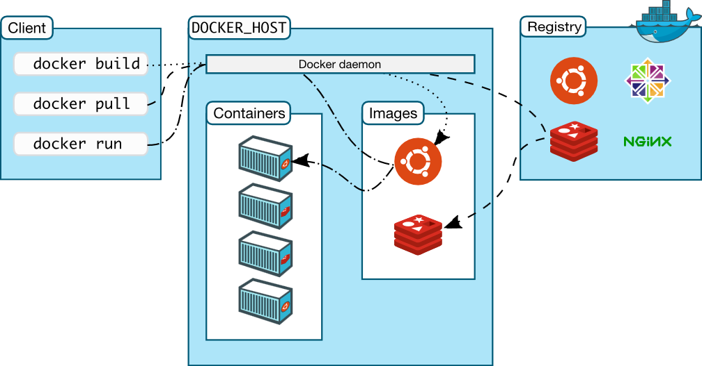
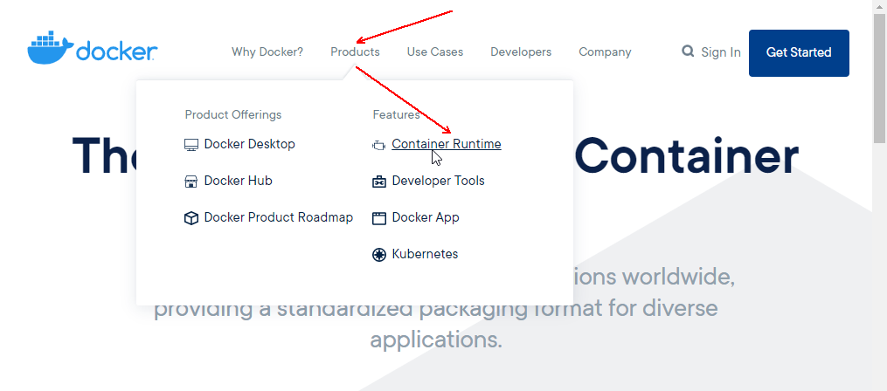
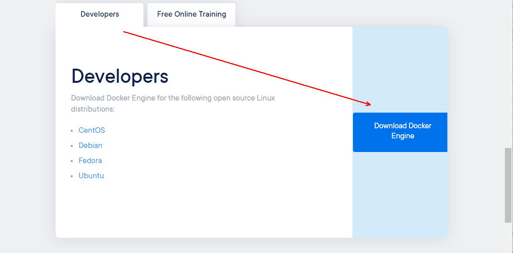
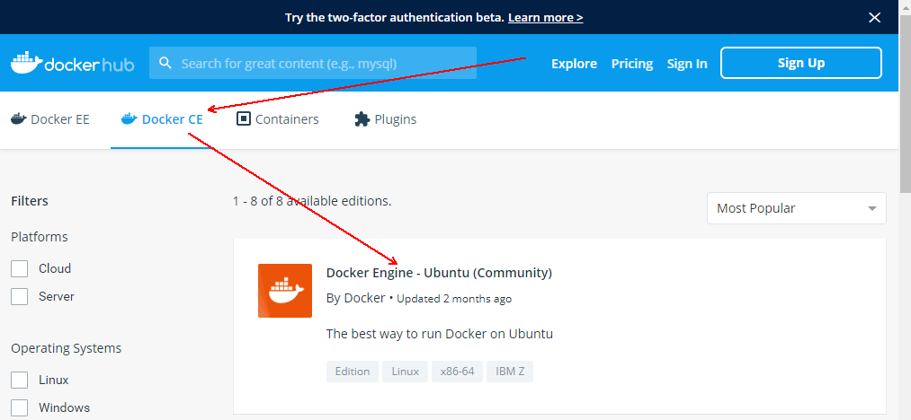
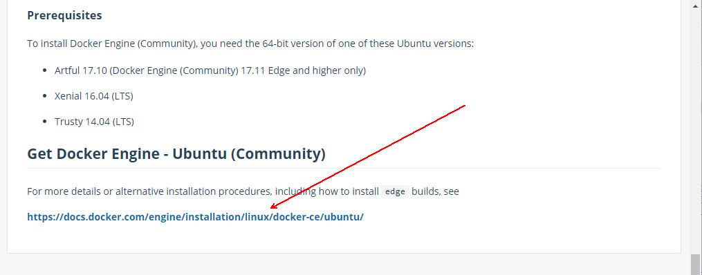
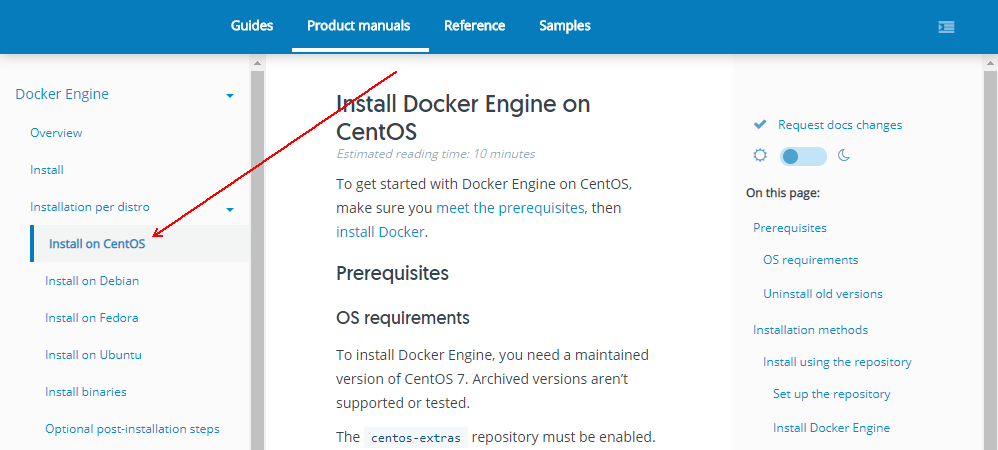
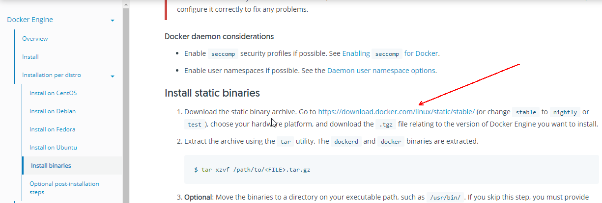
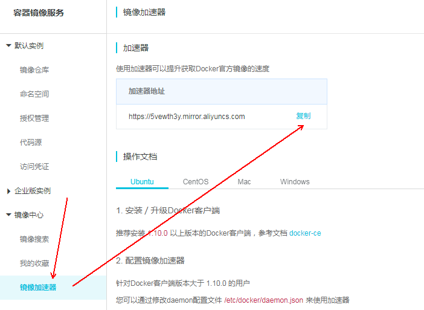

= dockre
Author 卢冬榕
:doctype: article
:encoding: utf-8
:lang: en
:toc: left
:numbered:

= docker

== `docker` 是什么？

Docker is an open platform for developing, shipping, and running applications.

[NOTE]
====
https://docs.docker.com/get-started/overview/
====

- 代码托管

https://github.com/docker/docker-ce

=== `docker` 具备哪些解决能力？

Docker provides the ability to package and run an application in a loosely isolated environment called a container.

[NOTE]
====
https://docs.docker.com/get-started/overview/
====

==== 什么是 '容器'？

Containers are an abstraction at the app layer that packages code and dependencies together. Multiple containers can run on the same machine and share the OS kernel with other containers, each running as isolated processes in user space.

[NOTE]
====
https://www.docker.com/resources/what-container
====

=== `docker` 的工作原理是什么？

Docker uses a client-server architecture. The Docker client and daemon communicate using a REST API, over UNIX sockets or a network interface.

== 搭建 `docker` 环境

=== 下载 `docker`

[NOTE]
====
https://www.docker.com/products/container-runtime
====

==== 下载 `Ubuntu` 版 `docker`

[NOTE]
====
https://hub.docker.com/search?q=&type=edition&offering=community
====

[NOTE]
====
https://hub.docker.com/editions/community/docker-ce-server-ubuntu
====

==== 下载 `Centos` 版 `docker`

[NOTE]
====
https://docs.docker.com/engine/install/centos/
====

==== 下载 `Docker` 的 `binaries`

[NOTE]
====
https://docs.docker.com/engine/install/binaries/
====

[source,]
----
wget https://download.docker.com/linux/static/stable/x86_64/docker-18.09.6.tgz
----

=== 安装 `docker`

推荐您在Ubuntu下面安装，因为docker是在Ubuntu下面开发的，安装包测试比较充分，可以保证软件包的可用性。

[NOTE]
====
http://www.docker.org.cn/book/install/install-docker-trusty-14.04-26.html
====

- `ubuntu` 支持版本。

Eoan 19.10 Bionic 18.04 (LTS) Xenial 16.04 (LTS)

[NOTE]
====
https://docs.docker.com/engine/install/ubuntu/
====

==== 在 `ubuntu-18.04` 上通过 `apt` 安装 `18.09.6`

推荐通过 `repository` 安装，方便安装和升级的有点。

[NOTE]
====
https://docs.docker.com/engine/install/ubuntu/#install-using-the-repository
====

===== 安装 `Docker Engine`

卸载旧版本 `Docker`

[source,sh]
----
$ sudo apt-get remove docker docker-engine docker.io containerd runc
----

SET UP THE REPOSITORY

[source,sh]
----
$ sudo apt-get update
$ sudo apt-get install apt-transport-https \
​    ca-certificates \
​    curl \
​    gnupg-agent \
​    software-properties-common
----

添加Docker的官方GPG密钥

[source,sh]
----
$ curl -fsSL https://download.docker.com/linux/ubuntu/gpg | sudo apt-key add -
----

查看秘钥列表

[source,sh]
----
$ apt-key list
----

验证当前是否拥有密钥

[source,sh]
----
$ sudo apt-key fingerprint 0EBFCD88
----

添加Docker的官方源

[source,sh]
----
$ sudo add-apt-repository \
   "deb [arch=amd64] https://download.docker.com/linux/ubuntu \
   $(lsb_release -cs) \
   stable"
----

更新本地源索引

[source,sh]
----
$ sudo apt-get update
----

获取版本信息

[source,sh]
----
$ apt-cache madison docker-ce
----

安装指定版本的 `Docker Engine`

[source,]
----
# 格式
$ sudo apt-get install \
  docker-ce=<versiong_string> \
  docker-ce-cli=<versiong_string> \
  containerd.io

# 样例
$ sudo apt-get install \
  docker-ce=5:19.03.8~3-0~ubuntu-bionic \
  docker-ce-cli=5:19.03.8~3-0~ubuntu-bionic \
  containerd.io
----

安装最新版本的 `Docker Engine`

[source,]
----
$ sudo apt-get update
$ sudo apt-get install docker-ce docker-ce-cli containerd.io
----

安装信息

[source,text]
----
Created symlink /etc/systemd/system/multi-user.target.wants/containerd.service → /lib/systemd/system/containerd.service.

...

Created symlink /etc/systemd/system/multi-user.target.wants/docker.service → /lib/systemd/system/docker.service.

Created symlink /etc/systemd/system/sockets.target.wants/docker.socket → /lib/systemd/system/docker.socket.
----

== 维护 `某某` 环境

=== manage docker as a non-root user.

[NOTE]
====
https://docs.docker.com/engine/install/linux-postinstall/
====

[source,]
----
$ sudo groupadd docker
$ sudo usermod -aG docker $USER
$ newgrp docker
$ docker run hello-world
$ sudo chown "$USER":"$USER" /home/"$USER"/.docker -R
$ sudo chmod g+rwx "$HOME/.docker" -R
----

=== not support cgroup swap limit

[NOTE]
====
https://docs.docker.com/engine/install/linux-postinstall/
====

On Ubuntu or Debian hosts, You may see messages similar to the following when working with an image.

WARNING: Your kernel does not support swap limit capabilities. Limitation discarded.

[source,sh]
----
$ sudo vi /etc/default/grub
----

GRUB_CMDLINE_LINUX="cgroup_enable=memory swapaccount=1"

[source,sh]
----
$ sudo update-grub
$ sudo reboot
----

=== Insecure registries and registry-mirrors

[NOTE]
====
https://cr.console.aliyun.com/cn-hangzhou/instances/mirrors
====

https://5vewth3y.mirror.aliyuncs.com

验证镜像地址的可用性

[source,sh]
----
$ docker pull docker.io/library/ubuntu:latest
$ docker rm ubuntu
$ docker pull 5vewth3y.mirror.aliyuncs.com/library/ubuntu:latest
$ docker rm ubuntu
$ sudo vi /etc/docker/daemon.json
{
​    "registry-mirrors":["https://5vewth3y.mirror.aliyuncs.com"],
​    "insecure-registry": ["192.168.41.32:5000","192.168.41.33:8082"]
}
$ sudo systemctl daemon-reload
$ sudo systemctl restart docker.service
$ sudo netstat -lntp | grep dockerd
----

=== registries>>废弃

[source,sh]
----
$ systemctl status docker
----

docker.service - Docker Application Container Engine

   Loaded: loaded (/lib/systemd/system/docker.service; enabled; vendor preset: disabled)

   Active: active (running) since 日 2018-05-13 10:02:21 CST; 14min ago

[source,sh]
----
$ vi /lib/systemd/system/docker.service
----

ExecStart=/usr/local/bin/dockerd --log-level=error --add-registry=192.168.80.129:5000

重启 `docker`

[source,sh]
----
$ sudo systemctl daemon-reload
$ sudo systemctl restart docker
----

查看Registries是否更改

[source,sh]
----
$ sudo docker info
----

Registry: https://192.168.80.129:5000/v1/

Experimental: false...

=== 远程启动

[NOTE]
====
https://docs.docker.com/engine/reference/commandline/dockerd/#daemon-configuration-file
====

On systems that use systemd to start the Docker daemon, -H is already set, so you cannot use the hosts key in daemon.json to add listening addresses.

[source,sh]
----
$ sudo vi /lib/systemd/system/docker.service
----

...

ExecStart=/usr/bin/dockerd -H fd:// --containerd=/run/containerd/containerd.sock

改成

ExecStart=/usr/bin/dockerd --containerd=/run/containerd/containerd.sock

==== systemd

[source,sh]
----
$ sudo systemctl edit docker.service
----

[source,text]
----
[Service]

ExecStart=

ExecStart=/usr/bin/dockerd -H fd:// -H tcp://127.0.0.1:2375
----

[source,sh]
----
$ sudo systemctl daemon-reload
$ sudo systemctl restart docker.service
$ sudo netstat -lntp | grep dockerd
----

==== daemon.json

[NOTE]
====
https://docs.docker.com/engine/reference/commandline/dockerd/#daemon-configuration-file
====

192.168.41.31机器 >> tcp://192.168.41.31:2375，192.168.41.32机器 >> tcp://192.168.41.32:2375...

[source,text]
----
$ sudo vi /etc/docker/daemon.json
{
    "hosts": ["unix:///var/run/docker.sock",
    "tcp://192.168.41.31:2375"]
}
----

[source,text]
----
$ sudo systemctl daemon-reload
$ sudo systemctl restart docker.service
$ sudo netstat -lntp | grep dockerd
----

=== Protect the Docker daemon socket

[NOTE]
====
https://docs.docker.com/engine/security/security/#docker-daemon-attack-surface

https://docs.docker.com/engine/security/https/
====

[source,sh]
----
$ mkdir -p /opt/n5/docker/work /opt/n5/docker/bin
----

==== 插件ca

[source,sh]
----
$ cd /opt/n5/docker/bin
$ cat > environment.sh <<EOF
#!/usr/bin/bash

#部署docker的机器IP

export NODE_IPS=(192.168.41.31 192.168.41.32 192.168.41.33 192.168.41.34 192.168.41.35)

EOF

$ source environment.sh
$ cd /opt/n5/docker/work
$ cat > docker-csr.json <<EOF
{

  "CN": "docker",
  "hosts": [
​    "127.0.0.1",
​    "192.168.41.31",
​    "192.168.41.32",
​    "192.168.41.33",
​    "192.168.41.34",
​    "192.168.41.35"
  ],
  "key": {
​    "algo": "rsa",
​    "size": 2048
  },

  "names": [
​    {
​      "C": "CN",
​      "ST": "BeiJing",
​      "L": "BeiJing",
​      "O": "docker",
​      "OU": "opsnull"
​    }
  ]
}

EOF

$ cfssl gencert -ca=/etc/cert/n5/ca.pem \
  -ca-key=/etc/cert/n5/ca-key.pem \
  -config=/etc/cert/n5/ca-config.json \
  -profile=n5 docker-csr.json | cfssljson -bare docker

$ ls docker*
----

==== 分发ca

[source,sh]
----
$ su root
$ cd /opt/n5/docker/work
$ source /opt/n5/docker/bin/environment.sh

for node_ip in ${NODE_IPS[@]}
  do
    echo ">>> ${node_ip}"
    ssh root@${node_ip} "mkdir -p /etc/cert/docker"
    scp docker*.pem docker-csr.json root@${node_ip}:/etc/cert/docker
  done
----

==== 配置daemon.json

[source,sh]
----
$ sudo vi /etc/docker/daemon.json
{
​    "tlsverify": true,
​    "tlscacert": "/etc/cert/n5/ca.pem",
​    "tlscert": "/etc/cert/docker/docker.pem",
​    "tlskey": "/etc/cert/docker/docker-key.pem"
}

$ sudo systemctl daemon-reload
$ sudo systemctl restart docker.service
----

==== 验证

[source,sh]
----
$ docker -H=127.0.0.1:2375 version
----

Error response from daemon: Client sent an HTTP request to an HTTPS server.

验证

[source,sh]
----
$ docker --tlsverify --tlscacert=/etc/cert/n5/ca.pem \
  --tlscert=/etc/cert/docker/docker.pem \
  --tlskey=/etc/cert/docker/docker-key.pem \
  -H=127.0.0.1:2375 version
----

验证

[source,sh]
----
$ curl https://127.0.0.1:2375/images/json \
  --cert /etc/cert/docker/docker.pem \
  --key /etc/cert/docker/docker-key.pem \
  --cacert /etc/cert/n5/ca.pem
----

[{"Containers":-1,"Created":1578014497,"Id":"sha256:bf756fb1ae65adf866bd8c456593cd24beb6a0a061dedf42b26a993176745f6b","Labels":null,"ParentId":"","RepoDigests":["hello-world@sha256:8e3114318a995a1ee497790535e7b88365222a21771ae7e53687ad76563e8e76"],"RepoTags":["hello-world:latest"],"SharedSize":-1,"Size":13336,"VirtualSize":13336}]

[source,sh]
----
$ curl https://192.168.41.31:2375/images/json \
  --cert /etc/cert/docker/docker.pem \
  --key /etc/cert/docker/docker-key.pem \
  --cacert /etc/cert/n5/ca.pem
----

==== 测试

[source,sh]
----
$ sudo docker info
----

[source,text]
----
Docker Root Dir: /var/lib/docker
Debug Mode: false
Registry: https://index.docker.io/v1/
Insecure Registries: 127.0.0.0/8
----

[source,sh]
----
$ sudo docker run hello-world
----

[source,text]
----
Unable to find image 'hello-world:latest' locally
latest: Pulling from library/hello-world
0e03bdcc26d7: Pull complete 
Digest: sha256:8e3114318a995a1ee497790535e7b88365222a21771ae7e53687ad76563e8e76
Status: Downloaded newer image for hello-world:latest
----

=== 卸载

[source,sh]
----
$ sudo apt-get purge docker-ce docker-ce-cli containerd.io
$ sudo rm -rf /var/lib/docker
----

=== 访问私有仓库

docker证书存放目录

[NOTE]
====
https://docs.docker.com/engine/security/certificates/
====

[source,text]
----
/etc/docker/certs.d/        <-- Certificate directory
    └── localhost:5000          <-- Hostname:port
       ├── client.cert          <-- Client certificate
       ├── client.key           <-- Client key
       └── ca.crt               <-- Certificate authority that signed
----

the registry certificate

==== ca

[source,sh]
----
$ ll /etc/cert/n5
----

[source,text]
----
/etc/cert/n5/ca-config.json
/etc/cert/n5/ca-key.pem
/etc/cert/n5/ca.pem
----

分发 ca

[source,sh]
----
$ export HARBOR_NODE_IP=192.168.41.33:8082
$ export DOCKER_NODE_LIST=(192.168.41.31 192.168.41.32 192.168.41.33 192.168.41.33 192.168.41.34 192.168.41.35)

for docke_node_ip in ${DOCKER_NODE_LIST[@]}
  do
    echo ">>> ${docke_node_ip}"
    ssh root@${docke_node_ip} "mkdir -p /etc/docker/certs.d/${HARBOR_NODE_IP}"
    scp /etc/cert/n5/n5.pem root@${docke_node_ip}:/etc/docker/certs.d/${HARBOR_NODE_IP}/client.cert
    scp /etc/cert/n5/n5-key.pem root@${docke_node_ip}:/etc/docker/certs.d/${HARBOR_NODE_IP}/client.key
    scp /etc/cert/n5/ca.pem root@${docke_node_ip}:/etc/docker/certs.d/${HARBOR_NODE_IP}/ca.crt
    ssh root@${docke_node_ip} "systemctl daemon-reload"
    ssh root@${docke_node_ip} "systemc/tl restart docker"
  done
----

http

[source,sh]
----
$ systemctl status docker
$ vi /etc/docker/daemon.json
{
  "insecure-registries": ["192.168.41.31"]
}

$ sudo systemctl daemon-reload
$ sudo systemctl restart docker.service
----

https

[source,sh]
----
$ sudo systemctl daemon-reload
$ sudo systemctl restart docker.service
----

==== 替换默认仓库 

===== daemon.json方式

[NOTE]
====
https://docs.docker.com/engine/reference/commandline/dockerd/
====

[source,sh]
----
$ systemctl status docker
$ vi /etc/docker/daemon.json
{
  "registry-mirrors":["https://192.168.41.33:8082"],
  "insecure-registries": ["192.168.41.33:8082"]
}
$ sudo systemctl daemon-reload
$ sudo systemctl restart docker.service
----

删除旧镜像

[source,sh]
----
$ docker images
$ docker rmi -f bf756fb1ae65
----

测试pull

[source,sh]
----
$ docker pull hello-world
----

===== docker.service方式

https://docs.docker.com/registry/recipes/mirror/

[source,sh]
----
$ systemctl status docker
$ vi /lib/systemd/system/docker.service
----

在ExecStart=/usr/bin/dockerd  后追加参数 --registry-mirror=https://192.168.41.33:8082

[source,sh]
----
$ sudo systemctl daemon-reload
$ sudo systemctl restart docker.service
----

==== login >> harbor

[source,sh]
----
$ docker login 192.168.41.32
----

[source,text]
----
Username: admin

Password:
----

==== login >> nexus

group仓库

[source,sh]
----
$ docker login -u admin -p admin123 192.168.41.33:8082
----

local仓库

[source,sh]
----
$ docker login -u admin -p admin123 192.168.41.33:8083
----

==== 测试pull/push

[source,sh]
----
$ docker pull 192.168.41.33:8082/hello-world
----

[source,text]
----
Using default tag: latest

latest: Pulling from hello-world

Digest: sha256:90659bf80b44ce6be8234e6ff90a1ac34acbeb826903b02cfa0da11c82cbc042

Status: Downloaded newer image for 192.168.41.33:8082/hello-world:latest

192.168.41.33:8082/hello-world:latest
----

**访问私有仓库 >>错误**

x509: certificate signed by unknown authority

证书位置放错或者证书错误

**使用****Docker**

Docker CLI（Command-Line）

[NOTE]
====
https://docs.docker.com/engine/reference/commandline/docker/
====

=== 管理

\>>查看docker版本

[source,sh]
----
$ sudo docker version
----

\>>查看docker安装信息

[source,sh]
----
$ sudo docker -H 192.168.41.31 info
----

\>>docker命令帮助文档

[source,sh]
----
$ sudo docker stats --help
----

**docker启停**

\>>service

[source,sh]
----
$ service docker {start|stop|restart|status}

# 样例
$ sudo systemctl restart docker.service
----

\>>systemctl

[source,sh]
----
$ sudo systemctl daemon-reload
$ sudo systemctl restart docker
----

\>>启动docker程序

[source,sh]
----
$ systemctl daemon-reload
$ systemctl start docker
$ systemctl enable docker
----

**docker>>增加映射端口**

[source,sh]
----
$ cd /var/lib/docker/containers/[hash_of_the_container]
$ vi hostconfig.json
----

"8443/tcp":[{"HostIp":"","HostPort":"8443"}]

[source,sh]
----
$ vi config.v2.json
----

ExposedPorts":{"8443/tcp":{}}

service docker restart

**仓库管理**

**搜索**

\>>到Docker Hub网址上搜索

https://hub.docker.com/

\>>使用命令来搜索镜像

[source,sh]
----
$ docker search ubuntu
----

**拉取**

[source,sh]
----
$ docker pull ubuntu
$ docker pull 192.168.41.33:8082/nginx:1.18.0
----

[source,]
----
[Service]

Environment="HTTP_PROXY=https://192.168.41.33:8082"
----

**推送**

[source,sh]
----
$ docker push username/ubuntu:18.04
----

\#1.标记镜像

[source,sh]
----
$ docker tag {镜像名}:{tag} {Harbor地址}:{端口}/{Harbor项目名}/{自定义镜像名}:{自定义tag}

$ docker tag goharbor/harbor-migrator:v1.10.1 192.168.235.31/library/harbor-migrator:v1.10.1
----

\#2.push 到Harbor

[source,sh]
----
$ docker push {Harbor地址}:{端口}/{自定义镜像名}:{自定义tag}

$ docker push 192.168.235.31/library/harbor-migrator:v1.10.1

# pull 到本地
$ docker pull 192.168.2.108：5000/test/harbor-adminserver:v1.1.0
----

**推送 >> 批量推送**

[source,sh]
----
readonly old_repo=k8s.gcr.io
readonly new_repo=192.168.235.31/library
for image in $(docker images --format '{{.Repository}}:{{.Tag}}'); do
​	name=${image##*/}
​	new_img=${new_repo}/${name}
​	echo "Processing ${image} -> ${new_img}"
​	docker tag ${image} ${new_img}
​	docker push ${new_img}
done

for i in $(docker images | grep zabbix | awk 'BEGIN{OFS=":"}{print $1,$2}'); do 
  docker push $i;
done
----

**登录**

[source,sh]
----
$ docker login
----

**退出**

[source,sh]
----
$ docker logout
----

**加载**

[source,sh]
----
$ docker load [OPTIONS] <文件>
----

OPTIONS说明

-i：从tar文件读取

-q：禁止读入输出

**保存**

[source,sh]
----
$ docker save 0245d66323de -o /opt/docker/chartmuseum-photon.tar
----

**镜像管理**

**列表**

[source,sh]
----
$ docker images
----

[source,text]
----
REPOSITORY：表示镜像的仓库源
TAG：镜像的标签
IMAGE ID：镜像ID
CREATED：镜像创建时间
SIZE：镜像大小
----

同一仓库源可以有多个 TAG，代表这个仓库源的不同个版本，如 ubuntu 仓库源里，

有 15.10、14.04 等多个不同的版本，我们使用 REPOSITORY:TAG 来定义不同的镜像。

**导入**

[source,]
----
cat docker/ubuntu.tar | docker import - test/ubuntu:v1
----

将快照文件 ubuntu.tar 导入到镜像 test/ubuntu:v1:

[source,]
----
docker import http://example.com/exampleimage.tgz example/imagerepo
----

通过指定 URL 或者某个目录来导入

**导出**

[source,]
----
docker export 1e560fca3906 > ubuntu.tar
----

**删除**

[source,]
----
$ docker rmi [镜像名|镜像ID]

$ docker rmi [镜像名|镜像ID] [镜像名|镜像ID]
----

强制删除

[source,]
----
$ docker rmi -f [镜像名|镜像ID]
----

删除全部

[source,]
----
$ docker rmi -f $(docker images -qa) 
----

docker tag 860c279d2fec runoob/centos:dev

docker tag 镜像ID，这里是 860c279d2fec ,用户名称、镜像源名(repository name)和新的标签名(tag)。

使用 docker images 命令可以看到，ID为860c279d2fec的镜像多一个标签。
[source,]
----
docker commit -m="has update" -a="runoob" e218edb10161 runoob/ubuntu:v2
----

各个参数说明：

-m: 提交的描述信息

-a: 指定镜像作者
[source,]
----
e218edb10161：容器 ID

runoob/ubuntu:v2: 指定要创建的目标镜像名

Dockerfile格式

FROM nginx

RUN echo '这是一个本地构建的nginx镜像' > /usr/share/nginx/html/index.html

RUN格式

RUN：用于执行后面跟着的命令行命令。有以下俩种格式：

shell 格式：

RUN <命令行命令>

\# <命令行命令> 等同于，在终端操作的 shell 命令。
----

exec 格式：

[source,]
----
RUN ["可执行文件", "参数1", "参数2"]
FROM centos
RUN yum install wget \
   && wget -O redis.tar.gz "http://download.redis.io/releases/redis-5.0.3.tar.gz" \
   && tar -xvf redis.tar.gz
----

**容器管理**

**运行容器**

[source,]
----
$ docker run ubuntu:15.10 /bin/echo "Hello world"
----

/bin/echo "Hello world": 在启动的容器里执行的命令

**运行容器（后台模式）**

[source,]
----
$ docker run -d ubuntu:15.10 /bin/sh -c "while true; do echo hello world; sleep 1; done"
----

输出

2b1b7a428627c51ab8810d541d759f072b4fc75487eed05812646b8534a2fe63

​          
**运行容器（启动带映射端口）**

[source,]
----
$ docker run -d -p 5000:5000 training/webapp python app.py
----

容器内部的 5000 端口映射到我们本地主机的 5000 端口上

**运行容器（交互方式）**

[source,]
----
$ docker run -i -t ubuntu:15.10 /bin/bash
----

-t->在新容器内指定一个伪终端或终端。

-i->允许你对容器内的标准输入 (STDIN) 进行交互。

通过运行 exit 命令或者使用 CTRL+D 来退出容器。

**进入容器**

[source,]
----
$ docker attach 1e560fca3906 

$ docker exec 1e560fca3906
----

推荐大家使用 docker exec 命令，因为此退出容器终端，不会导致容器的停止。

**挂载目录**

依据于【https://docs.docker.com/storage/volumes/】

[source,]
----
$ docker run -i -t -v /root/software/:/mnt/software/ 9f38484d220f /bin/bash
----

**查看容器**

$ sudo docker ps

输出详情介绍：
[source,]
----
CONTAINER ID: 容器 ID。

IMAGE: 使用的镜像。

COMMAND: 启动容器时运行的命令。

CREATED: 容器的创建时间。

STATUS: 容器状态。状态有7种。

PORTS: 容器的端口信息和使用的连接类型（tcp\udp）。

NAMES: 自动分配的容器名称。
----

容器状态
[source,]
----
created（已创建）

restarting（重启中）

running（运行中）

removing（迁移中）

paused（暂停）

exited（停止）

dead（死亡）
----

**查看端口**

docker port

**查看容器内部的标准输出**

docker logs -f bf08b7f2cd89

-f->持续输出

**查看底层**

docker inspect wizardly_chandrasekhar

**查看进程**

docker top wizardly_chandrasekhar

**停止/重启**

[source,]
----
$ docker stop/start/kill/restart /rm 容器名字或者ID
$ docker stop amazing_cori
----

== 使用 `docker`

=== 制作镜像

[source,sh]
----
$ mkdir dockerfile/jdk8
$ tee dockerfile <<-'EOF'
FROM ubuntu:latest
COPY jdk1.8.0_45 /usr/local
ENV JAVA_HOME /usr/local/jdk1.8.0_45
EOF

$ cd dockerfile/jdk8
$ cat dockerfile
$ docker build -t jdk8:fjnsn .
----

==== 环境变量 >> ENV

[source,sh]
----
ENV <key> <value>
ENV <key1>=<value1> <key2>=<value2>...
----

以下示例设置 NODE_VERSION = 7.2.0，在后续的指令中可以通过 $NODE_VERSION 引用：

[source,sh]
----
ENV NODE_VERSION 7.2.0
RUN curl -SLO "https://nodejs.org/dist/v$NODE_VERSION/node-v$NODE_VERSION-linux-x64.tar.xz" \
 && curl -SLO "https://nodejs.org/dist/v$NODE_VERSION/SHASUMS256.txt.asc"
----

==== 环境变量 >> ARG

构建参数，与 ENV 作用一至。不过作用域不一样。ARG 设置的环境变量仅对 Dockerfile 内有效，也就是说只有 docker build 的过程中有效，构建好的镜像内不存在此环境变量。

构建命令 docker build 中可以用 --build-arg <参数名>=<值> 来覆盖。

[source,sh]
----
ARG <参数名>[=<默认值>]
----

==== 环境变量 >> FROM

[source,sh]
----
FROM <镜像名称>
----

==== 复制 >>  COPY

[source,sh]
----
COPY [--chown=<user>:<group>] <源路径1>... <目标路径>
COPY [--chown=<user>:<group>] ["<源路径1>",... "<目标路径>"
----

[source,sh]
----
COPY hom* /mydir/
COPY hom?.txt /mydir/
----

通配符规则要满足 Go 的 filepath.Match 规则

==== 复制 >> ADD

ADD 指令和 COPY 的使用格式一致（同样需求下，官方推荐使用 COPY）。功能也类似，不同之处如下：

- ADD 的优点：在执行 <源文件> 为 tar 压缩文件的话，压缩格式为 gzip, bzip2 以及 xz 的情况下，会自动复制并解压到 <目标路径>。
- ADD 的缺点：在不解压的前提下，无法复制 tar 压缩文件。会令镜像构建缓存失效，从而可能会令镜像构建变得比较缓慢。具体是否使用，可以根据是否需要自动解压来决定。

==== RUN

RUN 是在 docker build。控制RUN次数，避免镜像膨胀。

[source,sh]
----
RUN ["可执行文件", "参数1", "参数2"]
----

样例

[source,sh]
----
RUN ["./test.php", "dev", "offline"] 等价于 RUN ./test.php dev offline
----

<命令行命令> 等同于，在终端操作的 shell 命令。

[source,]
----
RUN yum install wget \
  && wget -O redis.tar.gz "http://download.redis.io/releases/redis-5.0.3.tar.gz" \
  && tar -xvf redis.tar.gz
----

==== CMD

CMD 在docker run 时运行。如果存在多个 CMD 指令，仅最后一个生效。CMD 指令指定的程序可被 docker run 命令行参数中指定要运行的程序所覆盖。

[source,]
----
CMD <shell 命令> 
CMD ["<可执行文件或命令>","<param1>","<param2>",...] 
CMD ["<param1>","<param2>",...] 
----

==== ENTRYPOINT

类似于 CMD 指令，但其不会被 docker run 的命令行参数指定的指令所覆盖，而且这些命令行参数会被当作参数送给 ENTRYPOINT 指令指定的程序。但是, 如果运行 docker run 时使用了 --entrypoint 选项，此选项的参数可当作要运行的程序覆盖 ENTRYPOINT 指令指定的程序。

- 优点：在执行 docker run 的时候可以指定 ENTRYPOINT 运行所需的参数。

注意：如果 Dockerfile 中如果存在多个 ENTRYPOINT 指令，仅最后一个生效。

[source,]
----
ENTRYPOINT ["nginx", "-c"] # 定参
CMD ["/etc/nginx/nginx.conf"] # 变参 
----

[source,]
----
# 不传参运行
$ docker run nginx:test

# 容器内会默认运行以下命令，启动主进程。
$ nginx -c /etc/nginx/nginx.conf

# 传参运行
$ docker run nginx:test -c /etc/nginx/new.conf

# 容器内会默认运行以下命令，启动主进程(/etc/nginx/new.conf:假设容器内已有此文件)
$ nginx -c /etc/nginx/new.conf

ENTRYPOINT ["<executeable>","<param1>","<param2>",...]

- 该写法是为 ENTRYPOINT 指令指定的程序提供默认参数
- 推荐使用第二种格式，执行过程比较明确。第一种格式实际上在运行的过程中也会自动转换成第二种格式运行，并且默认可执行文件是 sh。

FROM nginx

ENTRYPOINT ["nginx", "-c"] # 定参

CMD ["/etc/nginx/nginx.conf"] # 变参 
----

==== 数据卷

定义匿名数据卷。在启动容器时忘记挂载数据卷，会自动挂载到匿名卷。作用：避免重要的数据，因容器重启而丢失，这是非常致命的。避免容器不断变大。

格式：

[source,sh]
----
VOLUME ["<路径1>", "<路径2>"...]
VOLUME <路径>
----

在启动容器 docker run 的时候，我们可以通过 -v 参数修改挂载点。

==== 声明端口

帮助镜像使用者理解这个镜像服务的守护端口，以方便配置映射。在运行时使用随机端口映射时，也就是 docker run -P 时，会自动随机映射 EXPOSE 的端口。

格式：

[source,sh]
----
EXPOSE <端口1> [<端口2>...]
----

==== 工作目录

指定工作目录。用 WORKDIR 指定的工作目录，会在构建镜像的每一层中都存在。（WORKDIR 指定的工作目录，必须是提前创建好的）。docker build 构建镜像过程中的，每一个 RUN 命令都是新建的一层。只有通过 WORKDIR 创建的目录才会一直存在。WORKDIR <工作目录路径>

==== 指定执行后续命令的用户和用户组

这边只是切换后续命令执行的用户（用户和用户组必须提前已经存在）。USER <用户名>[:<用户组>]

==== 指定程序监控 docker 容器服务的运行状态

[source,sh]
----
HEALTHCHECK [选项] CMD <命令>：设置检查容器健康状况的命令
HEALTHCHECK NONE：如果基础镜像有健康检查指令，使用这行可以屏蔽掉其健康检查指令
HEALTHCHECK [选项] CMD <命令> : 这边 CMD 后面跟随的命令使用，可以参考 CMD 的用法。
ONBUILD
----

用于延迟构建命令的执行。简单的说，就是 Dockerfile 里用 ONBUILD 指定的命令，在本次构建镜像的过程中不会执行（假设镜像为 test-build）。当有新的 Dockerfile 使用了之前构建的镜像 FROM test-build ，这是执行新镜像的 Dockerfile 构建时候，会执行 test-build 的 Dockerfile 里的 ONBUILD 指定的命令。

格式：

ONBUILD <其它指令>

==== 创建

[source,]
----
docker build -t runoob/centos:6.7 .
----

- -t

指定要创建的目标镜像名

- .

Dockerfile 文件所在目录，可以指定Dockerfile 的绝对路径

[source,sh]
----
docker pull mirrorgooglecontainers/kube-apiserver-amd64:v1.11.3

docker pull mirrorgooglecontainers/kube-controller-manager-amd64:v1.11.3

docker pull mirrorgooglecontainers/kube-scheduler-amd64:v1.11.3

docker pull mirrorgooglecontainers/kube-proxy-amd64:v1.11.3

docker pull mirrorgooglecontainers/pause:3.1

docker pull mirrorgooglecontainers/etcd-amd64:3.2.18

docker pull coredns/coredns:1.1.3

docker save -o mirrorgooglecontainers1.tar \
  mirrorgooglecontainers/kube-proxy-amd64:v1.11.3  \
----
  
= docker-component

== `docker-component` 是什么？

Compose is a tool for defining and running multi-container Docker applications.

[NOTE]
====
https://docs.docker.com/compose/
====

=== `docker-component` 具备哪些解决能力？

defining and running multi-container Docker applications.

[NOTE]
====
https://docs.docker.com/compose/
====

== 搭建 `docker-component` 环境

[NOTE]
====
https://docs.docker.com/compose/install/
====

=== `docker-component` 环境依赖条件？

- docker

=== 在 `linux` 上搭建 `docker-component`

[source,sh]
----
$ sudo curl -L "https://github.com/docker/compose/releases/download/1.28.6/docker-compose-$(uname -s)-$(uname -m)" -o /usr/local/bin/docker-compose
$ sudo chmod +x /usr/local/bin/docker-compose
$ sudo ln -s /usr/local/bin/docker-compose /usr/bin/docker-compose
----

=== 验证 `docker-component` 环境

[source,sh]
----
$ docker-compose --version
----

=== 下载 `docker-component`

==== 下载 1.26.0-rc4

[source,sh]
----
$ wget https://github.com/docker/compose/releases/download/1.26.0-rc4/docker-compose-Linux-x86_64
----

==== 下载 1.25.5

[source,sh]
----
$ wget https://github.com/docker/compose/releases/download/1.25.5/docker-compose-Linux-x86_64
----

[NOTE]
====
https://github.com/docker/compose/releases
====

[source,]
----
$ sudo mkdir -p /opt/n5/docker-component/bin
$ sudo mkdir -p /opt/n5/docker-component/work
$ sudo cd /opt/n5/docker-component/work
$ wget https://github.com/docker/compose/releases/download/1.21.2/docker-compose-Linux-x86_64
----

== 使用 `docker-component`

[NOTE]
====
https://docs.docker.com/compose/reference/
====

[source,sh]
----
docker-compose up
docker-compose up <SERVICE>
docker-compose up [options] [--scale SERVICE=NUM...] [SERVICE...]
----

= docker-machine

== `docker-machine` 是什么？

Docker Machine is a tool that lets you install Docker Engine on virtual hosts, and manage the hosts with docker-machine commands. You can use Machine to create Docker hosts on your local Mac or Windows box, on your company network, in your data center, or on cloud providers like Azure, AWS, or DigitalOcean.

[NOTE]
====
https://docs.docker.com/machine/
====

=== `docker-machine` 具备哪些解决能力？

- Install and run Docker on Mac or Windows
- Provision and manage multiple remote Docker hosts
- Provision Swarm clusters

[NOTE]
====
https://docs.docker.com/machine/
====

=== `docker-machine` 的工作原理是什么？

image::./README/docker-machine.png[align="center"]

==== `docker-machine` 跟 `docker-engine` 的差异

You can use Machine to install Docker Engine on one or more virtual systems. These virtual systems can be local (as when you use Machine to install and run Docker Engine in VirtualBox on Mac or Windows) or remote (as when you use Machine to provision Dockerized hosts on cloud providers). The Dockerized hosts themselves can be thought of, and are sometimes referred to as, managed “machines”.

[NOTE]
====
https://docs.docker.com/machine/
====

== 搭建 `docker-machine` 环境

=== `docker-machine` 环境依赖条件？

- docker

=== 下载 `docker-machine`

==== linux 系统

[source,sh]
----
$base=https://github.com/docker/machine/releases/download/v0.16.0 &&
  curl -L $base/docker-machine-$(uname -s)-$(uname -m) > /tmp/docker-machine &&
  sudo mv /tmp/docker-machine /usr/local/bin/docker-machine &&
  chmod +x /usr/local/bin/docker-machine
----

==== window 系统 git bash

[source,sh]
----
$base=https://github.com/docker/machine/releases/download/v0.16.0 &&
  mkdir -p "$HOME/bin" && 
  curl -L $base/docker-machine-Windows-x86_64.exe > "$HOME/bin/docker-machine.exe" &&
  sudo mv /tmp/docker-machine /usr/local/bin/docker-machine &&
  chmod +x "$HOME/bin/docker-machine.exe"
----

=== 验证 `docker-machine` 环境

[source,sh]
----
$ sudo docker-machine version
----

=== Install bash completion scripts

The Machine repository supplies several bash scripts that add features such as:

- command completion
- a function that displays the active machine in your shell prompt
- a function wrapper that adds a docker-machine use subcommand to switch the active machine

[source,]
----
base=https://raw.githubusercontent.com/docker/machine/v0.16.0
for i in docker-machine-prompt.bash docker-machine-wrapper.bash docker-machine.bash
do
  sudo wget "$base/contrib/completion/bash/${i}" -P /etc/bash_completion.d
done

# in your bash terminal to tell your setup where it can find the file docker-machine-prompt.bash that you previously downloaded.
$ source /etc/bash_completion.d/docker-machine-prompt.bash

# To enable the docker-machine shell prompt, add $(__docker_machine_ps1) to your PS1 setting in ~/.bashrc.
PS1='[\u@\h \W$(__docker_machine_ps1)]\$ '
----

[NOTE]
====
https://docs.docker.com/machine/install-machine/
====

== 使用 `docker-machine`

[NOTE]
====
https://docs.docker.com/machine/reference/
====

[source,sh]
----
# 移除
$ docker-machine rm <machine-name>
# 移除（所有）
$ docker-machine rm -f $(docker-machine ls -q)
# 删除
$ rm $(which docker-machine)

# kill
$ docker-machine ls
$ docker-machine kill dev
----

= swarm

== `swarm` 是什么？

A Docker Swarm is a group of either physical or virtual machines that are running the Docker application and that have been configured to join together in a cluster. 

[NOTE]
====
https://www.sumologic.com/glossary/docker-swarm/
====

Do not confuse Docker Swarm mode with Docker Classic Swarm which is no longer actively developed.

[NOTE]
====
https://docs.docker.com/engine/swarm/
====

=== `swarm` 具备哪些解决能力？

Docker swarm is a container orchestration tool, meaning that it allows the user to manage multiple containers deployed across multiple host machines.

[NOTE]
====
https://www.sumologic.com/glossary/docker-swarm/
====

== 搭建 `swarm` 环境

=== `swarm` 环境依赖条件？

- install docker engine on linux machines

- open protocols and ports between the hosts

[NOTE]
====
https://docs.docker.com/engine/swarm/swarm-tutorial/
====

=== 安装 `swarm`

[source,]
----
$ docker swarm init --advertise-addr 192.168.41.33
$ docker swarm join-token worker
----

[NOTE]
====
https://docs.docker.com/engine/swarm/swarm-tutorial/create-swarm/
====

== 使用 `swarm`

=== docker swarm join

[source,]
----
$ docker swarm join \
 --token SWMTKN-1-49nj1cmql0jkz5s954yi3oex3nedyz0fb0xx14ie39trti4wxv-8vxv8rssmk743ojnwacrr2e7c \
 192.168.41.33:2377

$ docker swarm join \
 --token SWMTKN-1-49nj1cmql0jkz5s954yi3oex3nedyz0fb0xx14ie39trti4wxv-8vxv8rssmk743ojnwacrr2e7c \
 192.168.41.33:2377
----

[NOTE]
====
https://docs.docker.com/engine/swarm/swarm-tutorial/add-nodes/
====

=== docker node

[source,]
----
# 删除down状态的节点
$ docker node rm sprkw7t8irlb4l3dtvwszpdjj

# 删除active状态的节点
$ docker node rm --force sprkw7t8irlb4l3dtvwszpdjj

# 分配
# 调度程序不会将新任务分配给节点。
# 调度程序关闭任何现有任务并在可用节点上安排它们。
$ docker node update --availability drain work-node1

# 调度程序可以将任务分配给节点
$ docker node update --availability active work-node1

# 调度程序不向节点分配新任务，但是现有任务仍然保持运行
$ docker node update --availability pause work-node1

# 查看节点信息
$ docker node inspect work-node1 --pretty
# 将节点升级为manager
$ docker node promote work-node1
# 将节点降级为worker
$ docker node demote work-node1
$ docker service ls
$ docker service ps web
----

=== docker service

[source,sh]
----
$ docker service inspect --pretty <SERVICE-ID>/<SERVICE-NAME>
$ docker service create --name web --replicas 3 -p 80:80 nginx
$ docker service rm web

# 缩放
$ docker service scale web=5
# 回滚
$ docker service update --rollback mysql
# 为指定的服务删除一个开放端口
$ docker service update --publish-rm 8080:80 web
# 为指定的服务添加一个开放端口
$ docker service update --publish-add 8080:80 web

# 升级
$ docker service update --image nginx:1.13.12 nginx-dev

# 每次更新两个副本，间隔时间一分半钟
$ docker service update --replicas 6 --update-parallelism 2 --update-delay 1m30s nginx-dev
----