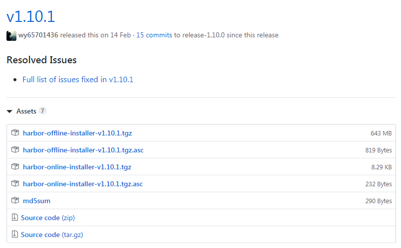
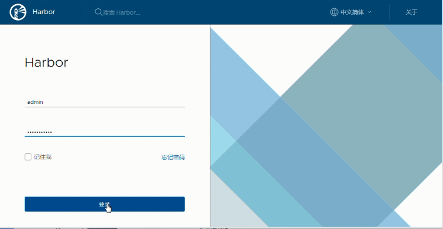
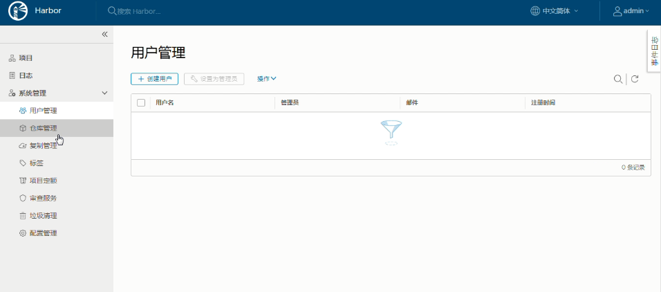
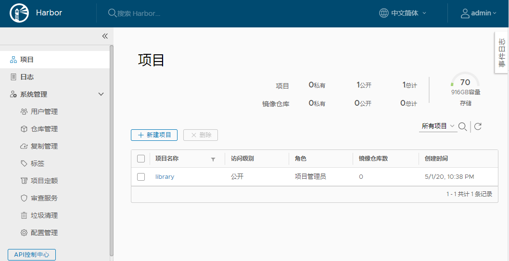
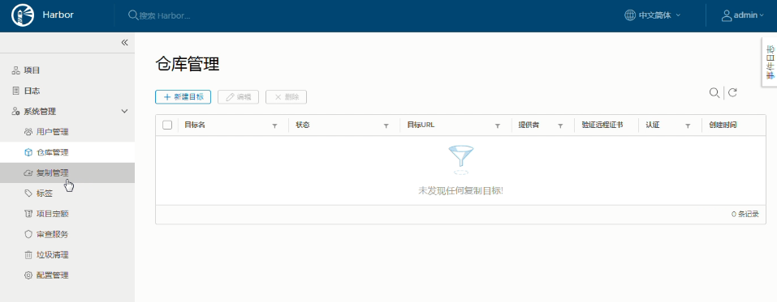

= harbor
Author 卢冬榕
:doctype: article
:encoding: utf-8
:lang: en
:toc: left
:numbered:

= Harbor

== `Harbor` 是什么？

`Harbor` 是开源镜像管理软件，基于角色控制权限。 

[NOTE]
====
https://goharbor.io
====

- 代码托管 - https://github.com/goharbor/harbor

- webhook - https://goharbor.io/docs/1.10/working-with-projects/project-configuration/configure-webhooks/

=== `Harbor` 的能力

`Harbor` 支持拉、推、删除、标记、复制和扫描镜像。

[NOTE]
====
https://github.com/goharbor/harbor/wiki/Architecture-Overview-of-Harbor
====

==== `Harbor` 跟 `同类` 的差异

https://github.com/goharbor/harbor

- Cloud native registry

- Role based access control

- LDAP/AD support

- ...

=== `harbor` 的原理

https://github.com/goharbor/harbor/wiki/Architecture-Overview-of-Harbor

用户可以管理镜像。拉、推、删除...

image::./README/2021-05-06_09-32-01.png[align="center"]

== 搭建 `Harbor` 环境

=== 依赖环境

https://goharbor.io/docs/2.2.0/install-config/installation-prereqs/

- Hardware

[width="100%",options="header"]
|====================
| Resource | Minimum | Recommended
| CPU      | 2CPU    | 4CPU       
| Mem      | 4GB     | 8GB        
| Disk     | 40G     | 160G       
|====================

- Software

[width="100%",options="header"]
|====================
| 软件           |  版本                 | 描述
| Docker engine  | 17.06.0-ce+ or higher | https://docs.docker.com/engine/installation/[documentation]
| Docker Compose | 1.18.0 or higher      | https://docs.docker.com/compose/install/[documentation]
| Openssl        | latest                | ...
|====================

- Network ports

[width="100%",options="header"]
|====================
| Port | Protocol | Description
| 443  | HTTPS    | Harbor portal
| 4443 | HTTPS    | Connections to the Docker Content Trust service for Harbor
| 80   | HTTP     | Harbor portal 
|====================

=== 下载软件

下载在线安装程序或离线安装程序。

[NOTE]
====
https://goharbor.io/docs/1.10/install-config/download-installer/
====

==== 发布地址

https://github.com/goharbor/harbor/releases

===== 下载地址

- 下载offline->离线版

[source,sh]
----
wget https://github.com/goharbor/harbor/releases/download/v1.10.2/harbor-offline-installer-v1.10.2.tgz
----

- 下载online->在线版

[source,sh]
----
wget https://github.com/goharbor/harbor/releases/download/v1.10.2/harbor-online-installer-v1.10.2.tgz
----

=== 在 `Docker` 上搭建 `Harbor`

==== 下载 `v1.10.1`

[source,sh]
----
$ mkdir -p /opt/n5/harbor/work && mkdir -p /opt/n5/harbor/bin
$ cd /opt/n5/harbor/work
$ wget https://github.com/goharbor/harbor/releases/download/v1.10.2/harbor-offline-installer-v1.10.2.tgz
----

==== 安装 `v1.10.1`

[source,sh]
----
$ cd /opt/n5/harbor/work
$ tar -xzvf harbor-offline-installer-v1.10.1.tgz
$ cd /opt/n5/harbor
$ docker load -i harbor.v1.10.1.tar.gz
----

==== 创建 `CA证书`

- 如何创建 `CA证书` - https://github.com/ludongrong/devops-dev-net

[source,sh]
----
$ ll /etc/cert/n5
----

[source,text]
----
/etc/cert/n5/ca-config.json
/etc/cert/n5/ca-key.pem
/etc/cert/n5/ca.pem
----

==== 配置

https://goharbor.io/docs/1.10/install-config/configure-yml-file/

[source,sh]
----
$ cd /opt/n5/harbor
$ vi harbor.yml

# The IP address or hostname to access admin UI and registry service.
# DO NOT use localhost or 127.0.0.1, because Harbor needs to be accessed by external clients.

hostname: 192.168.41.32 <1>

# https related config
https:

# https port for harbor, default is 443 <2>
  port: 443

# The path of cert and key files for nginx <3>
  certificate: /etc/cert/n5/ca.pem
  private_key: /etc/cert/n5/ca-key.pem

# The initial password of Harbor admin
# It only works in first time to install harbor
# Remember Change the admin password from UI after launching Harbor.
harbor_admin_password: Harbor12345 <4>

# Harbor DB configuration
database:
# The password for the root user of Harbor DB. Change this before any production use.
  password: root123
# The default data volume
data_volume: /opt/n5/harbor/bin/harbor-v1.10.1/data <5>
----

<1> 地址
<2> https端口
<3> https证书
<4> 登录密码
<5> 数据卷

== 维护 `Harbor` 环境

=== 开启和关闭

https://goharbor.io/docs/1.10/install-config/run-installer-script/

[source,]
----
$ sudo mkdir -p /opt/n5/harbor/bin/harbor-v1.10.1/data
$ sudo chmod +r+w-x /var/run/docker.sock /opt/n5/harbor/bin/harbor-v1.10.1/data
$ sudo apt-get install python
$ sudo ./prepare
$ sudo ./install.sh
----

==== 关闭

[source,]
----
$ docker-compose down -v
----

==== 开启

[source,]
----
$ docker-compose up -d
----

=== dial tcp 127.0.0.1:1514: connect: connection refused

使用docker-compose ps查看容器，发现harbor-log容器一直在重启。

使用docker logs -f harbor-log查看harbor-log日志。

解决方案

[source,sh]
----
# 导出harbor-log容器
mkdir -p /tmp/harbor-log
cd /tmp/harbor-log
docker export harbor-log -o harbor-log.tar

# 解压tar包
tar xvfp harbor-log.tar

# 修改shadow文件的值
sed -i 's/:90:/:99999:/g' /tmp/harbor-log/etc/shadow

# 将修改后的shadow文件挂载到harbor-log容器内
mkdir -p /opt/harbor-log-etc/
cp /tmp/harbor-log/etc/shadow /opt/harbor-log-etc/shadow

# 修改docker-composr.yml文件，harbor-log容器的volumes配置，增加以下配置
      - type: bind
        source: /opt/harbor-log-etc/shadow
        target: /etc/shadow
# 重启harbor即可
docker-compose down
docker-compose up -d
----

== 使用 `Harbor`

=== 使用 `Harbor` 的 `站点`

==== 登录系统

浏览器访问 `https://192.168.41.32:443`，用账号 `admin` 和 `harbor.cfg` 配置文件中的默认密码 `Harbor12345` 登陆系统。

==== 站点主页

==== 用户管理

==== 仓库管理

=== 推送到 `Harbor`

连接 `Harbor` 前需要先配置 `Docker` 客户端证书。 https://docs.docker.com/engine/security/certificates/

[source,]
----
docker login 192.168.41.32
username:admin
password:....
docker tag hello-world 192.168.41.32/test/hello-world
docker images
docker push 192.168.41.32/test/hello-world
----

=== 从 `Harbor` 拉取

连接 `Harbor` 前需要先配置 `Docker` 客户端证书。 https://docs.docker.com/engine/security/certificates/

[source,]
----
docker rmi 192.168.41.32/test/hello-world
docker images
docker pull 192.168.41.32/test/hello-world
docker images
----