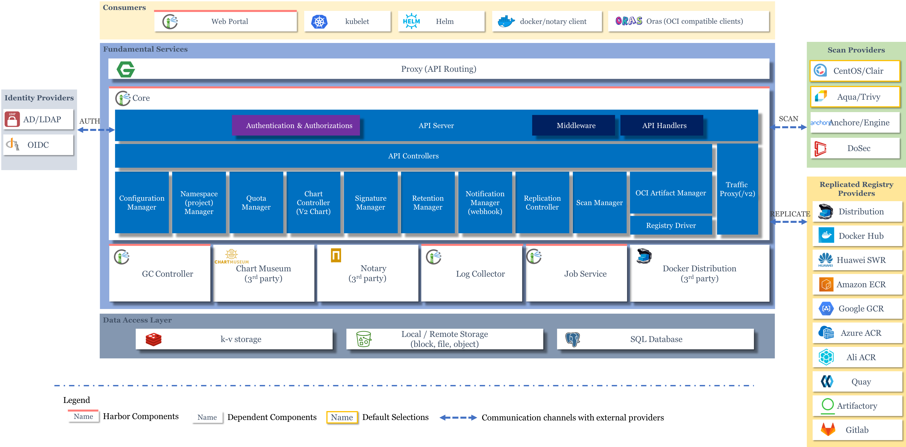

= harbor
Author 卢冬榕
:doctype: article
:encoding: utf-8
:lang: en
:toc: left
:numbered:

= harbor

== `harbor` 是什么？

Harbor is an open source registry that secures artifacts with policies and role-based access control, ensures images are scanned and free from vulnerabilities, and signs images as trusted. 

[NOTE]
====
https://goharbor.io
====

- 代码托管

https://github.com/goharbor/harbor

=== `harbor` 具备哪些解决能力？

users can manage images, manifest lists, Helm charts, CNABs, OPAs among others which all adhere to the OCI image specification. It also allows for pulling, pushing, deleting, tagging, replicating, and scanning such kinds of artifacts. Signing images and manifest list are also possible now.

[NOTE]
====
https://github.com/goharbor/harbor/wiki/Architecture-Overview-of-Harbor
====

==== 跟 `类似` 对比存在哪些优势？

- Cloud native registry

- Role based access control

- LDAP/AD support

- ...

[NOTE]
====
https://github.com/goharbor/harbor
====

=== `harbor` 的工作原理是什么？

users can manage images.pulling, pushing, deleting...

[NOTE]
====
https://github.com/goharbor/harbor/wiki/Architecture-Overview-of-Harbor
====

== 搭建 `harbor` 环境

=== `harbor` 环境依赖条件？

- Hardware

[width="100%",options="header"]
|====================
| Resource | Minimum | Recommended
| CPU      | 2CPU    | 4CPU       
| Mem      | 4GB     | 8GB        
| Disk     | 40G     | 160G       
|====================

- Software

[width="100%",options="header"]
|====================
| 软件           |  版本                 | 描述
| Docker engine  | 17.06.0-ce+ or higher | https://docs.docker.com/engine/installation/[documentation]
| Docker Compose | 1.18.0 or higher      | https://docs.docker.com/compose/install/[documentation]
| Openssl        | latest                | ...
|====================

- Network ports

[width="100%",options="header"]
|====================
| Port | Protocol | Description
| 443  | HTTPS    | Harbor portal
| 4443 | HTTPS    | Connections to the Docker Content Trust service for Harbor
| 80   | HTTP     | Harbor portal 
|====================

[NOTE]
====
https://goharbor.io/docs/2.2.0/install-config/installation-prereqs/
====

=== 下载 `harbor`

Download either the online installer or the offline installer.

[NOTE]
====
https://goharbor.io/docs/1.10/install-config/download-installer/
====

==== releases page

[NOTE]
====
https://github.com/goharbor/harbor/releases
====

===== 下载链接地址

image::./README/20200817113702.png[align="center"]

===== 下载offline->离线版

[source,sh]
----
wget https://github.com/goharbor/harbor/releases/download/v1.10.2/harbor-offline-installer-v1.10.2.tgz
----

===== 下载online->在线版

[source,sh]
----
wget https://github.com/goharbor/harbor/releases/download/v1.10.2/harbor-online-installer-v1.10.2.tgz
----

=== 在 `docker` 上搭建 `harbor`

==== 安装 `v1.10.1`

[source,sh]
----
$ mkdir -p /opt/n5/harbor/work && mkdir -p /opt/n5/harbor/bin
$ cd /opt/n5/harbor/work
$ wget https://github.com/goharbor/harbor/releases/download/v1.10.2/harbor-offline-installer-v1.10.2.tgz
----

==== 安装 load image

[source,sh]
----
$ cd /opt/n5/harbor/work
$ tar -xzvf harbor-offline-installer-v1.10.1.tgz
$ cd /opt/n5/harbor
$ docker load -i harbor.v1.10.1.tar.gz
----

==== 安装 ca

[source,sh]
----
$ ll /etc/cert/n5
----

[source,sh]
----
/etc/cert/n5/ca-config.json
/etc/cert/n5/ca-key.pem
/etc/cert/n5/ca.pem
----

==== 配置

[source,sh]
----
$ cd /opt/n5/harbor
$ vi harbor.yml

# The IP address or hostname to access admin UI and registry service.
# DO NOT use localhost or 127.0.0.1, because Harbor needs to be accessed by external clients.

hostname: 192.168.41.32

# https related config
https:

# https port for harbor, default is 443
  port: 443

# The path of cert and key files for nginx
  certificate: /etc/cert/n5/ca.pem
  private_key: /etc/cert/n5/ca-key.pem

# The initial password of Harbor admin
# It only works in first time to install harbor
# Remember Change the admin password from UI after launching Harbor.
harbor_admin_password: Harbor12345

# Harbor DB configuration
database:
# The password for the root user of Harbor DB. Change this before any production use.
  password: root123
# The default data volume
data_volume: /opt/n5/harbor/bin/harbor-v1.10.1/data
----

[NOTE]
====
https://goharbor.io/docs/1.10/install-config/configure-yml-file/
====

== 维护 `harbor` 环境

=== 开启和关闭

[source,]
----
$ sudo mkdir -p /opt/n5/harbor/bin/harbor-v1.10.1/data
$ sudo chmod +r+w-x /var/run/docker.sock /opt/n5/harbor/bin/harbor-v1.10.1/data
$ sudo apt-get install python
$ sudo ./prepare
$ sudo ./install.sh
----

==== 关闭

[source,]
----
$ docker-compose down -v
----

==== 开启
[source,]
----
$ docker-compose up -d
----

[NOTE]
====
https://goharbor.io/docs/1.10/install-config/run-installer-script/
====

== 使用 `harbor`

=== 使用 `harbor` 的 `站点`

==== 登录系统

浏览器访问 `https://192.168.41.32:443`，用账号 `admin` 和 harbor.cfg 配置文件中的默认密码 `Harbor12345` 登陆系统。

image::./README/20200817113703.png[align="center"]

==== 站点主页

==== 用户管理

image::./README/20200817113705.png[align="center"]

==== 仓库管理

