= kubernetes
Author 卢冬榕
:doctype: article
:encoding: utf-8
:lang: en
:toc: left
:numbered:

= kubernetes

== `kubernetes` 是什么？

`kubernetes` 是一个开源的容器编排引擎，用来对容器化应用进行自动化部署、 扩缩和管理。

image::./README/components-of-kubernetes.png[align="center"]

[NOTE]
====
https://kubernetes.io
====

- 代码托管 - https://github.com/kubernetes/kubernetes

- 命令手册 - https://kubernetes.io/zh/docs/reference/

- http://docs.kubernetes.org.cn/475.html

- https://hardocs.com/d/kubernetes/154-kubectl_logs.html

- kubectl命令手册 - https://kubernetes.io/docs/reference/generated/kubectl/kubectl-commands#-em-restart-em-

- 配置手册 - https://kubernetes.io/docs/reference/kubernetes-api/workload-resources/deployment-v1/

- 社区 - https://github.com/kubernetes/community

=== `kubernetes` 的能力

- Service discovery and load balancing（服务发现和负载均衡）
- Storage orchestration（存储编排）
...

[NOTE]
====
https://kubernetes.io/docs/concepts/overview/what-is-kubernetes/
====

=== `kubernetes` 的组件

https://kubernetes.io/docs/concepts/overview/components/

- Control 组件

kube-apiserver、etcd、kube-scheduler、kube-controller-manager、cloud-controller-manager

- Node 组件

kubelet、kube-proxy、Container Runtime

- 插件

DNS、Dashboard

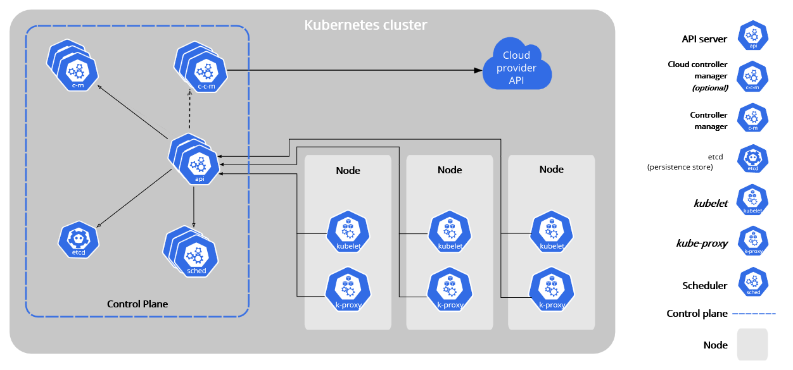

==== `kubernetes` 的 `kube-apiserver`

`kube-apiserver` 提供集群管理的REST API接口，包括认证授权、数据校验以及集群状态变更等。

. 只有 `API Server` 才直接操作 `etcd`
. 其他模块通过 `API Server` 查询或修改数据
. 提供其他模块之间的数据交互和通信的枢纽

==== `kubernetes` 的 `kube-controller-manager`

`kube-controller-manager` 由一系列的控制器组成，它通过apiserver监控整个集群的状态，并确保集群处于预期的工作状态。

==== `kubernetes` 的 `kube-scheduler`

`kube-scheduler` 负责分配调度 `Pod` 到集群内的 `node` 节点。

. 监听 `kube-apiserver`，查询还未分配 `Node` 的 `Pod`
. 根据调度策略为这些 `Pod` 分配节点

==== `kubernetes` 的 `kube-proxy`

`kube-proxy` 负责发布应用服务与负载均衡

==== `kubernetes` 的 `kubelet`

`kubelet` 在每个 `Node` 上都会启动一个 `kubelet` 服务进程。`kubelet` 作为连接 `Kubernetes Master` 和各 `Node` 之间的桥梁，用于处理 `Master` 下发到本节点的任务，管理 `Pod` 及 `Pod` 中的容器。每个 `kubelet` 进程都会在 `api-server` 上注册本节点自身的信息，定期向 `Master` 汇报节点资源的使用情况，`Node` 和 `Pod` 的CPU和内存使用数据由 `Metrics Server` 提供，其他指标由 `Prometheus` 采集和存储。

==== `Traditional deployment` 跟 `Container deployment` 的差异

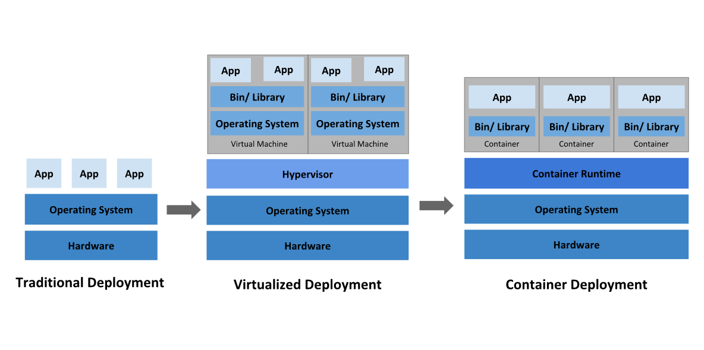

[NOTE]
====
https://kubernetes.io/docs/concepts/overview/what-is-kubernetes/
====

=== `kubernetes` 的 `CRI`

`CRI` 是 Container Runtime Interface 的缩写。凡是支持CRI的容器运行时，皆可作为K8S的底层容器运行时。

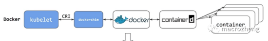

如果你使用containerd作为K8S容器运行时的话，由于containerd内置了 CRI 插件，kubelet可以直接调用containerd。

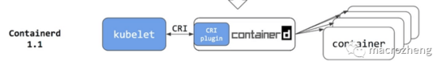

==== 为什么弃用 `k8s+docker`？

如果你使用Docker作为K8S容器运行时的话，kubelet需要先要通过 dockershim 去调用Docker，再通过Docker去调用containerd。

==== `kubernetes` 的 `k8s+containerd`

image::./README/2021-05-04_11-48-59.png[align="center"]

==== `kubernetes` 的 `k8s+cri-o`

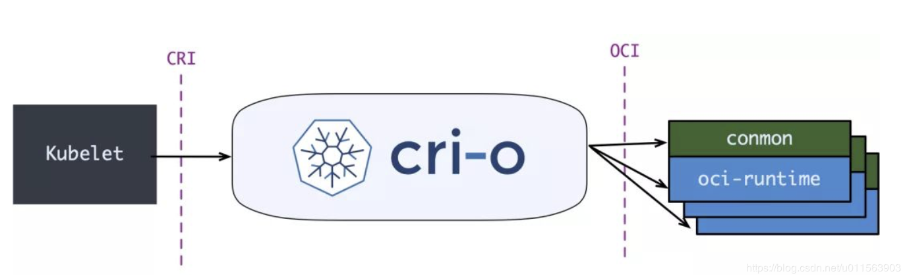

== 搭建 `k8s+containerd` 环境

=== `metallb` 版本架构

自己搭建的 `k8s` 集群 （公有云环境除外），是没有 `LB` 能力的。`MetalLB` 能够帮助你在 `kubernetes` 中创建 `LoadBalancer` 类型的 `kubernetes` 服务。

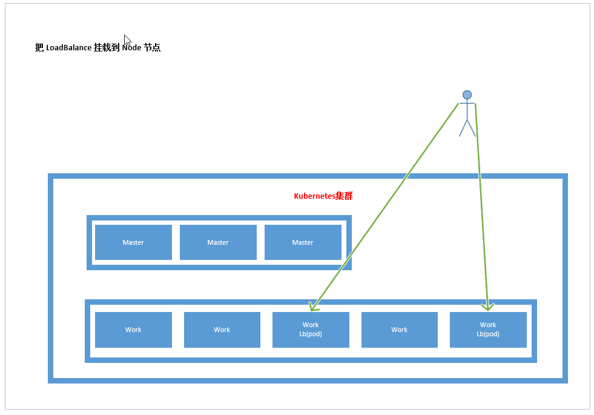

==== 安装 `metallb`

- 引用 - https://blog.csdn.net/textdemo123/article/details/99400237
- https://blog.csdn.net/networken/article/details/85928369
- https://zhuanlan.zhihu.com/p/266422557

- 官方文档 - https://metallb.universe.tf/tutorial/layer2/
- 代码托管 - https://github.com/google/metallb

[source,sh]
----
$ wget https://raw.githubusercontent.com/google/metallb/v0.7.3/manifests/metallb.yaml
$ kubectl apply -f metallb.yaml
$ kubectl get pod -n metallb-system  -o wide
$ kubectl get daemonset -n metallb-system
$ wget https://raw.githubusercontent.com/google/metallb/v0.7.3/manifests/example-layer2-config.yaml
$ vi example-layer2-config.yaml
----

[source,sh]
----
kubectl get pod -n metallb-system
----

[source,yaml]
----
apiVersion: v1
kind: ConfigMap
metadata:
  namespace: metallb-system
  name: config
data:
  config: |
    address-pools:
    - name: default
      protocol: layer2
      addresses:
      - 192.168.92.200-192.168.92.210
----

[source,sh]
----
kubectl apply -f example-layer2-config.yaml
----

[source,yaml]
----
apiVersion: v1
kind: Service
metadata:
  name: nginx
  annotations:
    metallb.universe.tf/address-pool: 192.168.5.5-192.168.5.9 <1>
spec:
  ports:
  - port: 80
    targetPort: 80
  selector:
    app: nginx
  type: LoadBalancer
----

<1> 特定池的分配

[source,yaml]
----
apiVersion: v1
kind: Service
metadata:
  annotations:
    ...
    metallb.universe.tf/allow-shared-ip: 192.168.5.9 <1>
  name: myapp-svc
  namespace: default
spec:
  clusterIP: 10.43.245.81
  externalTrafficPolicy: Cluster <2>
  ports:
  - nodePort: 31714
    port: 80
    protocol: TCP
    targetPort: 80
  selector:
    app: myapp
  sessionAffinity: None
  type: LoadBalancer
----

<1> 指定共享外部IP，而不是从MetalLB中IP地址池中取
<2> service.spec.externalTrafficPolicy=Cluster -> 将流量分配到服务中的所有Pod。service.spec.externalTrafficPolicy=Local -> 将流量发送到同一节点上的服务的pod

=== `nginx+dns+ingress` 版本架构

nginx -> dns -> ingress-nginx -> service -> pod

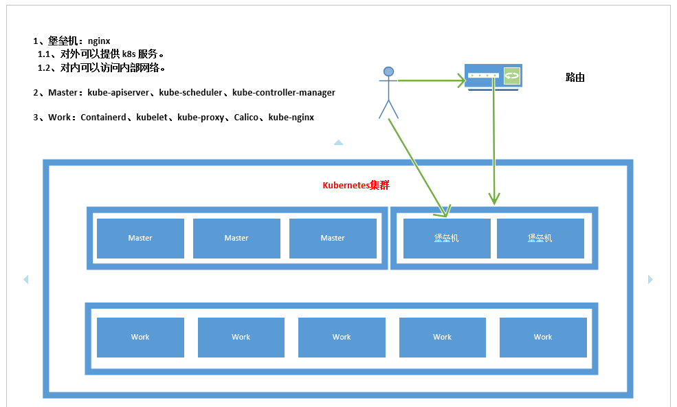

- 引用

https://www.yuque.com/crabluo/k8s/ynuw6s

https://kubernetes.io/docs/concepts/services-networking/connect-applications-service/

https://blog.csdn.net/weixin_45191791/article/details/109956817

- 组件

[width="100%",options="header"]
|====================
| 组件 | 版本 | 发布时间
| kubernetes | 1.16.6 | 2020-01-22
| etcd | 3.4.3 | 2019-10-24
| containerd | 1.3.3 | 2020-02-07
| runc | 1.0.0-rc10 | 2019-12-23
| calico | 3.12.0 | 2020-01-27
| coredns | 1.6.6 | 2019-12-20
| dashboard | v2.0.0-rc4 | 2020-02-06
| k8s-prometheus-adapter | 0.5.0 | 2019-04-03
| prometheus-operator | 0.35.0 | 2020-01-13
| prometheus | 2.15.2 | 2020-01-06
| elasticsearch、kibana | 7.2.0 | 2019-06-25
| cni-plugins | 0.8.5 | 2019-12-20
| metrics-server | 0.3.6 | 2019-10-15
|====================

==== 安装 `Ingress-Nginx`

Ingress-Nginx 是从 Nginx 改造来的，而不是传统的Nginx。

Ingress-Nginx官网地址

https://kubernetes.github.io/ingress-nginx/
Ingress-Nginx GitHub地址

https://github.com/kubernetes/ingress-nginx

[source,sh]
----
kubectl apply -f https://raw.githubusercontent.com/kubernetes/ingress-nginx/controller-v0.46.0/deploy/static/provider/baremetal/deploy.yaml
wget https://github.com/kubernetes/ingress-nginx/archive/nginx-0.30.0.tar.gz
tar xf nginx-0.30.0.tar.gz
cp -a ingress-nginx-nginx-0.30.0/deploy/static/mandatory.yaml ./
vi mandatory.yaml
kubectl apply -f mandatory.yaml
kubectl get ingress -n ingress-nginx -o wide
kubectl get pod -n ingress-nginx -o wide
kubectl apply -f hello.yaml
kubectl get hello -o wide
kubectl get pod -o wide --show-labels
kubectl delete -f hello.yaml
kubectl get svc -o wide
----

==== 安装堡垒机的 `nginx`

[source,]
----
for node_ip in ${NODE_IPS[@]}
  do
    echo ">>> ${node_ip}"
    ssh root@${node_ip} "mkdir -p /opt/k8s/k8s-nginx/{conf,logs,sbin}"
    scp /opt/k8s/work/nginx-1.15.3/nginx-http/sbin/nginx  root@${node_ip}:/opt/k8s/k8s-nginx/sbin/k8s-nginx
    ssh root@${node_ip} "chmod a+x /opt/k8s/k8s-nginx/sbin/*"
  done
  
cat > k8s-nginx.conf <<EOF
EOF
  
cat > k8s-nginx.conf << \EOF
worker_processes 1;

events {
    worker_connections  1024;
}

http {
    default_type  application/octet-stream;
    keepalive_timeout  65;
    server {
        listen       9090;
        server_name  127.0.0.1;
		location '/' {
            proxy_pass hello-example.org;
        }
    }
}
EOF

for node_ip in ${NODE_IPS[@]}
  do
    echo ">>> ${node_ip}"
    scp k8s-nginx.conf  root@${node_ip}:/opt/k8s/k8s-nginx/conf/k8s-nginx.conf
  done
  
  
cat > k8s-nginx.service <<EOF
[Unit]
Description=k8s nginx proxy
After=network.target
After=network-online.target
Wants=network-online.target

[Service]
Type=forking
ExecStartPre=/opt/k8s/k8s-nginx/sbin/k8s-nginx -c /opt/k8s/k8s-nginx/conf/k8s-nginx.conf -p /opt/k8s/k8s-nginx -t
ExecStart=/opt/k8s/k8s-nginx/sbin/k8s-nginx -c /opt/k8s/k8s-nginx/conf/k8s-nginx.conf -p /opt/k8s/k8s-nginx
ExecReload=/opt/k8s/k8s-nginx/sbin/k8s-nginx -c /opt/k8s/k8s-nginx/conf/k8s-nginx.conf -p /opt/k8s/k8s-nginx -s reload
PrivateTmp=true
Restart=always
RestartSec=5
StartLimitInterval=0
LimitNOFILE=65536

[Install]
WantedBy=multi-user.target
EOF

for node_ip in ${NODE_IPS[@]}
  do
    echo ">>> ${node_ip}"
    scp k8s-nginx.service  root@${node_ip}:/etc/systemd/system/
  done
  
systemctl daemon-reload && systemctl enable k8s-nginx && systemctl restart k8s-nginx
----

=== `frps+frpc穿透代理` 版本架构

frps -> frpc -> service -> pod

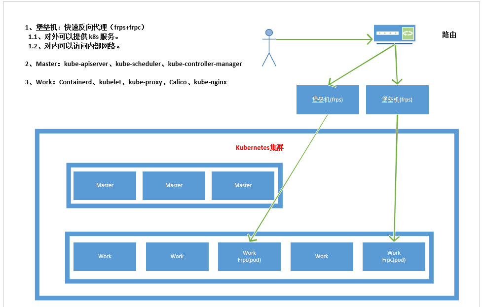

=== 版本对比

[width="100%",options="header"]
|====================
| 搭建 | 维护 | 性能
| 各有优缺 | 各有优缺 | frp优于ingress,ingress优于metallb
|====================

相同 k8s 环境，用 jemeter 并发 500 压测，请求迟延越大，性能越差。

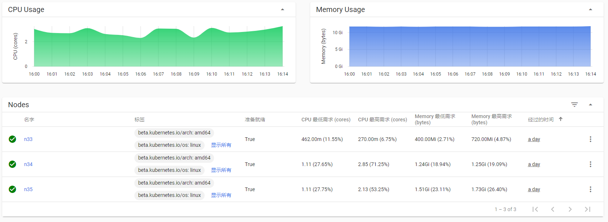

[source,yaml]
----
cat > frpc31-deploy.yaml <<EOF
apiVersion: apps/v1
kind: Deployment
metadata:
  name: frpc31
  labels:
    app: frpc31
spec:
  replicas: 2
  selector:
    matchLabels:
      app: frpc31
  template:
    metadata:
      labels:
        app: frpc31
    spec:
      containers:
      - image: 192.168.41.32/test/frpc31:0.0.1
        name: frpc31
EOF
----

[source,sh]
----
kubectl create -f frpc31-deploy.yaml
----

- `ansible` 方式 - https://faun.pub/how-to-create-your-own-kubernetes-cluster-using-ansible-7c6b5c031a5d

=== 下载 `kubernetes`

==== 编译方式

[source,sh]
----
git clone https://github.com/kubernetes/kubernetes
cd kubernetes
make
----

You have a working Docker environment.

[source,sh]
----
git clone https://github.com/kubernetes/kubernetes
cd kubernetes
make quick-release
----

==== 下载现成

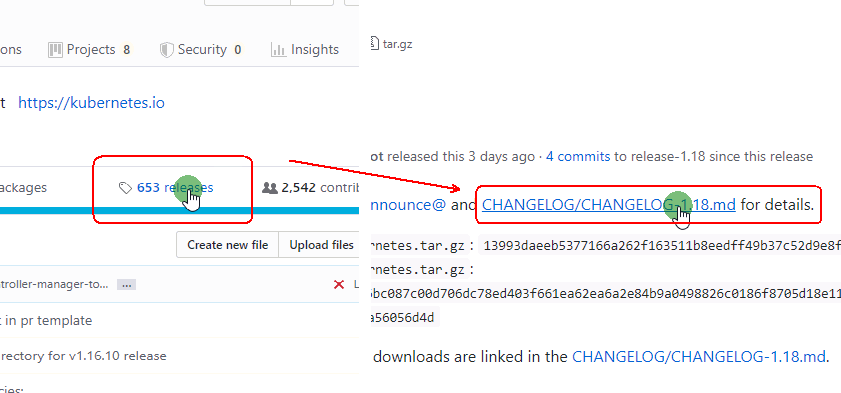

=== 安装 `etcd`

https://github.com/ludongrong/devops/tree/main/41-%E9%85%8D%E7%BD%AE%E4%B8%AD%E5%BF%83

=== 安装 `containerd`

==== 修改 `/etc/containerd/config.toml`

- containerd/cri - https://github.com/containerd/cri/blob/release/1.4/docs/registry.md

- containerd/containerd - https://github.com/containerd/containerd/blob/master/docs/cri/config.md

===== 配置 `http` 协议注册端 - Registry Endpoint

注册端 -> 拉取镜像的服务器。

[source,toml]
----
version = 2
root = "${CONTAINERD_DIR}/root"
state = "${CONTAINERD_DIR}/state"

[plugins]
  [plugins."io.containerd.grpc.v1.cri"]
	sandbox_image = "gcr.io/google-containers/pause:3.2" <1>
    [plugins."io.containerd.grpc.v1.cri".cni]
      bin_dir = "/opt/k8s/bin"
      conf_dir = "/etc/cni/net.d"
  [plugins."io.containerd.grpc.v1.cri".registry]
    [plugins."io.containerd.grpc.v1.cri".registry.mirrors]
      [plugins."io.containerd.grpc.v1.cri".registry.mirrors."docker.io"]
        endpoint = ["http://192.168.41.32:8083"]
	  [plugins."io.containerd.grpc.v1.cri".registry.mirrors."gcr.io"]
	    endpoint = ["http://192.168.41.32:8083"]
	  [plugins."io.containerd.grpc.v1.cri".registry.mirrors."k8s.gcr.io"]
	    endpoint = ["http://192.168.41.32:8083"]
	  [plugins."io.containerd.grpc.v1.cri".registry.mirrors."quay.io"]
	    endpoint = ["http://192.168.41.32:8083"]
	  [plugins."io.containerd.grpc.v1.cri".registry.mirrors."quay.azk8s.cn"]
	    endpoint = ["http://192.168.41.32:8083"]
	  [plugins."io.containerd.grpc.v1.cri".registry.mirrors."192.168.41.32"]
	    endpoint = ["https://192.168.41.32"]
    [plugins."io.containerd.grpc.v1.cri".registry.configs]
      [plugins."io.containerd.grpc.v1.cri".registry.configs."docker.io".tls]
        insecure_skip_verify = true
	  [plugins."io.containerd.grpc.v1.cri".registry.configs."gcr.io".tls]
        insecure_skip_verify = true
	  [plugins."io.containerd.grpc.v1.cri".registry.configs."k8s.gcr.io".tls]
        insecure_skip_verify = true
	  [plugins."io.containerd.grpc.v1.cri".registry.configs."quay.io".tls]
        insecure_skip_verify = true
      [plugins."io.containerd.grpc.v1.cri".registry.configs."quay.azk8s.cn".tls]
        insecure_skip_verify = true
      [plugins."io.containerd.grpc.v1.cri".registry.configs."192.168.41.32".tls]
        ca_file   = "/etc/cert/n5/ca.pem"
        cert_file = "/etc/cert/n5/n5.pem"
        key_file  = "/etc/cert/n5/n5-key.pem"
  [plugins."io.containerd.runtime.v1.linux"]
    shim = "containerd-shim"
    runtime = "runc"
    runtime_root = ""
    no_shim = false
    shim_debug = false
----

<1> 国内镜像 registry.cn-hangzhou.aliyuncs.com/google_containers/pause:3.2

===== 配置 `https` 协议注册端 - Registry TLS Communication

注册端 -> 拉取镜像的服务器。

[NOTE]
====
引用 - https://blog.csdn.net/y_chen_007/article/details/97525206
====

[source,toml]
----
version = 2
root = "${CONTAINERD_DIR}/root"
state = "${CONTAINERD_DIR}/state"

[plugins]
  [plugins."io.containerd.grpc.v1.cri"]
	sandbox_image = "gcr.io/google-containers/pause:3.2" 
    [plugins."io.containerd.grpc.v1.cri".cni]
      bin_dir = "/opt/k8s/bin"
      conf_dir = "/etc/cni/net.d"
  [plugins."io.containerd.grpc.v1.cri".registry]
    [plugins."io.containerd.grpc.v1.cri".registry.mirrors]
      [plugins."io.containerd.grpc.v1.cri".registry.mirrors."docker.io"]
        endpoint = ["https://192.168.41.32:8082"]
	  [plugins."io.containerd.grpc.v1.cri".registry.mirrors."gcr.io"]
	    endpoint = ["https://192.168.41.32:8082"]
	  [plugins."io.containerd.grpc.v1.cri".registry.mirrors."k8s.gcr.io"]
	    endpoint = ["https://192.168.41.32:8082"]
	  [plugins."io.containerd.grpc.v1.cri".registry.mirrors."quay.io"]
	    endpoint = ["https://192.168.41.32:8082"]
	  [plugins."io.containerd.grpc.v1.cri".registry.mirrors."quay.azk8s.cn"]
	    endpoint = ["https://192.168.41.32:8082"]
	  [plugins."io.containerd.grpc.v1.cri".registry.mirrors."192.168.41.32"]
	    endpoint = ["https://192.168.41.32"]
    [plugins."io.containerd.grpc.v1.cri".registry.configs]
	  [plugins."io.containerd.grpc.v1.cri".registry.configs."192.168.41.32:8082".tls]
        ca_file   = "/etc/cert/n5/ca.pem"
        cert_file = "/etc/cert/n5/n5.pem"
        key_file  = "/etc/cert/n5/n5-key.pem"
      [plugins."io.containerd.grpc.v1.cri".registry.configs."192.168.41.32".tls]
        ca_file   = "/etc/cert/n5/ca.pem"
        cert_file = "/etc/cert/n5/n5.pem"
        key_file  = "/etc/cert/n5/n5-key.pem"
  [plugins."io.containerd.runtime.v1.linux"]
    shim = "containerd-shim"
    runtime = "runc"
    runtime_root = ""
    no_shim = false
    shim_debug = false
----

==== 升级 `containerd`

[source,sh]
----
cd /opt/k8s/work

wget https://github.com/containerd/containerd/releases/download/v1.5.0/containerd-1.5.0-linux-amd64.tar.gz

mkdir containerd-1.5.0
tar -xvf containerd-1.3.3.linux-amd64.tar.gz -C containerd-1.5.0

for node_ip in ${NODE_IPS[@]}
  do
    echo ">>> ${node_ip}"
    scp containerd-1.5.0/bin/* root@${node_ip}:/opt/k8s/bin
    ssh root@${node_ip} "chmod a+x /opt/k8s/bin/* && mkdir -p /etc/cni/net.d"
  done
----

=== 安装 `calicoctl`

https://www.kancloud.cn/willfeng/k8s/654128

- https://github.com/projectcalico/calico

- https://docs.projectcalico.org/about/about-calico

==== `kubernetes` 方式安装

https://docs.projectcalico.org/getting-started/kubernetes/flannel/flannel

==== `etc` 方式安装

https://docs.projectcalico.org/getting-started/calicoctl/configure/etcd

[source,sh]
----
cd /opt/k8s/work
curl -O -L  https://github.com/projectcalico/calicoctl/releases/download/v3.12.0/calicoctl
mv calicoctl ../bin
chmod +x /opt/k8s/bin/calicoctl
----

配置

[source,sh]
----
cd /opt/k8s/work
source /opt/k8s/bin/environment.sh
cat > calicoctl.cfg <<EOF
apiVersion: projectcalico.org/v3
kind: CalicoAPIConfig
metadata:
spec:
  etcdEndpoints: ${ETCD_ENDPOINTS}
  etcdKeyFile: /etc/calico/key.pem
  etcdCertFile: /etc/calico/cert.pem
  etcdCACertFile: /etc/calico/ca.pem
EOF
----

查看

[source,sh]
----
# 查看所有calico节点状态
calicoctl node status
calicoctl get nodes
calicoctl get ippool
# 查看集群ipPool情况
calicoctl get ipPool -o yaml

kubectl get pods -n kube-system -owide
----

[source,sh]
----
cd /opt/k8s/work
source /opt/k8s/bin/environment.sh
for node_ip in ${NODE_IPS[@]}
  do
    echo ">>> ${node_ip}"
    ssh root@${node_ip} "systemctl status etcd|grep Active"
  done
----

==== 问题 - BGP not established with...

- 问题

Readiness probe failed: caliconode is not ready: BIRD is not ready: BGP not established with 10.117.

[NOTE]
====
取日志命令 -> kubectl describe pods calico-node-hzsff -n kube-system
====

- 解决方法

调整calicao 网络插件的网卡发现机制。在 `calico.yaml` 文件添加以下二行。

[source,text]
----
- name: IP_AUTODETECTION_METHOD
    value: "interface=ens.*"  <1>
----

<1> ens 根据实际网卡开头配置

- 引用

https://blog.csdn.net/u011327801/article/details/100579803

==== 升级 `calico`

[source,sh]
----
cd /opt/k8s/work

wget https://github.com/projectcalico/calico/releases/download/v3.12.0/release-v3.12.0.tgz

tar -xvf release-v3.12.0.tgz
----

== 维护 `kubernetes` 环境

- `kubectl` 命令手册 - https://kubernetes.io/docs/reference/kubectl/kubectl/

- 拉取镜像有关证书权限问题的引用 -  https://www.cnblogs.com/unchch/p/11771005.html

=== 通过 `kubectl` 查看日志

[source,sh]
----
kubectl describe pod kubernetes-dashboard-849cd79b75-s2snt --namespace kube-system
kubectl logs -f pods/monitoring-influxdb-fc8f8d5cd-dbs7d -n kube-system
kubectl logs --tail 200 -f kube-apiserver -n kube-system |more
kubectl logs --tail 200 -f podname -n jenkins
----

[NOTE]
====
使用Kubelet describe 查看日志，一定要带上 命名空间，否则会报如下错误。如：kubectl describe pod coredns-6c65fc5cbb-8ntpv。报错 Error from server (NotFound): pods "coredns-6c65fc5cbb-8ntpv" not found。
====

=== 通过 `journalctl` 查看日志

[source,sh]
----
journalctl -u kube-scheduler
journalctl -xefu kubelet
journalctl -u kube-apiserver
journalctl -u kubelet |tail
journalctl -xe
----

=== 通过 `系统` 查看日志

[source,sh]
----
cat /var/log/messages
----

=== 无法删除monitoring

https://github.com/kubernetes/kubeadm/issues/1688

[source,sh]
----
kubectl delete namespace monitoring --force
kubectl get namespace monitoring -o json > tmp.json
kubectl proxy --address=0.0.0.0
curl -k -H "Content-Type: application/json" -X PUT --data-binary @tmp.json http://192.168.41.35:8001/api/v1/namespaces/monitoring/finalize
----

=== coredns Back-off restarting failed container

https://github.com/kubernetes/kubeadm/issues/1688

[source,sh]
----
kubectl get pods -n kube-system -o wide
kubectl describe pod/coredns-5c9dddbdcb-rczbl --namespace kube-system
kubectl delete pod coredns-5c9dddbdcb-rczbl  --grace-period=0 --force -n kube-system
kubectl logs -f coredns-5c9dddbdcb-rczbl -n kube-system
kubectl edit cm coredns -n kube-system
----

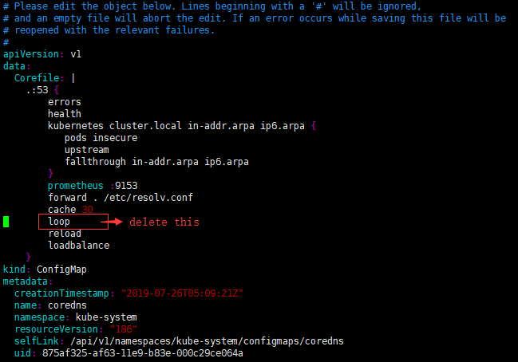

=== 部署无状态应用

https://kubernetes.io/docs/tutorials/stateless-application/expose-external-ip-address/

https://matthewpalmer.net/kubernetes-app-developer/articles/kubernetes-deployment-tutorial-example-yaml.html

- tsl拉取镜像 - https://www.cnblogs.com/unchch/p/11771005.html

- service配置手册 - https://kubernetes.io/docs/reference/kubernetes-api/service-resources/service-v1/#ServiceSpec

image::./README/2021-05-10_23-18-25.png[align="center"]

[source,yaml]
----
apiVersion: apps/v1
kind: Deployment
metadata:
  labels:
    app.kubernetes.io/name: load-balancer-example
  name: hello1
spec:
  replicas: 3
  selector:
    matchLabels:
      app.kubernetes.io/name: load-balancer-example
  template:
    metadata:
      labels:
        app.kubernetes.io/name: load-balancer-example
    spec:
      containers:
      - image: 192.168.41.32/test/test-jenkins:1.0.0
        name: hello1
        ports:
        - containerPort: 8080

---

apiVersion: v1
kind: Service
metadata:
  labels:
    app.kubernetes.io/name: load-balancer-example
  name: hello1-service
  namespace: default
spec:
  externalIPs:
  - 192.168.41.33
  externalTrafficPolicy: Cluster
  ports:
  - port: 9022 <1>
    protocol: TCP
    targetPort: 8080 <2>
  selector:
    app.kubernetes.io/name: load-balancer-example
  sessionAffinity: None <3>
  sessionAffinityConfig: <4>
    clientIP:
      timeoutSeconds: 10800
  type: LoadBalancer
  allocateLoadBalancerNodePorts: false <5>
status:
  loadBalancer:
    ingress:
    - ip: 192.168.41.33
----

<1> 暴露给服务的端口
<2> 容器的端口
<3> 用于维持会话亲和力，参数 ClientIP、None，某个ip的所有请求都由同一个pod处理。
<4> 会话保持时间，在 sessionAffinity: ClientIP 有效
<5> 是否自动为类型为LoadBalancer的服务分配NodePorts

[source,sh]
----
# 创建
kubectl apply -f load-balancer-example.yaml
# 显示副本信息
kubectl get replicasets
kubectl describe replicasets
# 显示部署信息 - deployments
kubectl get deployments hello1
kubectl describe deployments hello1
# 显示部署信息 - services
kubectl get services hello1-service
kubectl describe services hello1-service

# 删除
kubectl delete -f load-balancer-example.yaml

# 升级
kubectl set image deployment hello1 hello1=192.168.41.32/test/test-jenkins:1.0.1 --record
# 查看升级状态
kubectl rollout status deployment/hello1

# 回退指定版本
kubectl rollout history deployment/hello1
kubectl rollout undo deployment/hello1 –revision=2

# 回退
kubectl rollout undo deployment hello1
# 查看回退状态
kubectl rollout status deployment/hello1
----

http://192.168.41.33:8080/springmvcdemo/

[source,]
----
eyJhbGciOiJSUzI1NiIsImtpZCI6IkJoUVRFR09XS0dRNGtOTWJyR29xdGM1WjNUb2RudmhtWVVzbkhCbW9CUGsifQ.eyJpc3MiOiJrdWJlcm5ldGVzL3NlcnZpY2VhY2NvdW50Iiwia3ViZXJuZXRlcy5pby9zZXJ2aWNlYWNjb3VudC9uYW1lc3BhY2UiOiJrdWJlLXN5c3RlbSIsImt1YmVybmV0ZXMuaW8vc2VydmljZWFjY291bnQvc2VjcmV0Lm5hbWUiOiJkYXNoYm9hcmQtYWRtaW4tdG9rZW4tejhjcXYiLCJrdWJlcm5ldGVzLmlvL3NlcnZpY2VhY2NvdW50L3NlcnZpY2UtYWNjb3VudC5uYW1lIjoiZGFzaGJvYXJkLWFkbWluIiwia3ViZXJuZXRlcy5pby9zZXJ2aWNlYWNjb3VudC9zZXJ2aWNlLWFjY291bnQudWlkIjoiOTk5MTg5YmQtZmJlMS00ODY2LWEyNmEtYTc3NmU1NjZhZDU1Iiwic3ViIjoic3lzdGVtOnNlcnZpY2VhY2NvdW50Omt1YmUtc3lzdGVtOmRhc2hib2FyZC1hZG1pbiJ9.ifbQgR4IaF_hjXLvMKZVaZoX1roMxYwKFCYpOYHd-fOBGeWMjcFiFhC0LbNZfFhIpOMVnTGFR58_GgM3kVT053XC6cJNM8hqRHbQ-ll7PNc5310egzkm0NdvTeGCqKprlbZcLssaPYfaOqq9ADEksM9aoxCE36jadfQKoaLoPn2XXP7bkDS7ubA_cebnO3QywDbXvtR_fz91B02KJpxH_bV4kWVjysrm25StiD2cAW9Iyk6pOmGHspnDWRNT-WJ68zGolqwEf6ihD2u7jc9TfAdcPoQ3jRSsdPDxunSC9OzswCuHGBqO6OjY5Pso22rHQVrqS3anTKwF5-RjLpd9Lg
----

其他记录

[source,]
----
cat > hello-example.yaml <<EOF
apiVersion: apps/v1
kind: Deployment
metadata:
  name: hello-example
  labels:
    app: hello-example
spec:
  replicas: 3
  selector:
    matchLabels:
      app: hello-example
  template:
    metadata:
      labels:
        app: hello-example
    spec:
      containers:
      - image: 192.168.41.32/test/test-jenkins:1.0.0
        name: hello-example
        ports:
        - containerPort: 8080
---
apiVersion: v1
kind: Service
metadata:
  name: hello-example
  labels:
    app: hello-example
spec:
  selector:
    app: hello-example
  ports:
  - port: 8080
    protocol: TCP
    targetPort: 8080
EOF

kubectl apply -f hello-example.yaml

kubectl get pods -o wide -l app=hello-example
kubectl describe deployment hello-example

kubectl get svc -l app=hello-example
curl -L 10.254.157.154:8080/springmvcdemo

cat > hello-example-ingress.yaml <<EOF
apiVersion: networking.k8s.io/v1beta1
kind: Ingress
metadata: 
  name: hello-example
  namespace: default
spec: 
  rules: 
    - host: hello-example.org
      http: 
        paths: 
        - path: /springmvcdemo/
          backend: 
            serviceName: hello-example
            servicePort: 8080
EOF

kubectl create -f hello-example-ingress.yaml
kubectl delete -f hello-example-ingress.yaml
kubectl describe ingress hello-example
curl -L hello-example.org/b/springmvcdemo
----