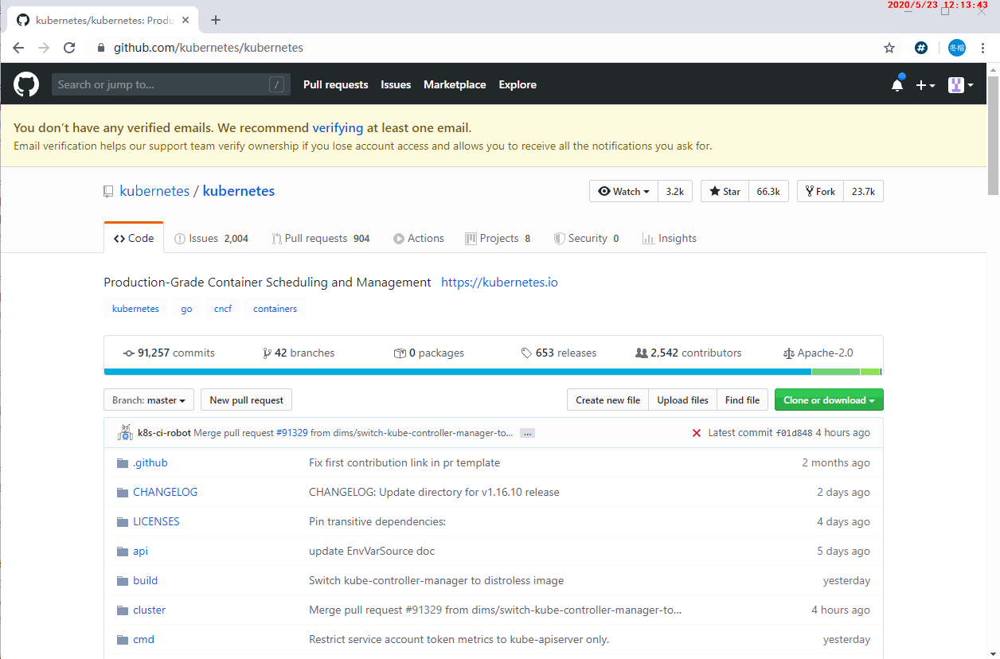
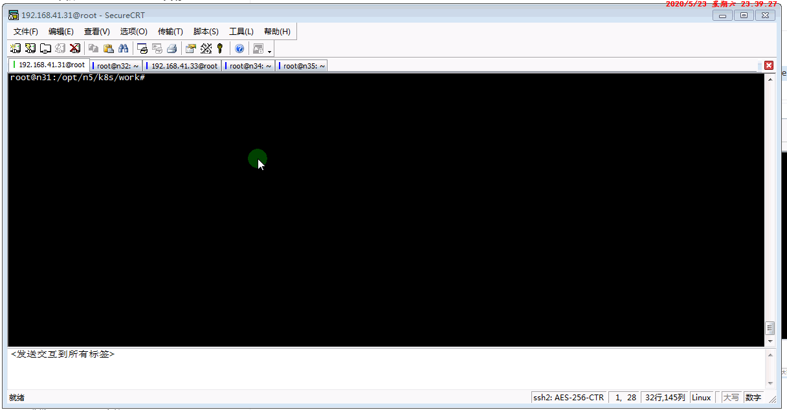
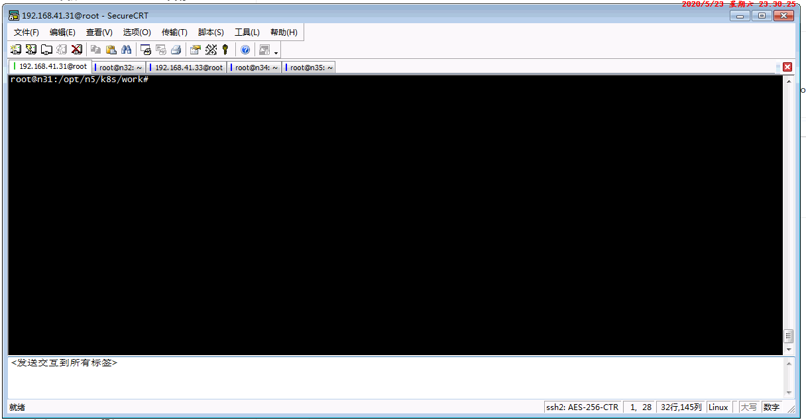

= kubernetes
Author 卢冬榕
:doctype: article
:encoding: utf-8
:lang: en
:toc: left
:numbered:


= kubernetes

== `kubernetes` 是什么？

Kubernetes, also known as K8s, is an open-source system for automating deployment, scaling, and management of containerized applications.

image::./README/components-of-kubernetes.png[align="center"]

[NOTE]
====
https://kubernetes.io
====

- 代码托管

https://github.com/kubernetes/kubernetes

- 社区

https://github.com/kubernetes/community

=== `kubernetes` 具备哪些解决能力？

- Service discovery and load balancing（服务发现和负载均衡）
- Storage orchestration（存储编排）

[NOTE]
====
https://kubernetes.io/docs/concepts/overview/what-is-kubernetes/
====

=== `kubernetes` 的工作原理是什么？

- Control Plane Components

kube-apiserver、etcd、kube-scheduler、kube-controller-manager、cloud-controller-manager

- Node Components

kubelet、kube-proxy、Container Runtime

- Addons

DNS、Dashboard

image::./README/kubernetes-components.png[align="center"]

[NOTE]
====
https://kubernetes.io/docs/concepts/overview/components/
====

==== `Traditional deployment` 跟 `Container deployment` 的差异

image::./README/container_evolution.png[align="center"]

[NOTE]
====
https://kubernetes.io/docs/concepts/overview/what-is-kubernetes/
====

== 搭建 `kubernetes` 环境

```
mkdir -p $GOPATH/src/k8s.io
cd $GOPATH/src/k8s.io
git clone https://github.com/kubernetes/kubernetes
cd kubernetes
make
```

You have a working Docker environment.

```
git clone https://github.com/kubernetes/kubernetes
cd kubernetes
make quick-release
```

=== `kubernetes` 环境依赖条件？

- ansible

https://faun.pub/how-to-create-your-own-kubernetes-cluster-using-ansible-7c6b5c031a5d

==== 关闭 `os` 的 firewall

```
sudo apt-get install ufw
sudo ufw disable
```

==== 关闭 `os` 的 swap

否则kubelet 会启动失败(可以设置 kubelet 启动参数 --fail-swap-on 为 false 关闭 swap 检查)

```
swapoff -a
sed -i '/ swap / s/^\(.*\)$/#\1/g' /etc/fstab
```

==== 关闭 `os` 的 SELinux

否则 kubelet 挂载目录时可能报错 `Permission denied`

```
setenforce 0
```

==== 集群规划

[source,]
----
n31：192.168.41.31 > docker/etcd/k8s-work/k8s-master
n32：192.168.41.32 > docker/etcd/k8s-work/k8s-master
n33：192.168.41.33 > docker/etcd/k8s-work/k8s-master
n34：192.168.41.34 > docker/etcd/k8s-work
n35：192.168.41.35 > docker/etcd/k8s-work
----

==== 安装依赖软件

- 安装docker
- 安装etcd

=== 下载 `kubernetes`



### 安装环境 > 安装k8s

```bash
mkdir -p /opt/n5/k8s/bin && mkdir -p /opt/n5/k8s/work
cd /opt/n5/k8s/bin
cat > k8s.environment.sh <<EOF
#!/usr/bin/bash

# 生成 EncryptionConfig 所需的加密 key
# echo $(head -c 32 /dev/urandom | base64)
export ENCRYPTION_KEY=DK7Piib1/ihpZe7uuaY+fRjlJdYS2+qEy5Ig1nvnA5c=

# 集群各机器 IP 数组
export NODE_IPS=(192.168.41.31 192.168.41.32 192.168.41.33 192.168.41.34 192.168.41.35)

# 集群各 IP 对应的主机名数组
export NODE_NAMES=(n31 n32 n33 n34 n35)

# etcd > 集群服务地址列表
export ETCD_ENDPOINTS="https://192.168.41.31:2379,https://192.168.41.32:2379,https://192.168.41.33:2379,https://192.168.41.34:2379,https://192.168.41.35:2379"

# etcd > CA证书
export ETCD_CA_CACERT="/etc/cert/n5/ca.pem"
export ETCD_CA_CACERT_KEY="/etc/cert/n5/ca-key.pem"
export ETCD_CA_CERT="/etc/cert/n5/n5.pem"
export ETCD_CA_KEY="/etc/cert/n5/n5-key.pem"

# k8s > CA证书
export K8S_CA_CN="admin"
export K8S_CA_CACERT="/etc/kubernetes/cert/ca.pem"
export K8S_CA_CACERT_KEY="/etc/kubernetes/cert/ca-key.pem"
export K8S_CA_CERT="/etc/kubernetes/cert/admin.pem"
export K8S_CA_KEY="/etc/kubernetes/cert/admin-key.pem"

# kube-apiserver 的反向代理(kube-nginx)地址端口
export KUBE_APISERVER="https://127.0.0.1:8448"

# 节点间互联网络接口名称
export IFACE="enp3s0"

# k8s
export K8S_BIN_DIR="/opt/n5/k8s/bin"

# k8s 各组件数据目录
export K8S_DIR="/opt/n5/k8s/bin/data/k8s"

## DOCKER_DIR 和 CONTAINERD_DIR 二选一
# docker 数据目录
export DOCKER_DIR="/opt/n5/k8s/bin/data/docker"

# containerd 数据目录
export CONTAINERD_DIR="/opt/n5/k8s/bin/data/containerd"

## 以下参数一般不需要修改

# TLS Bootstrapping 使用的 Token
# 可以使用命令 head -c 16 /dev/urandom | od -An -t x | tr -d ' ' 生成
BOOTSTRAP_TOKEN="41f7e4ba8b7be874fcff18bf5cf41a7c"

# 最好使用 当前未用的网段 来定义服务网段和 Pod 网段

# 服务网段，部署前路由不可达，部署后集群内路由可达(kube-proxy 保证)
SERVICE_CIDR="10.254.0.0/16"

# Pod 网段，建议 /16 段地址，部署前路由不可达，部署后集群内路由可达(flanneld 保证)
CLUSTER_CIDR="172.30.0.0/16"

# 服务端口范围 (NodePort Range)
export NODE_PORT_RANGE="30000-32767"

# kubernetes 服务 IP (一般是 SERVICE_CIDR 中第一个IP)
export CLUSTER_KUBERNETES_SVC_IP="10.254.0.1"

# 集群 DNS 服务 IP (从 SERVICE_CIDR 中预分配)
export CLUSTER_DNS_SVC_IP="10.254.0.2"

# 集群 DNS 域名（末尾不带点号）
export CLUSTER_DNS_DOMAIN="cluster.local"

# 将二进制目录加到 PATH 中
export PATH=/opt/n5/k8s/bin:$PATH
EOF
source /opt/n5/k8s/bin/k8s.environment.sh
```


## 安装k8s >> ca

### 创建 ca-config.json

```bash
cd /opt/n5/k8s/work
cat > ca-config.json <<EOF
{
  "signing": {
    "default": {
      "expiry": "87600h"
    },
    "profiles": {
      "kubernetes": {
        "usages": [
            "signing",
            "key encipherment",
            "server auth",
            "client auth"
        ],
        "expiry": "876000h"
      }
    }
  }
}
EOF
```


### 创建 ca-csr.json

```bash
cd /opt/n5/k8s/work
cat > ca-csr.json <<EOF
{
  "CN": "kubernetes-ca",
  "key": {
    "algo": "rsa",
    "size": 2048
  },
  "names": [
    {
      "C": "CN",
      "ST": "BeiJing",
      "L": "BeiJing",
      "O": "k8s",
      "OU": "opsnull"
    }
  ],
  "ca": {
    "expiry": "876000h"
 }
}
EOF
```


### 创建 ca

```bash
cd /opt/n5/k8s/work
/opt/n5/cfssl/bin/cfssl gencert -initca ca-csr.json | /opt/n5/cfssl/bin/cfssljson -bare ca
ls ca*
```


### 分发 ca

```bash
cd /opt/n5/k8s/work
source /opt/n5/k8s/bin/k8s.environment.sh
for node_ip in ${NODE_IPS[@]}
  do
    echo ">>> ${node_ip}"
    ssh root@${node_ip} "mkdir -p /etc/kubernetes/cert"
    scp ca*.pem ca-config.json root@${node_ip}:/etc/kubernetes/cert
  done
```


## 安装k8s >> ca-admin

### 创建 admin-csr.json

```bash
cd /opt/n5/k8s/work
cat > admin-csr.json <<EOF
{
  "CN": "admin",
  "hosts": [
    "127.0.0.1",
    "192.168.41.31",
    "192.168.41.32",
    "192.168.41.33",
    "192.168.41.34",
    "192.168.41.35"
  ],
  "key": {
    "algo": "rsa",
    "size": 2048
  },
  "names": [
    {
      "C": "CN",
      "ST": "BeiJing",
      "L": "BeiJing",
      "O": "system:masters",
      "OU": "opsnull"
    }
  ]
}
EOF
```


### 创建 ca-admin

```bash
cd /opt/n5/k8s/work
/opt/n5/cfssl/bin/cfssl gencert -ca=ca.pem \
  -ca-key=ca-key.pem \
  -config=ca-config.json \
  -profile=kubernetes admin-csr.json | /opt/n5/cfssl/bin/cfssljson -bare admin
ls admin*
```


### 分发 ca-admin

```bash
cd /opt/n5/k8s/work
source /opt/n5/k8s/bin/k8s.environment.sh
for node_ip in ${NODE_IPS[@]}
  do
    echo ">>> ${node_ip}"
    ssh root@${node_ip} "mkdir -p /etc/kubernetes/cert"
    scp admin*.pem admin-csr.json root@${node_ip}:/etc/kubernetes/cert
  done
```


## 安装k8s >> kubectl

### 下载kubectl

```bash
cd /opt/n5/k8s/work
wget https://dl.k8s.io/v1.16.6/kubernetes-client-linux-amd64.tar.gz
tar -xzvf kubernetes-client-linux-amd64.tar.gz
```


### 分发kubectl

```bash
cd /opt/n5/k8s/work
source /opt/n5/k8s/bin/k8s.environment.sh
for node_ip in ${NODE_IPS[@]}
  do
    echo ">>> ${node_ip}"
    ssh root@${node_ip} "[ -d ${K8S_BIN_DIR} ] && echo ok || mkdir -p ${K8S_BIN_DIR}"
    scp kubernetes/client/bin/kubectl root@${node_ip}:${K8S_BIN_DIR}
    ssh root@${node_ip} "chmod +x ${K8S_BIN_DIR}/*"
  doneF
```


### 创建 kubectl.kubeconfig

```bash
cd /opt/n5/k8s/work
source /opt/n5/k8s/bin/k8s.environment.sh

# 设置集群参数
kubectl config set-cluster kubernetes \
  --certificate-authority=${K8S_CA_CACERT} \
  --embed-certs=true \
  --server=https://${NODE_IPS[0]}:6443 \
  --kubeconfig=kubectl.kubeconfig

# 设置客户端认证参数
kubectl config set-credentials admin \
  --client-certificate=${K8S_CA_CERT} \
  --client-key=${K8S_CA_KEY} \
  --embed-certs=true \
  --kubeconfig=kubectl.kubeconfig

# 设置上下文参数
kubectl config set-context kubernetes \
  --cluster=kubernetes \
  --user=admin \
  --kubeconfig=kubectl.kubeconfig

# 设置默认上下文
kubectl config use-context kubernetes --kubeconfig=kubectl.kubeconfig
```


### 分发 kubectl.kubeconfig

```bash
cd /opt/n5/k8s/work
source /opt/n5/k8s/bin/k8s.environment.sh
for node_ip in ${NODE_IPS[@]}
  do
    echo ">>> ${node_ip}"
    ssh root@${node_ip} "mkdir -p ~/.kube"
    scp kubectl.kubeconfig root@${node_ip}:~/.kube/config
  done
```


## 安装k8s > kubelet

### 下载kubernetes-server

```bash
cd /opt/n5/k8s/work
wget https://dl.k8s.io/v1.16.6/kubernetes-server-linux-amd64.tar.gz
tar -xzvf kubernetes-server-linux-amd64.tar.gz
cd kubernetes
tar -xzvf  kubernetes-src.tar.gz
```


### 分发kubernetes-server

```bash
cd /opt/n5/k8s/work
source /opt/n5/k8s/bin/k8s.environment.sh
for node_ip in ${NODE_IPS[@]}
  do
    echo ">>> ${node_ip}"
    scp kubernetes/server/bin/{apiextensions-apiserver,kube-apiserver,kube-controller-manager,kube-proxy,kube-scheduler,kubeadm,kubectl,kubelet,mounter} root@${node_ip}:${K8S_BIN_DIR}
    ssh root@${node_ip} "chmod +x ${K8S_BIN_DIR}/*"
  done
```


## 安装k8s >> master

### 创建加密配置文件

```bash
cd /opt/n5/k8s/work
source /opt/n5/k8s/bin/k8s.environment.sh
cat > encryption-config.yaml <<EOF
kind: EncryptionConfig
apiVersion: v1
resources:
  - resources:
      - secrets
    providers:
      - aescbc:
          keys:
            - name: key1
              secret: '${ENCRYPTION_KEY}'
      - identity: {}
EOF
```


### 分发加密配置文件

```bash
cd /opt/n5/k8s/work
source /opt/n5/k8s/bin/k8s.environment.sh
for node_ip in ${NODE_IPS[@]}
  do
    echo ">>> ${node_ip}"
    ssh root@${node_ip} "[ -d /etc/kubernetes ] && echo ok || mkdir -p /etc/kubernetes"
    scp encryption-config.yaml root@${node_ip}:/etc/kubernetes
  done
```


### 创建审计策略文件

```bash
cd /opt/n5/k8s/work
source /opt/n5/k8s/bin/k8s.environment.sh
cat > audit-policy.yaml <<EOF
apiVersion: audit.k8s.io/v1beta1
kind: Policy
rules:
  # The following requests were manually identified as high-volume and low-risk, so drop them.
  - level: None
    resources:
      - group: ""
        resources:
          - endpoints
          - services
          - services/status
    users:
      - 'system:kube-proxy'
    verbs:
      - watch

  - level: None
    resources:
      - group: ""
        resources:
          - nodes
          - nodes/status
    userGroups:
      - 'system:nodes'
    verbs:
      - get

  - level: None
    namespaces:
      - kube-system
    resources:
      - group: ""
        resources:
          - endpoints
    users:
      - 'system:kube-controller-manager'
      - 'system:kube-scheduler'
      - 'system:serviceaccount:kube-system:endpoint-controller'
    verbs:
      - get
      - update

  - level: None
    resources:
      - group: ""
        resources:
          - namespaces
          - namespaces/status
          - namespaces/finalize
    users:
      - 'system:apiserver'
    verbs:
      - get

  # Don't log HPA fetching metrics.
  - level: None
    resources:
      - group: metrics.k8s.io
    users:
      - 'system:kube-controller-manager'
    verbs:
      - get
      - list

  # Don't log these read-only URLs.
  - level: None
    nonResourceURLs:
      - '/healthz*'
      - /version
      - '/swagger*'

  # Don't log events requests.
  - level: None
    resources:
      - group: ""
        resources:
          - events

  # node and pod status calls from nodes are high-volume and can be large, don't log responses
  # for expected updates from nodes
  - level: Request
    omitStages:
      - RequestReceived
    resources:
      - group: ""
        resources:
          - nodes/status
          - pods/status
    users:
      - kubelet
      - 'system:node-problem-detector'
      - 'system:serviceaccount:kube-system:node-problem-detector'
    verbs:
      - update
      - patch

  - level: Request
    omitStages:
      - RequestReceived
    resources:
      - group: ""
        resources:
          - nodes/status
          - pods/status
    userGroups:
      - 'system:nodes'
    verbs:
      - update
      - patch

  # deletecollection calls can be large, don't log responses for expected namespace deletions
  - level: Request
    omitStages:
      - RequestReceived
    users:
      - 'system:serviceaccount:kube-system:namespace-controller'
    verbs:
      - deletecollection

  # Secrets, ConfigMaps, and TokenReviews can contain sensitive & binary data,
  # so only log at the Metadata level.
  - level: Metadata
    omitStages:
      - RequestReceived
    resources:
      - group: ""
        resources:
          - secrets
          - configmaps
      - group: authentication.k8s.io
        resources:
          - tokenreviews
  # Get repsonses can be large; skip them.
  - level: Request
    omitStages:
      - RequestReceived
    resources:
      - group: ""
      - group: admissionregistration.k8s.io
      - group: apiextensions.k8s.io
      - group: apiregistration.k8s.io
      - group: apps
      - group: authentication.k8s.io
      - group: authorization.k8s.io
      - group: autoscaling
      - group: batch
      - group: certificates.k8s.io
      - group: extensions
      - group: metrics.k8s.io
      - group: networking.k8s.io
      - group: policy
      - group: rbac.authorization.k8s.io
      - group: scheduling.k8s.io
      - group: settings.k8s.io
      - group: storage.k8s.io
    verbs:
      - get
      - list
      - watch

  # Default level for known APIs
  - level: RequestResponse
    omitStages:
      - RequestReceived
    resources:
      - group: ""
      - group: admissionregistration.k8s.io
      - group: apiextensions.k8s.io
      - group: apiregistration.k8s.io
      - group: apps
      - group: authentication.k8s.io
      - group: authorization.k8s.io
      - group: autoscaling
      - group: batch
      - group: certificates.k8s.io
      - group: extensions
      - group: metrics.k8s.io
      - group: networking.k8s.io
      - group: policy
      - group: rbac.authorization.k8s.io
      - group: scheduling.k8s.io
      - group: settings.k8s.io
      - group: storage.k8s.io
      
  # Default level for all other requests.
  - level: Metadata
    omitStages:
      - RequestReceived
EOF
```


### 分发审计策略文件

```bash
cd /opt/n5/k8s/work
source /opt/n5/k8s/bin/k8s.environment.sh
for node_ip in ${NODE_IPS[@]}
  do
    echo ">>> ${node_ip}"
    ssh root@${node_ip} "[ -d /etc/kubernetes ] && echo ok || mkdir -p /etc/kubernetes"
    scp audit-policy.yaml root@${node_ip}:/etc/kubernetes/audit-policy.yaml
  done
```


### master > apiserver

#### 创建 systemd unit 模板文件

```bash
cd /opt/n5/k8s/work
source /opt/n5/k8s/bin/k8s.environment.sh
cat > kube-apiserver.service.template <<EOF
[Unit]
Description=Kubernetes API Server
Documentation=https://github.com/GoogleCloudPlatform/kubernetes
After=network.target

[Service]
WorkingDirectory=${K8S_DIR}/kube-apiserver
ExecStart=${K8S_BIN_DIR}/kube-apiserver \\
  --advertise-address=##NODE_IP## \\
  --default-not-ready-toleration-seconds=360 \\
  --default-unreachable-toleration-seconds=360 \\
  --feature-gates=DynamicAuditing=true \\
  --max-mutating-requests-inflight=2000 \\
  --max-requests-inflight=4000 \\
  --default-watch-cache-size=200 \\
  --delete-collection-workers=2 \\
  --encryption-provider-config=/etc/kubernetes/encryption-config.yaml \\
  --etcd-cafile=${ETCD_CA_CACERT} \\
  --etcd-certfile=${ETCD_CA_CERT} \\
  --etcd-keyfile=${ETCD_CA_KEY} \\
  --etcd-servers=${ETCD_ENDPOINTS} \\
  --bind-address=##NODE_IP## \\
  --secure-port=6443 \\
  --tls-cert-file=${K8S_CA_CERT} \\
  --tls-private-key-file=${K8S_CA_KEY} \\
  --insecure-port=0 \\
  --audit-dynamic-configuration \\
  --audit-log-maxage=15 \\
  --audit-log-maxbackup=3 \\
  --audit-log-maxsize=100 \\
  --audit-log-truncate-enabled \\
  --audit-log-path=${K8S_DIR}/kube-apiserver/audit.log \\
  --audit-policy-file=/etc/kubernetes/audit-policy.yaml \\
  --profiling \\
  --anonymous-auth=false \\
  --client-ca-file=${K8S_CA_CACERT} \\
  --enable-bootstrap-token-auth \\
  --requestheader-allowed-names=${K8S_CA_CN} \\
  --requestheader-client-ca-file=${K8S_CA_CACERT} \\
  --requestheader-extra-headers-prefix="X-Remote-Extra-" \\
  --requestheader-group-headers=X-Remote-Group \\
  --requestheader-username-headers=X-Remote-User \\
  --service-account-key-file=${K8S_CA_CACERT} \\
  --authorization-mode=Node,RBAC \\
  --runtime-config=api/all=true \\
  --enable-admission-plugins=NodeRestriction \\
  --allow-privileged=true \\
  --apiserver-count=3 \\
  --event-ttl=168h \\
  --kubelet-certificate-authority=${K8S_CA_CACERT} \\
  --kubelet-client-certificate=${K8S_CA_CERT} \\
  --kubelet-client-key=${K8S_CA_KEY} \\
  --kubelet-https=true \\
  --kubelet-timeout=10s \\
  --proxy-client-cert-file=${K8S_CA_CERT} \\
  --proxy-client-key-file=${K8S_CA_KEY} \\
  --service-cluster-ip-range=${SERVICE_CIDR} \\
  --service-node-port-range=${NODE_PORT_RANGE} \\
  --logtostderr=true \\
  --v=2
Restart=on-failure
RestartSec=10
Type=notify
LimitNOFILE=65536

[Install]
WantedBy=multi-user.target
EOF
```


#### 创建 systemd 文件

```bash
cd /opt/n5/k8s/work
source /opt/n5/k8s/bin/k8s.environment.sh
for (( i=0; i < 5; i++ ))
  do
    sed -e "s/##NODE_NAME##/${NODE_NAMES[i]}/" -e "s/##NODE_IP##/${NODE_IPS[i]}/" kube-apiserver.service.template > kube-apiserver-${NODE_IPS[i]}.service 
  done
ls kube-apiserver*.service
```


#### 分发 systemd 文件

```bash
cd /opt/n5/k8s/work
source /opt/n5/k8s/bin/k8s.environment.sh
for node_ip in ${NODE_IPS[@]}
  do
    echo ">>> ${node_ip}"
    scp kube-apiserver-${node_ip}.service root@${node_ip}:/etc/systemd/system/kube-apiserver.service
  done
```


#### 启动 kube-apiserver 服务

```bash
cd /opt/n5/k8s/work
source /opt/n5/k8s/bin/k8s.environment.sh
for node_ip in ${NODE_IPS[@]}
  do
    echo ">>> ${node_ip}"
    ssh root@${node_ip} "mkdir -p ${K8S_DIR}/kube-apiserver"
    ssh root@${node_ip} "systemctl daemon-reload && systemctl enable kube-apiserver && systemctl restart kube-apiserver"
  done
```


#### 检查 kube-apiserver 运行状态

```bash
cd /opt/n5/k8s/work
source /opt/n5/k8s/bin/k8s.environment.sh
for node_ip in ${NODE_IPS[@]}
  do
    echo ">>> ${node_ip}"
    ssh root@${node_ip} "systemctl status kube-apiserver |grep 'Active:'"
  done
```


#### 检查 kube-apiserver 集群状态

```
$ kubectl cluster-info
$ kubectl get all --all-namespaces
$ kubectl get componentstatuses
```


### master > controller-manager

kube-controller-manager 使用 kubeconfig 文件访问 apiserver，该文件提供了 apiserver 地址、嵌入的 CA 证书和 kube-controller-manager 证书等信息。


#### 创建 kubeconfig

```bash
cd /opt/n5/k8s/work
source /opt/n5/k8s/bin/k8s.environment.sh
kubectl config set-cluster kubernetes \
  --certificate-authority=${K8S_CA_CACERT} \
  --embed-certs=true \
  --server="https://##NODE_IP##:6443" \
  --kubeconfig=kube-controller-manager.kubeconfig

kubectl config set-credentials system:kube-controller-manager \
  --client-certificate=${K8S_CA_CERT} \
  --client-key=${K8S_CA_KEY} \
  --embed-certs=true \
  --kubeconfig=kube-controller-manager.kubeconfig

kubectl config set-context system:kube-controller-manager \
  --cluster=kubernetes \
  --user=system:kube-controller-manager \
  --kubeconfig=kube-controller-manager.kubeconfig

kubectl config use-context system:kube-controller-manager --kubeconfig=kube-controller-manager.kubeconfig
```


#### 分发 kubeconfig

```bash
cd /opt/n5/k8s/work
for node_ip in ${NODE_IPS[@]}
  do
    echo ">>> ${node_ip}"
    sed -e "s/##NODE_IP##/${node_ip}/" kube-controller-manager.kubeconfig > kube-controller-manager-${node_ip}.kubeconfig
    scp kube-controller-manager-${node_ip}.kubeconfig root@${node_ip}:/etc/kubernetes/kube-controller-manager.kubeconfig
  done
```


#### 创建systemd unit 模板文件

```bash
cd /opt/n5/k8s/work
source /opt/n5/k8s/bin/k8s.environment.sh
cat > kube-controller-manager.service.template <<EOF
[Unit]
Description=Kubernetes Controller Manager
Documentation=https://github.com/GoogleCloudPlatform/kubernetes

[Service]
WorkingDirectory=${K8S_DIR}/kube-controller-manager
ExecStart=${K8S_BIN_DIR}/kube-controller-manager \\
  --profiling \\
  --cluster-name=kubernetes \\
  --controllers=*,bootstrapsigner,tokencleaner \\
  --kube-api-qps=1000 \\
  --kube-api-burst=2000 \\
  --leader-elect \\
  --use-service-account-credentials\\
  --concurrent-service-syncs=2 \\
  --bind-address=##NODE_IP## \\
  --secure-port=10252 \\
  --tls-cert-file=${K8S_CA_CERT} \\
  --tls-private-key-file=${K8S_CA_KEY} \\
  --port=0 \\
  --authentication-kubeconfig=/etc/kubernetes/kube-controller-manager.kubeconfig \\
  --client-ca-file=/etc/kubernetes/cert/ca.pem \\
  --requestheader-allowed-names="aggregator" \\
  --requestheader-client-ca-file=${K8S_CA_CACERT} \\
  --requestheader-extra-headers-prefix="X-Remote-Extra-" \\
  --requestheader-group-headers=X-Remote-Group \\
  --requestheader-username-headers=X-Remote-User \\
  --authorization-kubeconfig=/etc/kubernetes/kube-controller-manager.kubeconfig \\
  --cluster-signing-cert-file=${K8S_CA_CACERT} \\
  --cluster-signing-key-file=${K8S_CA_CACERT_KEY} \\
  --experimental-cluster-signing-duration=876000h \\
  --horizontal-pod-autoscaler-sync-period=10s \\
  --concurrent-deployment-syncs=10 \\
  --concurrent-gc-syncs=30 \\
  --node-cidr-mask-size=24 \\
  --service-cluster-ip-range=${SERVICE_CIDR} \\
  --pod-eviction-timeout=6m \\
  --terminated-pod-gc-threshold=10000 \\
  --root-ca-file=${K8S_CA_CACERT} \\
  --service-account-private-key-file=${K8S_CA_CACERT_KEY} \\
  --kubeconfig=/etc/kubernetes/kube-controller-manager.kubeconfig \\
  --logtostderr=true \\
  --v=2
Restart=on-failure
RestartSec=5

[Install]
WantedBy=multi-user.target
EOF
```


#### 创建systemd文件

```bash
cd /opt/n5/k8s/work
source /opt/n5/k8s/bin/k8s.environment.sh
for (( i=0; i < 5; i++ ))
  do
    sed -e "s/##NODE_NAME##/${NODE_NAMES[i]}/" -e "s/##NODE_IP##/${NODE_IPS[i]}/" kube-controller-manager.service.template > kube-controller-manager-${NODE_IPS[i]}.service 
  done
ls kube-controller-manager*.service
```


#### 分发systemd文件

```bash
cd /opt/n5/k8s/work
source /opt/n5/k8s/bin/k8s.environment.sh
for node_ip in ${NODE_IPS[@]}
  do
    echo ">>> ${node_ip}"
    scp kube-controller-manager-${node_ip}.service root@${node_ip}:/etc/systemd/system/kube-controller-manager.service
  done
```


#### 启动 kube-controller-manager 服务

```bash
cd /opt/n5/k8s/work
source /opt/n5/k8s/bin/k8s.environment.sh
for node_ip in ${NODE_IPS[@]}
  do
    echo ">>> ${node_ip}"
    ssh root@${node_ip} "mkdir -p ${K8S_DIR}/kube-controller-manager"
    ssh root@${node_ip} "systemctl daemon-reload && systemctl enable kube-controller-manager && systemctl restart kube-controller-manager"
  done
```


#### 检查 kube-controller-manager 运行状态

```bash
cd /opt/n5/k8s/work
source /opt/n5/k8s/bin/k8s.environment.sh
for node_ip in ${NODE_IPS[@]}
  do
    echo ">>> ${node_ip}"
    ssh root@${node_ip} "systemctl status kube-controller-manager|grep Active"
  done
```


```bash
$ curl -s --cacert ${K8S_CA_CACERT} --cert ${K8S_CA_CERT} --key ${K8S_CA_KEY} https://192.168.41.31:10252/metrics |head
```


#### 查看当前的 leader

``` bash
$ kubectl get endpoints kube-controller-manager --namespace=kube-system  -o yaml
```


### master > kube-scheduler

#### 创建 kubeconfig

```bash
cd /opt/n5/k8s/work
source /opt/n5/k8s/bin/k8s.environment.sh
kubectl config set-cluster kubernetes \
  --certificate-authority=${K8S_CA_CACERT} \
  --embed-certs=true \
  --server="https://##NODE_IP##:6443" \
  --kubeconfig=kube-scheduler.kubeconfig

kubectl config set-credentials system:kube-scheduler \
  --client-certificate=${K8S_CA_CERT} \
  --client-key=${K8S_CA_KEY} \
  --embed-certs=true \
  --kubeconfig=kube-scheduler.kubeconfig

kubectl config set-context system:kube-scheduler \
  --cluster=kubernetes \
  --user=system:kube-scheduler \
  --kubeconfig=kube-scheduler.kubeconfig

kubectl config use-context system:kube-scheduler --kubeconfig=kube-scheduler.kubeconfig
```


#### 分发 kubeconfig

```bash
cd /opt/n5/k8s/work
source /opt/n5/k8s/bin/k8s.environment.sh
for node_ip in ${NODE_IPS[@]}
  do
    echo ">>> ${node_ip}"
    sed -e "s/##NODE_IP##/${node_ip}/" kube-scheduler.kubeconfig > kube-scheduler-${node_ip}.kubeconfig
    scp kube-scheduler-${node_ip}.kubeconfig root@${node_ip}:/etc/kubernetes/kube-scheduler.kubeconfig
  done
```


#### 创建 kube-scheduler 配置模板文件

```bash
cd /opt/n5/k8s/work
cat >kube-scheduler.yaml.template <<EOF
apiVersion: kubescheduler.config.k8s.io/v1alpha1
kind: KubeSchedulerConfiguration
bindTimeoutSeconds: 600
clientConnection:
  burst: 200
  kubeconfig: "/etc/kubernetes/kube-scheduler.kubeconfig"
  qps: 100
enableContentionProfiling: false
enableProfiling: true
hardPodAffinitySymmetricWeight: 1
healthzBindAddress: ##NODE_IP##:10251
leaderElection:
  leaderElect: true
metricsBindAddress: ##NODE_IP##:10251
EOF
```


#### 创建 kube-scheduler 配置文件

```bash
cd /opt/n5/k8s/work
source /opt/n5/k8s/bin/k8s.environment.sh
for (( i=0; i < 5; i++ ))
  do
    sed -e "s/##NODE_NAME##/${NODE_NAMES[i]}/" -e "s/##NODE_IP##/${NODE_IPS[i]}/" kube-scheduler.yaml.template > kube-scheduler-${NODE_IPS[i]}.yaml
  done
ls kube-scheduler*.yaml
```


#### 分发 kube-scheduler 配置文件

```bash
cd /opt/n5/k8s/work
source /opt/n5/k8s/bin/k8s.environment.sh
for node_ip in ${NODE_IPS[@]}
  do
    echo ">>> ${node_ip}"
    scp kube-scheduler-${node_ip}.yaml root@${node_ip}:/etc/kubernetes/kube-scheduler.yaml
  done
```


#### 创建systemd unit 模板文件

```bash
cd /opt/n5/k8s/work
source /opt/n5/k8s/bin/k8s.environment.sh
cat > kube-scheduler.service.template <<EOF
[Unit]
Description=Kubernetes Scheduler
Documentation=https://github.com/GoogleCloudPlatform/kubernetes

[Service]
WorkingDirectory=${K8S_DIR}/kube-scheduler
ExecStart=${K8S_BIN_DIR}/kube-scheduler \\
  --config=/etc/kubernetes/kube-scheduler.yaml \\
  --bind-address=##NODE_IP## \\
  --secure-port=10259 \\
  --port=0 \\
  --tls-cert-file=${K8S_CA_CERT} \\
  --tls-private-key-file=${K8S_CA_KEY} \\
  --authentication-kubeconfig=/etc/kubernetes/kube-scheduler.kubeconfig \\
  --client-ca-file=/etc/kubernetes/cert/ca.pem \\
  --requestheader-allowed-names="" \\
  --requestheader-client-ca-file=${K8S_CA_CACERT} \\
  --requestheader-extra-headers-prefix="X-Remote-Extra-" \\
  --requestheader-group-headers=X-Remote-Group \\
  --requestheader-username-headers=X-Remote-User \\
  --authorization-kubeconfig=/etc/kubernetes/kube-scheduler.kubeconfig \\
  --logtostderr=true \\
  --v=2
Restart=always
RestartSec=5
StartLimitInterval=0

[Install]
WantedBy=multi-user.target
EOF
```


#### 创建systemd文件

```bash
cd /opt/n5/k8s/work
source /opt/n5/k8s/bin/k8s.environment.sh
for (( i=0; i < 5; i++ ))
  do
    sed -e "s/##NODE_NAME##/${NODE_NAMES[i]}/" -e "s/##NODE_IP##/${NODE_IPS[i]}/" kube-scheduler.service.template > kube-scheduler-${NODE_IPS[i]}.service 
  done
ls kube-scheduler*.service
```


#### 分发systemd文件

```bash
cd /opt/n5/k8s/work
source /opt/n5/k8s/bin/k8s.environment.sh
for node_ip in ${NODE_IPS[@]}
  do
    echo ">>> ${node_ip}"
    scp kube-scheduler-${node_ip}.service root@${node_ip}:/etc/systemd/system/kube-scheduler.service
  done
```


#### 启动 kube-scheduler 服务

```bash
cd /opt/n5/k8s/work
source /opt/n5/k8s/bin/k8s.environment.sh
for node_ip in ${NODE_IPS[@]}
  do
    echo ">>> ${node_ip}"
    ssh root@${node_ip} "mkdir -p ${K8S_DIR}/kube-scheduler"
    ssh root@${node_ip} "systemctl daemon-reload && systemctl enable kube-scheduler && systemctl restart kube-scheduler"
  done
```


#### 检查 kube-scheduler 运行状态

```bash
cd /opt/n5/k8s/work
source /opt/n5/k8s/bin/k8s.environment.sh
for node_ip in ${NODE_IPS[@]}
  do
    echo ">>> ${node_ip}"
    ssh root@${node_ip} "systemctl status kube-scheduler|grep Active"
  done
```


curl -s http://172.27.138.251:10251/metrics |head


查看当前的 leader

```bash
kubectl get endpoints kube-scheduler --namespace=kube-system  -o yaml
```


## 安装k8s >> worker


### worker >> nginx

```bash
cd /opt/n5/k8s/work
wget http://nginx.org/download/nginx-1.15.3.tar.gz
tar -xzvf nginx-1.15.3.tar.gz
```


```bash
cd /opt/n5/k8s/work/nginx-1.15.3
mkdir nginx-prefix
apt-get install -y gcc make
./configure --with-stream --without-http --prefix=$(pwd)/nginx-prefix --without-http_uwsgi_module --without-http_scgi_module --without-http_fastcgi_module
```


```bash
cd /opt/n5/k8s/work/nginx-1.15.3
make && make install
```


```bash
cd /opt/n5/k8s/work/nginx-1.15.3
./nginx-prefix/sbin/nginx -v
```


```bash
for node_ip in ${NODE_IPS[@]}
  do
    echo ">>> ${node_ip}"
    ssh root@${node_ip} "mkdir -p /opt/n5/nginx/bin/{conf,logs,sbin}"
    scp /opt/n5/k8s/work/nginx-1.15.3/nginx-prefix/sbin/nginx  root@${node_ip}:/opt/n5/nginx/bin/sbin
    ssh root@${node_ip} "chmod a+x /opt/n5/nginx/bin/sbin/*"
  done
```


```bash
cat > nginx.conf << \EOF
worker_processes 1;

events {
    worker_connections  1024;
}

stream {
    upstream backend {
        hash $remote_addr consistent;
        server 192.168.41.31:6443        max_fails=3 fail_timeout=30s;
        server 192.168.41.32:6443        max_fails=3 fail_timeout=30s;
        server 192.168.41.33:6443        max_fails=3 fail_timeout=30s;
    }

    server {
        listen 127.0.0.1:8448;
        proxy_connect_timeout 1s;
        proxy_pass backend;
    }
}
EOF
```


```bash
for node_ip in ${NODE_IPS[@]}
  do
    echo ">>> ${node_ip}"
    scp nginx.conf  root@${node_ip}:/opt/n5/nginx/bin/conf/nginx.conf
  done
```


```bash
cat > nginx.service <<EOF
[Unit]
Description=kube-apiserver nginx proxy
After=network.target
After=network-online.target
Wants=network-online.target

[Service]
Type=forking
ExecStartPre=/opt/n5/nginx/bin/sbin/nginx -c /opt/n5/nginx/bin/conf/nginx.conf -p /opt/n5/nginx/bin -t
ExecStart=/opt/n5/nginx/bin/sbin/nginx -c /opt/n5/nginx/bin/conf/nginx.conf -p /opt/n5/nginx/bin
ExecReload=/opt/n5/nginx/bin/sbin/nginx -c /opt/n5/nginx/bin/conf/nginx.conf -p /opt/n5/nginx/bin -s reload
PrivateTmp=true
Restart=always
RestartSec=5
StartLimitInterval=0
LimitNOFILE=65536

[Install]
WantedBy=multi-user.target
EOF
```


```bash
for node_ip in ${NODE_IPS[@]}
  do
    echo ">>> ${node_ip}"
    scp nginx.service  root@${node_ip}:/etc/systemd/system/
  done
```


```bash
for node_ip in ${NODE_IPS[@]}
  do
    echo ">>> ${node_ip}"
    ssh root@${node_ip} "systemctl daemon-reload && systemctl enable nginx && systemctl restart nginx"
  done
```


```bash
for node_ip in ${NODE_IPS[@]}
  do
    echo ">>> ${node_ip}"
    ssh root@${node_ip} "systemctl status nginx |grep 'Active:'"
  done
```


### worker >> kubelet

kubelet 运行在每个 worker 节点上，接收 kube-apiserver 发送的请求，管理 Pod 容器，执行交互式命令，如 exec、run、logs 等。


#### 创建 kubelet-bootstrap.kubeconfig

```bash
cd /opt/n5/k8s/work
for node_name in ${NODE_NAMES[@]}
  do
    echo ">>> ${node_name}"

    # 创建 token
    export BOOTSTRAP_TOKEN=$(kubeadm token create \
      --description kubelet-bootstrap-token \
      --groups system:bootstrappers:${node_name} \
      --kubeconfig ~/.kube/config)

    # 设置集群参数
    kubectl config set-cluster kubernetes \
      --certificate-authority=${K8S_CA_CACERT} \
      --embed-certs=true \
      --server=${KUBE_APISERVER} \
      --kubeconfig=kubelet-bootstrap-${node_name}.kubeconfig

    # 设置客户端认证参数
    kubectl config set-credentials kubelet-bootstrap \
      --token=${BOOTSTRAP_TOKEN} \
      --kubeconfig=kubelet-bootstrap-${node_name}.kubeconfig

    # 设置上下文参数
    kubectl config set-context default \
      --cluster=kubernetes \
      --user=kubelet-bootstrap \
      --kubeconfig=kubelet-bootstrap-${node_name}.kubeconfig

    # 设置默认上下文
    kubectl config use-context default --kubeconfig=kubelet-bootstrap-${node_name}.kubeconfig
  done
```


#### 分发 kubelet-bootstrap.kubeconfig

```bash
cd /opt/n5/k8s/work
for node_name in ${NODE_NAMES[@]}
  do
    echo ">>> ${node_name}"
    scp kubelet-bootstrap-${node_name}.kubeconfig root@${node_name}:/etc/kubernetes/kubelet-bootstrap.kubeconfig
  done
```


#### 创建 kubelet 参数配置文件

```bash
cd /opt/n5/k8s/work
cat > kubelet-config.yaml.template <<EOF
kind: KubeletConfiguration
apiVersion: kubelet.config.k8s.io/v1beta1
address: "##NODE_IP##"
staticPodPath: ""
syncFrequency: 1m
fileCheckFrequency: 20s
httpCheckFrequency: 20s
staticPodURL: ""
port: 10250
readOnlyPort: 0
rotateCertificates: true
serverTLSBootstrap: true
authentication:
  anonymous:
    enabled: false
  webhook:
    enabled: true
  x509:
    clientCAFile: "${K8S_CA_CACERT}"
authorization:
  mode: Webhook
registryPullQPS: 0
registryBurst: 20
eventRecordQPS: 0
eventBurst: 20
enableDebuggingHandlers: true
enableContentionProfiling: true
healthzPort: 10248
healthzBindAddress: "##NODE_IP##"
clusterDomain: "${CLUSTER_DNS_DOMAIN}"
clusterDNS:
  - "${CLUSTER_DNS_SVC_IP}"
nodeStatusUpdateFrequency: 10s
nodeStatusReportFrequency: 1m
imageMinimumGCAge: 2m
imageGCHighThresholdPercent: 85
imageGCLowThresholdPercent: 80
volumeStatsAggPeriod: 1m
kubeletCgroups: ""
systemCgroups: ""
cgroupRoot: ""
cgroupsPerQOS: true
cgroupDriver: cgroupfs
runtimeRequestTimeout: 10m
hairpinMode: promiscuous-bridge
maxPods: 220
podCIDR: "${CLUSTER_CIDR}"
podPidsLimit: -1
resolvConf: /etc/resolv.conf
maxOpenFiles: 1000000
kubeAPIQPS: 1000
kubeAPIBurst: 2000
serializeImagePulls: false
evictionHard:
  memory.available:  "100Mi"
  nodefs.available:  "10%"
  nodefs.inodesFree: "5%"
  imagefs.available: "15%"
evictionSoft: {}
enableControllerAttachDetach: true
failSwapOn: true
containerLogMaxSize: 20Mi
containerLogMaxFiles: 10
systemReserved: {}
kubeReserved: {}
systemReservedCgroup: ""
kubeReservedCgroup: ""
enforceNodeAllocatable: ["pods"]
EOF
```


#### 分发 kubelet 参数配置文件

```bash
cd /opt/n5/k8s/work
source /opt/n5/k8s/bin/environment.sh
for node_ip in ${NODE_IPS[@]}
  do 
    echo ">>> ${node_ip}"
    sed -e "s/##NODE_IP##/${node_ip}/" kubelet-config.yaml.template > kubelet-config-${node_ip}.yaml.template
    scp kubelet-config-${node_ip}.yaml.template root@${node_ip}:/etc/kubernetes/kubelet-config.yaml
  done
```


#### 创建systemd unit 模板文件

```bash
cd /opt/n5/k8s/work
source /opt/n5/k8s/bin/environment.sh
cat > kubelet.service.template <<EOF
[Unit]
Description=Kubernetes Kubelet
Documentation=https://github.com/GoogleCloudPlatform/kubernetes
After=containerd.service
Requires=containerd.service

[Service]
WorkingDirectory=${K8S_DIR}/kubelet
ExecStart=${K8S_BIN_DIR}/kubelet \\
  --bootstrap-kubeconfig=/etc/kubernetes/kubelet-bootstrap.kubeconfig \\
  --cert-dir=/etc/kubernetes/cert \\
  --root-dir=${K8S_DIR}/kubelet \\
  --kubeconfig=/etc/kubernetes/kubelet.kubeconfig \\
  --config=/etc/kubernetes/kubelet-config.yaml \\
  --hostname-override=##NODE_NAME## \\
  --image-pull-progress-deadline=15m \\
  --volume-plugin-dir=${K8S_DIR}/kubelet/kubelet-plugins/volume/exec/ \\
  --logtostderr=true \\
  --v=2
Restart=always
RestartSec=5
StartLimitInterval=0

[Install]
WantedBy=multi-user.target
EOF
```


#### 创建 systemd unit 文件

```bash
cd /opt/n5/k8s/work
source /opt/n5/k8s/bin/environment.sh
for node_name in ${NODE_NAMES[@]}
  do 
    echo ">>> ${node_name}"
    sed -e "s/##NODE_NAME##/${node_name}/" kubelet.service.template > kubelet-${node_name}.service
  done
```


#### 分发 systemd unit 文件

```bash
cd /opt/n5/k8s/work
source /opt/n5/k8s/bin/environment.sh
for node_name in ${NODE_NAMES[@]}
  do 
    echo ">>> ${node_name}"
    scp kubelet-${node_name}.service root@${node_name}:/etc/systemd/system/kubelet.service
  done
```


#### 授予 kube-apiserver 访问 kubelet API 的权限

```bash
kubectl create clusterrolebinding kube-apiserver:kubelet-apis --clusterrole=system:kubelet-api-admin --user admin
```


#### kubelet 向 kube-apiserver 发送证书签名请求 (CSR)

默认情况下，这个 user 和 group 没有创建 CSR 的权限，kubelet 启动失败。所以事先创建一个 clusterrolebinding，将 group system:bootstrappers 和 clusterrole system:node-bootstrapper 绑定

```bash
sudo journalctl -u kubelet -a |grep -A 2 'certificatesigningrequests'
kubectl create clusterrolebinding kubelet-bootstrap --clusterrole=system:node-bootstrapper --group=system:bootstrappers
```


#### approve CSR 请求，生成 kubelet client 证书

```bash
cd /opt/n5/k8s/work
cat > csr-crb.yaml <<EOF
 # Approve all CSRs for the group "system:bootstrappers"
 kind: ClusterRoleBinding
 apiVersion: rbac.authorization.k8s.io/v1
 metadata:
   name: auto-approve-csrs-for-group
 subjects:
 - kind: Group
   name: system:bootstrappers
   apiGroup: rbac.authorization.k8s.io
 roleRef:
   kind: ClusterRole
   name: system:certificates.k8s.io:certificatesigningrequests:nodeclient
   apiGroup: rbac.authorization.k8s.io
---
 # To let a node of the group "system:nodes" renew its own credentials
 kind: ClusterRoleBinding
 apiVersion: rbac.authorization.k8s.io/v1
 metadata:
   name: node-client-cert-renewal
 subjects:
 - kind: Group
   name: system:nodes
   apiGroup: rbac.authorization.k8s.io
 roleRef:
   kind: ClusterRole
   name: system:certificates.k8s.io:certificatesigningrequests:selfnodeclient
   apiGroup: rbac.authorization.k8s.io
---
# A ClusterRole which instructs the CSR approver to approve a node requesting a
# serving cert matching its client cert.
kind: ClusterRole
apiVersion: rbac.authorization.k8s.io/v1
metadata:
  name: approve-node-server-renewal-csr
rules:
- apiGroups: ["certificates.k8s.io"]
  resources: ["certificatesigningrequests/selfnodeserver"]
  verbs: ["create"]
---
 # To let a node of the group "system:nodes" renew its own server credentials
 kind: ClusterRoleBinding
 apiVersion: rbac.authorization.k8s.io/v1
 metadata:
   name: node-server-cert-renewal
 subjects:
 - kind: Group
   name: system:nodes
   apiGroup: rbac.authorization.k8s.io
 roleRef:
   kind: ClusterRole
   name: approve-node-server-renewal-csr
   apiGroup: rbac.authorization.k8s.io
EOF
kubectl apply -f csr-crb.yaml
```


#### 启动 kubelet 服务

```bash
cd /opt/n5/k8s/work
for node_ip in ${NODE_IPS[@]}
  do
    echo ">>> ${node_ip}"
    ssh root@${node_ip} "mkdir -p ${K8S_DIR}/kubelet/kubelet-plugins/volume/exec/"
    ssh root@${node_ip} "swapoff -a"
    ssh root@${node_ip} "systemctl daemon-reload && systemctl enable kubelet && systemctl restart kubelet"
  done
```

failed to run Kubelet: running with swap on is not supported, please disable swap! or 


```bash
journalctl -u kubelet
journalctl -u kubelet  -f
journalctl --since 22:40 --until now
journalctl --since "2020-05-24 08:50" --until "2020-05-24 03:00"
journalctl  -b -u httpd.service  -o json-pretty
```


```bash
cd /opt/n5/k8s/work
for node_ip in ${NODE_IPS[@]}
  do
    echo ">>> ${node_ip}"
    ssh root@${node_ip} "systemctl status kubelet|grep Active"
  done
```


#### 查看 kubelet 情况

```bash
kubectl get csr
# 手动 approve
kubectl get csr | grep Pending | awk '{print $1}' | xargs kubectl certificate approve
ls -l /etc/kubernetes/cert/kubelet-client-*
```



```bash
kubectl get node
```



### worker >> kube-proxy

#### 创建 kubeconfig 文件

```bash
cd /opt/n5/k8s/work
kubectl config set-cluster kubernetes \
  --certificate-authority=${K8S_CA_CACERT} \
  --embed-certs=true \
  --server=${KUBE_APISERVER} \
  --kubeconfig=kube-proxy.kubeconfig

kubectl config set-credentials kube-proxy \
  --client-certificate=${K8S_CA_CERT} \
  --client-key=${K8S_CA_KEY} \
  --embed-certs=true \
  --kubeconfig=kube-proxy.kubeconfig

kubectl config set-context default \
  --cluster=kubernetes \
  --user=kube-proxy \
  --kubeconfig=kube-proxy.kubeconfig

kubectl config use-context default --kubeconfig=kube-proxy.kubeconfig
```


#### 分发 kubeconfig 文件

```bash
cd /opt/n5/k8s/work
for node_name in ${NODE_NAMES[@]}
  do
    echo ">>> ${node_name}"
    scp kube-proxy.kubeconfig root@${node_name}:/etc/kubernetes/
  done
```


#### 创建 kube-proxy 配置文件

```bash
cd /opt/n5/k8s/work
cat > kube-proxy-config.yaml.template <<EOF
kind: KubeProxyConfiguration
apiVersion: kubeproxy.config.k8s.io/v1alpha1
clientConnection:
  burst: 200
  kubeconfig: "/etc/kubernetes/kube-proxy.kubeconfig"
  qps: 100
bindAddress: ##NODE_IP##
healthzBindAddress: ##NODE_IP##:10256
metricsBindAddress: ##NODE_IP##:10249
enableProfiling: true
clusterCIDR: ${CLUSTER_CIDR}
hostnameOverride: ##NODE_NAME##
mode: "ipvs"
portRange: ""
iptables:
  masqueradeAll: false
ipvs:
  scheduler: rr
  excludeCIDRs: []
EOF
```


#### 分发 kube-proxy 配置文件

```bash
cd /opt/n5/k8s/work
for (( i=0; i < 5; i++ ))
  do 
    echo ">>> ${NODE_NAMES[i]}"
    sed -e "s/##NODE_NAME##/${NODE_NAMES[i]}/" -e "s/##NODE_IP##/${NODE_IPS[i]}/" kube-proxy-config.yaml.template > kube-proxy-config-${NODE_NAMES[i]}.yaml.template
    scp kube-proxy-config-${NODE_NAMES[i]}.yaml.template root@${NODE_NAMES[i]}:/etc/kubernetes/kube-proxy-config.yaml
  done
```


#### 创建 systemd unit 模板文件

```bash
cd /opt/n5/k8s/work
cat > kube-proxy.service <<EOF
[Unit]
Description=Kubernetes Kube-Proxy Server
Documentation=https://github.com/GoogleCloudPlatform/kubernetes
After=network.target

[Service]
WorkingDirectory=${K8S_DIR}/kube-proxy
ExecStart=${K8S_BIN_DIR}/kube-proxy \\
  --config=/etc/kubernetes/kube-proxy-config.yaml \\
  --logtostderr=true \\
  --v=2
Restart=on-failure
RestartSec=5
LimitNOFILE=65536

[Install]
WantedBy=multi-user.target
EOF
```


#### 分发 systemd unit 文件

```bash
cd /opt/n5/k8s/work
for node_name in ${NODE_NAMES[@]}
  do 
    echo ">>> ${node_name}"
    scp kube-proxy.service root@${node_name}:/etc/systemd/system/
  done
```


#### 启动 kube-proxy 服务

``` bash
cd /opt/n5/k8s/work
for node_ip in ${NODE_IPS[@]}
  do
    echo ">>> ${node_ip}"
    ssh root@${node_ip} "mkdir -p ${K8S_DIR}/kube-proxy"
    ssh root@${node_ip} "modprobe ip_vs_rr"
    ssh root@${node_ip} "systemctl daemon-reload && systemctl enable kube-proxy && systemctl restart kube-proxy"
  done
```


#### 检查启动结果

``` bash
cd /opt/n5/k8s/work
for node_ip in ${NODE_IPS[@]}
  do
    echo ">>> ${node_ip}"
    ssh root@${node_ip} "systemctl status kube-proxy|grep Active"
  done
```


#### 查看监听端口

```bash
sudo netstat -lnpt|grep kube-prox
```


#### 查看 ipvs 路由规则

```bash
for node_ip in ${NODE_IPS[@]}
  do
    echo ">>> ${node_ip}"
    ssh root@${node_ip} "ipvsadm -ln"
  done
```


## 安装k8s >> calico


```bash
cd /opt/n5/k8s/work
curl https://docs.projectcalico.org/manifests/calico.yaml -O
```


修改配置：

``` bash
$ cp calico.yaml calico.yaml.orig
$ diff calico.yaml.orig calico.yaml
630c630,632
<               value: "192.168.0.0/16"
---
>               value: "172.30.0.0/16"
>             - name: IP_AUTODETECTION_METHOD
>               value: "interface=eth.*"
699c701
<             path: /opt/cni/bin
---
>             path: /opt/k8s/bin
```

+ 将 Pod 网段地址修改为 `172.30.0.0/16`;
+ calico 自动探查互联网卡，如果有多快网卡，则可以配置用于互联的网络接口命名正则表达式，如上面的 `eth.*`(根据自己服务器的网络接口名修改)；

kubectl apply -f  calico.yaml


```bash
kubectl get pods -n kube-system -o wide
watch kubectl get pods --all-namespaces
watch kubectl get pods --all-namespaces
kubectl get nodes -o wide
```


## 安装k8s >> coredns

## 下载和配置 coredns

``` bash
cd /opt/n5/k8s/work
git clone https://github.com/coredns/deployment.git
mv deployment coredns-deployment
```


## 创建 coredns

``` bash
cd /opt/k8s/work/coredns-deployment/kubernetes
source /opt/k8s/bin/environment.sh
./deploy.sh -i ${CLUSTER_DNS_SVC_IP} -d ${CLUSTER_DNS_DOMAIN} | kubectl apply -f -
```

## 检查 coredns 功能

``` bash
$ kubectl get all -n kube-system -l k8s-app=kube-dns
NAME                          READY   STATUS    RESTARTS   AGE
pod/coredns-76b74f549-cwm8d   1/1     Running   0          62s

NAME               TYPE        CLUSTER-IP   EXTERNAL-IP   PORT(S)                  AGE
service/kube-dns   ClusterIP   10.254.0.2   <none>        53/UDP,53/TCP,9153/TCP   62s

NAME                      READY   UP-TO-DATE   AVAILABLE   AGE
deployment.apps/coredns   1/1     1            1           62s

NAME                                DESIRED   CURRENT   READY   AGE
replicaset.apps/coredns-76b74f549   1         1         1       62s
```

新建一个 Deployment：

``` bash
cd /opt/k8s/work
cat > my-nginx.yaml <<EOF
apiVersion: apps/v1
kind: Deployment
metadata:
  name: my-nginx
spec:
  replicas: 2
  selector:
    matchLabels:
      run: my-nginx
  template:
    metadata:
      labels:
        run: my-nginx
    spec:
      containers:
      - name: my-nginx
        image: nginx:1.7.9
        ports:
        - containerPort: 80
EOF
kubectl create -f my-nginx.yaml
```

export 该 Deployment, 生成 `my-nginx` 服务：

``` bash
$ kubectl expose deploy my-nginx
service "my-nginx" exposed

$ kubectl get services my-nginx -o wide
NAME       TYPE        CLUSTER-IP      EXTERNAL-IP   PORT(S)   AGE   SELECTOR
my-nginx   ClusterIP   10.254.67.218   <none>        80/TCP    5s    run=my-nginx
```

创建另一个 Pod，查看 `/etc/resolv.conf` 是否包含 `kubelet` 配置的 `--cluster-dns` 和 `--cluster-domain`，是否能够将服务 `my-nginx` 解析到上面显示的 Cluster IP `10.254.40.167`

``` bash
cd /opt/k8s/work
cat > dnsutils-ds.yml <<EOF
apiVersion: v1
kind: Service
metadata:
  name: dnsutils-ds
  labels:
    app: dnsutils-ds
spec:
  type: NodePort
  selector:
    app: dnsutils-ds
  ports:
  - name: http
    port: 80
    targetPort: 80
---
apiVersion: apps/v1
kind: DaemonSet
metadata:
  name: dnsutils-ds
  labels:
    addonmanager.kubernetes.io/mode: Reconcile
spec:
  selector:
    matchLabels:
      app: dnsutils-ds
  template:
    metadata:
      labels:
        app: dnsutils-ds
    spec:
      containers:
      - name: my-dnsutils
        image: tutum/dnsutils:latest
        command:
          - sleep
          - "3600"
        ports:
        - containerPort: 80
EOF
kubectl create -f dnsutils-ds.yml
```

``` bash
$ kubectl get pods -lapp=dnsutils-ds -o wide 
NAME                READY   STATUS    RESTARTS   AGE   IP               NODE              NOMINATED NODE   READINESS GATES
dnsutils-ds-7h9np   1/1     Running   0          69s   172.30.244.3     zhangjun-k8s-01   <none>           <none>
dnsutils-ds-fthdl   1/1     Running   0          69s   172.30.82.131    zhangjun-k8s-02   <none>           <none>
dnsutils-ds-w69zp   1/1     Running   0          69s   172.30.184.132   zhangjun-k8s-03   <none>           <none>
```

``` bash
$ kubectl -it exec dnsutils-ds-7h9np  cat /etc/resolv.conf
search default.svc.cluster.local svc.cluster.local cluster.local 4pd.io
nameserver 10.254.0.2
options ndots:5
```

``` bash
$ kubectl -it exec dnsutils-ds-7h9np nslookup kubernetes
Server:         10.254.0.2
Address:        10.254.0.2#53

Name:   kubernetes.default.svc.cluster.local
Address: 10.254.0.1
```

``` bash
$ kubectl -it exec dnsutils-ds-7h9np nslookup www.baidu.com
Server:         10.254.0.2
Address:        10.254.0.2#53

Non-authoritative answer:
*** Can't find www.baidu.com: No answer
```

``` bash
$ kubectl -it exec dnsutils-ds-7h9np nslookup www.baidu.com.
Server:         10.254.0.2
Address:        10.254.0.2#53

Non-authoritative answer:
www.baidu.com   canonical name = www.a.shifen.com.
Name:   www.a.shifen.com
Address: 220.181.38.150
Name:   www.a.shifen.com
Address: 220.181.38.149
```

``` bash
$ kubectl -it exec dnsutils-ds-7h9np nslookup my-nginx
Server:         10.254.0.2
Address:        10.254.0.2#53

Name:   my-nginx.default.svc.cluster.local
Address: 10.254.67.218
```

## 参考

1. https://community.infoblox.com/t5/Community-Blog/CoreDNS-for-Kubernetes-Service-Discovery/ba-p/8187
2. https://coredns.io/2017/03/01/coredns-for-kubernetes-service-discovery-take-2/
3. https://www.cnblogs.com/boshen-hzb/p/7511432.html
4. https://github.com/kubernetes/kubernetes/tree/master/cluster/addons/dns


## 安装k8s >> dashboard

```
cd /opt/n5/k8s/work
git clone https://github.com/kubernetes/dashboard.git
wget https://raw.githubusercontent.com/kubernetes/dashboard/v2.0.0-rc4/aio/deploy/recommended.yaml
/opt/n5/k8s/work/dashboard/aio/deploy# cp recommended.yaml /opt/n5/k8s/work/
mv  recommended.yaml dashboard-recommended.yaml
```


#### 执行所有定义文件

``` bash
cd /opt/n5/k8s/work
kubectl apply -f  dashboard-recommended.yaml
```

#### 查看运行状态

``` bash
$ kubectl get pods -n kubernetes-dashboard 
NAME                                         READY   STATUS    RESTARTS   AGE
dashboard-metrics-scraper-7b8b58dc8b-dlk5t   1/1     Running   0          70s
kubernetes-dashboard-6cfc8c4c9-j8vcm         1/1     Running   0          70s
```


tags: cleanup

# 清理集群

## 清理 Node 节点

停相关进程：

``` bash
$ sudo systemctl stop kubelet kube-proxy kube-nginx
$ sudo systemctl disable kubelet kube-proxy kube-nginx
```

停容器进程：

``` bash
$ crictl ps -q | xargs crictl stop
$ killall -9 containerd-shim-runc-v1 pause
```

停 containerd 服务：

``` bash
$ systemctl stop containerd && systemctl disable containerd
```

清理文件：

``` bash
$ source /opt/k8s/bin/environment.sh
$ # umount k8s 挂载的目录
$ mount |grep -E 'kubelet|cni|containerd' | awk '{print $3}'|xargs umount
$ # 删除 kubelet 目录
$ sudo rm -rf ${K8S_DIR}/kubelet
$ # 删除 docker 目录
$ sudo rm -rf ${DOCKER_DIR}
$ # 删除 containerd 目录
$ sudo rm -rf ${CONTAINERD_DIR}
$ # 删除 systemd unit 文件
$ sudo rm -rf /etc/systemd/system/{kubelet,kube-proxy,containerd,kube-nginx}.service
$ # 删除程序文件
$ sudo rm -rf /opt/k8s/bin/*
$ # 删除证书文件
$ sudo rm -rf /etc/flanneld/cert /etc/kubernetes/cert
$
```

清理 kube-proxy 和 calico 创建的 iptables：

``` bash
$ sudo iptables -F && sudo iptables -X && sudo iptables -F -t nat && sudo iptables -X -t nat
$
```

## 清理 Master 节点

停相关进程：

``` bash
$ sudo systemctl stop kube-apiserver kube-controller-manager kube-scheduler
$
```

清理文件：

``` bash
$ # 删除 systemd unit 文件
$ sudo rm -rf /etc/systemd/system/{kube-apiserver,kube-controller-manager,kube-scheduler}.service
$ # 删除程序文件
$ sudo rm -rf /opt/k8s/bin/{kube-apiserver,kube-controller-manager,kube-scheduler}
$ # 删除证书文件
$ sudo rm -rf /etc/flanneld/cert /etc/kubernetes/cert
$
```

## 清理 etcd 集群

停相关进程：

``` bash
$ sudo systemctl stop etcd
$
```

清理文件：

``` bash
$ source /opt/k8s/bin/environment.sh
$ # 删除 etcd 的工作目录和数据目录
$ sudo rm -rf ${ETCD_DATA_DIR} ${ETCD_WAL_DIR}
$ # 删除 systemd unit 文件
$ sudo rm -rf /etc/systemd/system/etcd.service
$ # 删除程序文件
$ sudo rm -rf /opt/k8s/bin/etcd
$ # 删除 x509 证书文件
$ sudo rm -rf /etc/etcd/cert/*
$
```


**更新PATH变量**

echo 'PATH=/opt/k8s/bin:$PATH' >>/root/.bashrc source /root/.bashrc


etcd

```
source /opt/k8s/bin/environment.sh
for node_ip in ${NODE_IPS[@]}
  do
    echo ">>> ${node_ip}"
    ssh root@${node_ip} "mkdir -p ${ETCD_DATA_DIR} ${ETCD_WAL_DIR}"
    ssh root@${node_ip} "systemctl daemon-reload && systemctl enable etcd && systemctl restart etcd " &
  done


source /opt/k8s/bin/environment.sh
for node_ip in ${NODE_IPS[@]}
  do
    echo ">>> ${node_ip}"
    ssh root@${node_ip} "systemctl status etcd|grep Active"
  done


journalctl -u etcd
```


apiserver提供集群管理的REST API接口，包括认证授权、数据校验以及集群状态变更等

只有API Server才直接操作etcd

其他模块通过API Server查询或修改数据

提供其他模块之间的数据交互和通信的枢纽

```
source /opt/k8s/bin/environment.sh
for node_ip in ${NODE_IPS[@]}
  do
    echo ">>> ${node_ip}"
    ssh root@${node_ip} "mkdir -p ${K8S_DIR}/kube-apiserver"
    ssh root@${node_ip} "systemctl daemon-reload"
    ssh root@${node_ip} "systemctl enable kube-apiserver"
    ssh root@${node_ip} "systemctl restart kube-apiserver"
  done
```


```
source /opt/k8s/bin/environment.sh
for node_ip in ${NODE_IPS[@]}
  do
    echo ">>> ${node_ip}"
    ssh root@${node_ip} "systemctl status kube-apiserver |grep 'Active:'"
  done
```


```
journalctl -u kube-apiserver
```


controller-manager由一系列的控制器组成，它通过apiserver监控整个集群的状态，并确保集群处于预期的工作状态。
负责分配调度Pod到集群内的node节点，监听kube-apiserver，查询还未分配Node的Pod，根据调度策略为这些Pod分配节点。


```
source /opt/k8s/bin/environment.sh
for node_ip in ${NODE_IPS[@]}
  do
    echo ">>> ${node_ip}"
    ssh root@${node_ip} "mkdir -p ${K8S_DIR}/kube-controller-manager"
    ssh root@${node_ip} "systemctl daemon-reload"
    ssh root@${node_ip} "systemctl enable kube-controller-manager"
    ssh root@${node_ip} "systemctl restart kube-controller-manager"
  done
```


```
source /opt/k8s/bin/environment.sh
for node_ip in ${NODE_IPS[@]}
  do
    echo ">>> ${node_ip}"
    ssh root@${node_ip} "systemctl status kube-controller-manager|grep Active"
  done
```


```
journalctl -u kube-controller-manager
```


```
source /opt/k8s/bin/environment.sh
for node_ip in ${NODE_IPS[@]}
  do
    echo ">>> ${node_ip}"
    ssh root@${node_ip} "mkdir -p ${K8S_DIR}/kube-scheduler"
    ssh root@${node_ip} "systemctl daemon-reload && systemctl enable kube-scheduler && systemctl restart kube-scheduler"
  done


source /opt/k8s/bin/environment.sh
for node_ip in ${NODE_IPS[@]}
  do
    echo ">>> ${node_ip}"
    ssh root@${node_ip} "systemctl status kube-scheduler|grep Active"
  done


journalctl -u kube-scheduler
```


```
service kube-proxy restart
service kubelet restart
```


```
source /opt/k8s/bin/environment.sh
for node_ip in ${NODE_IPS[@]}
  do
    echo ">>> ${node_ip}"
    ssh root@${node_ip} "systemctl status kube-nginx |grep 'Active:'"
  done


journalctl -u kube-nginx
```


```
source /opt/k8s/bin/environment.sh
for node_ip in ${NODE_IPS[@]}
  do
    echo ">>> ${node_ip}"
    scp containerd.service root@${node_ip}:/etc/systemd/system
    ssh root@${node_ip} "systemctl enable containerd && systemctl restart containerd"
  done
```


```
https://kubernetes.io/docs/reference/command-line-tools-reference/kubelet/


source /opt/k8s/bin/environment.sh
for node_ip in ${NODE_IPS[@]}
  do
    echo ">>> ${node_ip}"
    ssh root@${node_ip} "mkdir -p ${K8S_DIR}/kubelet/kubelet-plugins/volume/exec/"
    ssh root@${node_ip} "swapoff -a"
    ssh root@${node_ip} "systemctl daemon-reload && systemctl enable kubelet && systemctl restart kubelet"
  done


kubectl get csr


kubectl get node

kubectl -n kube-system logs kube-flannel-ds-amd64-rp2pd


kubectl version				//显示客户端和服务器侧版本信息
kubectl get nodes			//显示node节点信息
kubectl api-versions		//列出当前版本的kubernetes的服务器端所支持的api版本信息
kubectl explain po			//查看帮助信息和help类似，尤其是资源清单的结构字段信息
//查看帮助信息，资源下的cpu和memory等，每个配置项都有详细的网页手册地址
kubectl explain Deployment.spec.template.spec.containers.resources

kubectl get pods			//查看pod信息
kubectl get pods -wide		//已监控方式查看pod信息，有新的创建和销毁会立刻打印出来
kubectl get pods -o wide	//查看pod详细信息
kubectl get nodes -o wide	//查看node详细信息
kubectl get namespaces		//列出所有的namespace

kubectl describe node nodeName 			//获取详细资源清单信息（包括CPU和Memory）
kubectl describe po podName 			//获取详细资源清单信息（包括错误信息和实时状态）

kubectl get deployment					//获取指定控制器pod信息
kubectl logs podName					//或者指定pod的日志信息
kubectl exec -it podName sh				//进入pod容器，但是对权限要求也较多
kubectl cp fileName podName:/fileName	//复制文件到pod的指定目录，也可从容器中复制文件到外部
kubectl attach podName					//获取实时的logs信息
kubectl cluster-info					//获取k8s集群信息

kubectl create -f yamls/sonar.yaml 			//根据yaml文件创建容器
kubectl create -f yamls/					//多个yaml文件创建容器
kubectl delete -f yamls/sonar.yaml 			//删除指定pod 
kubectl delete -f yamls/					//删除多个pod 
kubectl delete pods podName					//删除指定pod 
kubectl delete deployment ControllerName	//有控制器的pod不能直接删除，需先删除其控制器


kubectl delete -f calico-etcd.yaml
```


```
source /opt/k8s/bin/environment.sh
for node_ip in ${NODE_IPS[@]}
  do
    echo ">>> ${node_ip}"
    ssh root@${node_ip} "mkdir -p ${K8S_DIR}/kube-proxy"
    ssh root@${node_ip} "modprobe ip_vs_rr"
    ssh root@${node_ip} "systemctl daemon-reload && systemctl enable kube-proxy && systemctl restart kube-proxy"
  done


source /opt/k8s/bin/environment.sh
for node_ip in ${NODE_IPS[@]}
  do
    echo ">>> ${node_ip}"
    ssh root@${node_ip} "systemctl status kube-proxy|grep Active"
  done


journalctl -u kube-proxy


source /opt/k8s/bin/environment.sh
for node_ip in ${NODE_IPS[@]}
  do
    echo ">>> ${node_ip}"
    ssh root@${node_ip} "/usr/sbin/ipvsadm -ln"
  done
```


```
cd /opt/k8s/work
curl https://docs.projectcalico.org/v3.12/manifests/calico.yaml -O
source /opt/k8s/bin/environment.sh
sed -i -e "s?192.168.0.0/16?$CLUSTER_CIDR?g" calico.yaml


source /opt/k8s/bin/environment.sh
sudo kubeadm init --pod-network-cidr=${CLUSTER_CIDR}


mkdir -p $HOME/.kube
sudo cp -i /etc/kubernetes/admin.conf $HOME/.kube/config
sudo chown $(id -u):$(id -g) $HOME/.kube/config


kubectl apply -f calico.yaml
watch kubectl get pods --all-namespaces


wget https://github.com/projectcalico/calico/releases/download/v3.12.0/release-v3.12.0.tgz
tar -xvf release-v3.12.0.tgz

Installing with the etcd datastore
cd /opt/k8s/work
curl https://docs.projectcalico.org/v3.12/manifests/calico-etcd.yaml -O

source /opt/k8s/bin/environment.sh
sed -i "s#.*etcd_endpoints:.*#  etcd_endpoints: \"${ETCD_ENDPOINTS}\"#g" calico-etcd.yaml

source /opt/k8s/bin/environment.sh
sed -i -e "s?192.168.0.0/16?$CLUSTER_CIDR?g" calico-etcd.yaml

ETCD_CERT=`cat /opt/k8s/work/etcd.pem | base64 | tr -d '\n'`
ETCD_KEY=`cat /opt/k8s/work/etcd-key.pem | base64 | tr -d '\n'`
ETCD_CA=`cat /opt/k8s/work/ca.pem | base64 | tr -d '\n'`

sed -i "s#.*etcd-cert:.*#  etcd-cert: ${ETCD_CERT}#g" calico-etcd.yaml
sed -i "s#.*etcd-key:.*#  etcd-key: ${ETCD_KEY}#g" calico-etcd.yaml
sed -i "s#.*etcd-ca:.*#  etcd-ca: ${ETCD_CA}#g" calico-etcd.yaml

sed -i 's#.*etcd_ca:.*#  etcd_ca: "/etc/etcd/cert/ca.pem"#g' calico-etcd.yaml
sed -i 's#.*etcd_cert:.*#  etcd_cert: "/etc/etcd/cert/etcd.pem"#g' calico-etcd.yaml
sed -i 's#.*etcd_key:.*#  etcd_key: "/etc/etcd/cert/etcd-key.pem"#g' calico-etcd.yaml

kubectl apply -f calico-etcd.yaml

kubectl get pods -n kube-system -owide


calicoctl

下载
cd /opt/k8s/work
curl -O -L  https://github.com/projectcalico/calicoctl/releases/download/v3.12.0/calicoctl
mv calicoctl ../bin
chmod +x /opt/k8s/bin/calicoctl


配置
cd /opt/k8s/work
source /opt/k8s/bin/environment.sh
cat > calicoctl.cfg <<EOF
apiVersion: projectcalico.org/v3
kind: CalicoAPIConfig
metadata:
spec:
  etcdEndpoints: ${ETCD_ENDPOINTS}
  etcdKeyFile: /etc/calico/key.pem
  etcdCertFile: /etc/calico/cert.pem
  etcdCACertFile: /etc/calico/ca.pem
EOF


calicoctl node status
calicoctl get nodes
calicoctl get ippool

kubectl get pods -n kube-system -owide

参考
https://docs.projectcalico.org/getting-started/calicoctl/configure/etcd

cd /opt/k8s/work
source /opt/k8s/bin/environment.sh
for node_ip in ${NODE_IPS[@]}
  do
    echo ">>> ${node_ip}"
    ssh root@${node_ip} "systemctl status etcd|grep Active"
  done

--------------------------------------------------------------------------------

{
    "name": "calico-k8s-network",
    "cniVersion": "0.1.0",
    "type": "calico",
    "etcd_endpoints": "{{ ETCD_ENDPOINTS }}",
    "etcd_key_file": "/etc/calico/ssl/calico-key.pem",
    "etcd_cert_file": "/etc/calico/ssl/calico.pem",
    "etcd_ca_cert_file": "/etc/calico/ssl/ca.pem",
    "log_level": "info",
    "mtu": 1500,
    "ipam": {
        "type": "calico-ipam"
    },
    "policy": {
        "type": "k8s"
    },
    "kubernetes": {
        "kubeconfig": "/root/.kube/config"
    }
}


查看所有calico节点状态
calicoctl node status
查看集群ipPool情况
calicoctl get ipPool -o yaml


cat calico-cni.tar | docker import - calico-node:latest
cat calico-kube-controllers.tar | docker import - calico-kube-controllers:latest
cat calico-cni.tar | docker import - calico-cni:latest
cat calico-dikastes.tar | docker import - calico-dikastes:latest
cat calico-flannel-migration-controller.tar | docker import - calico-flannel-migration-controller:latest
cat calico-typha.tar | docker import - calico-typha:latest
cat calico-pod2daemon-flexvol.tar | docker import - calico-pod2daemon-flexvol:latest

```


```
cd /opt/k8s/work
git clone https://github.com/coredns/deployment.git
mv deployment coredns-deployment

cd /opt/k8s/work/coredns-deployment/kubernetes
source /opt/k8s/bin/environment.sh
./deploy.sh -i ${CLUSTER_DNS_SVC_IP} -d ${CLUSTER_DNS_DOMAIN} | kubectl apply -f -


kubectl get all -n kube-system -l k8s-app=kube-dns


cd /opt/k8s/work
cat > my-nginx.yaml <<EOF
apiVersion: apps/v1
kind: Deployment
metadata:
  name: my-nginx
spec:
  replicas: 2
  selector:
    matchLabels:
      run: my-nginx
  template:
    metadata:
      labels:
        run: my-nginx
    spec:
      containers:
      - name: my-nginx
        image: nginx:1.7.9
        ports:
        - containerPort: 80
EOF
kubectl create -f my-nginx.yaml


$ kubectl expose deploy my-nginx
service "my-nginx" exposed

$ kubectl get services my-nginx -o wide
NAME       TYPE        CLUSTER-IP      EXTERNAL-IP   PORT(S)   AGE   SELECTOR
my-nginx   ClusterIP   10.254.67.218   <none>        80/TCP    5s    run=my-nginx


cd /opt/k8s/work
cat > dnsutils-ds.yml <<EOF
apiVersion: v1
kind: Service
metadata:
  name: dnsutils-ds
  labels:
    app: dnsutils-ds
spec:
  type: NodePort
  selector:
    app: dnsutils-ds
  ports:
  - name: http
    port: 80
    targetPort: 80
---
apiVersion: apps/v1
kind: DaemonSet
metadata:
  name: dnsutils-ds
  labels:
    addonmanager.kubernetes.io/mode: Reconcile
spec:
  selector:
    matchLabels:
      app: dnsutils-ds
  template:
    metadata:
      labels:
        app: dnsutils-ds
    spec:
      containers:
      - name: my-dnsutils
        image: tutum/dnsutils:latest
        command:
          - sleep
          - "3600"
        ports:
        - containerPort: 80
EOF
kubectl create -f dnsutils-ds.yml


$ kubectl get pods -lapp=dnsutils-ds -o wide 
NAME                READY   STATUS    RESTARTS   AGE   IP               NODE              NOMINATED NODE   READINESS GATES
dnsutils-ds-7h9np   1/1     Running   0          69s   172.30.244.3     zhangjun-k8s-01   <none>           <none>
dnsutils-ds-fthdl   1/1     Running   0          69s   172.30.82.131    zhangjun-k8s-02   <none>           <none>
dnsutils-ds-w69zp   1/1     Running   0          69s   172.30.184.132   zhangjun-k8s-03   <none>           <none>
​```

​``` bash
$ kubectl -it exec dnsutils-ds-7h9np  cat /etc/resolv.conf
search default.svc.cluster.local svc.cluster.local cluster.local 4pd.io
nameserver 10.254.0.2
options ndots:5
​```

​``` bash
$ kubectl -it exec dnsutils-ds-7h9np nslookup kubernetes
Server:         10.254.0.2
Address:        10.254.0.2#53

Name:   kubernetes.default.svc.cluster.local
Address: 10.254.0.1
​```

​``` bash
$ kubectl -it exec dnsutils-ds-7h9np nslookup www.baidu.com
Server:         10.254.0.2
Address:        10.254.0.2#53

Non-authoritative answer:
*** Can't find www.baidu.com: No answer
​```

​``` bash
$ kubectl -it exec dnsutils-ds-7h9np nslookup www.baidu.com.
Server:         10.254.0.2
Address:        10.254.0.2#53

Non-authoritative answer:
www.baidu.com   canonical name = www.a.shifen.com.
Name:   www.a.shifen.com
Address: 220.181.38.150
Name:   www.a.shifen.com
Address: 220.181.38.149
​```

​``` bash
$ kubectl -it exec dnsutils-ds-7h9np nslookup my-nginx
Server:         10.254.0.2
Address:        10.254.0.2#53

Name:   my-nginx.default.svc.cluster.local
Address: 10.254.67.218
```


```
cd /opt/k8s/work
wget https://raw.githubusercontent.com/kubernetes/dashboard/v2.0.0-rc4/aio/deploy/recommended.yaml
mv  recommended.yaml dashboard-recommended.yaml


## 执行所有定义文件

​``` bash
cd /opt/k8s/work
kubectl apply -f  dashboard-recommended.yaml
​```

## 查看运行状态

​``` bash
$ kubectl get pods -n kubernetes-dashboard 
NAME                                         READY   STATUS    RESTARTS   AGE
dashboard-metrics-scraper-7b8b58dc8b-dlk5t   1/1     Running   0          70s
kubernetes-dashboard-6cfc8c4c9-j8vcm         1/1     Running   0          70s
​```
```


```
Master 节点
启动Master
sudo systemctl start kube-apiserver kube-controller-manager kube-scheduler


Node节点
停worker
sudo systemctl start kubelet kube-proxy kube-nginx
sudo systemctl disable kubelet kube-proxy kube-nginx


停容器
crictl ps -q | xargs crictl stop
killall -9 containerd-shim-runc-v1 pause


停容器服务
systemctl stop containerd && systemctl disable containerd


```


```
Node节点
停worker
sudo systemctl stop kubelet kube-proxy kube-nginx
sudo systemctl disable kubelet kube-proxy kube-nginx


停容器
source /opt/k8s/bin/environment.sh
for node_ip in ${NODE_IPS[@]}
  do
    echo ">>> ${node_ip}"
    ssh root@${node_ip} "crictl ps -q | xargs crictl stop"
    ssh root@${node_ip} "killall -9 containerd-shim-runc-v1 pause"
  done


停容器服务
source /opt/k8s/bin/environment.sh
for node_ip in ${NODE_IPS[@]}
  do
    echo ">>> ${node_ip}"
    ssh root@${node_ip} "systemctl stop containerd && systemctl disable containerd"
  done


Master 节点
停Master
sudo systemctl stop kube-apiserver kube-controller-manager kube-scheduler


```


```
看系统日志
用kubectl查看日志
Note
用journalctl查看日志
用docker查看日志


看系统日志
cat /var/log/messages


用kubectl查看日志
kubectl describe pod kubernetes-dashboard-849cd79b75-s2snt --namespace kube-system
kubectl logs -f pods/monitoring-influxdb-fc8f8d5cd-dbs7d -n kube-system
kubectl logs --tail 200 -f kube-apiserver -n kube-system |more
kubectl logs --tail 200 -f podname -n jenkins

Note
使用Kubelet describe 查看日志，一定要带上 命名空间，否则会报如下错误
[root@node2 ~]# kubectl describe pod coredns-6c65fc5cbb-8ntpv
Error from server (NotFound): pods "coredns-6c65fc5cbb-8ntpv" not found


用journalctl查看日志
journalctl -u kube-scheduler
journalctl -xefu kubelet
journalctl -u kube-apiserver
journalctl -u kubelet |tail
journalctl -xe


用docker查看日志
docker logs c36c56e4cfa3  (容器id)


```

